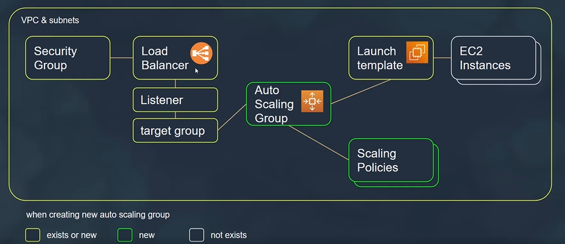

# Amazon Elastic Compute Cloud (EC2)

Amazon Elastic Compute Cloud (EC2) is a web service that provides resizable compute capacity in the cloud. It allows you to quickly scale compute resources up or down based on demand, making it easier to handle varying workloads and traffic patterns.

## Key Features of EC2:

### 1. Instances:
- **Virtual Servers**: EC2 instances are virtual servers in the cloud that can run various operating systems and applications.
- **Instance Types**: EC2 offers a wide selection of instance types optimized for different use cases, such as general-purpose, compute-optimized, memory-optimized, and storage-optimized instances.

### 2. Elasticity and Scalability:
- **Auto Scaling**: EC2 Auto Scaling allows you to automatically scale the number of EC2 instances based on demand, ensuring optimal performance and cost efficiency.
- **Elastic Load Balancing**: Combined with Elastic Load Balancing, EC2 instances can distribute incoming traffic across multiple instances to ensure high availability and fault tolerance.

### 3. Pricing and Billing:
- **Pay-As-You-Go**: With EC2, you pay only for the compute capacity you use, with no upfront costs or long-term commitments.
- **Reserved Instances**: EC2 offers Reserved Instances, which provide significant discounts compared to On-Demand pricing in exchange for a commitment to a one- or three-year term.

### 4. Security and Compliance:
- **Security Groups**: EC2 instances are secured using security groups, which act as virtual firewalls to control inbound and outbound traffic.
- **Compliance**: EC2 is compliant with various industry standards and certifications, including SOC, PCI DSS, HIPAA, and GDPR.

### 5. Integration and Flexibility:
- **Integration with AWS Services**: EC2 integrates with other AWS services, such as Amazon S3, Amazon RDS, and Amazon VPC, to provide a comprehensive cloud computing platform.
- **Flexibility**: EC2 provides flexibility to choose from a wide range of operating systems, AMIs (Amazon Machine Images), and software configurations to meet your specific requirements.

## Use Cases for EC2:
- Web Hosting and Application Hosting
- Development and Testing Environments
- Big Data and Analytics
- High-Performance Computing (HPC)
- Enterprise Applications and Databases
- Gaming and Media Streaming

Amazon EC2 offers a flexible and cost-effective solution for running virtual servers in the cloud, providing the foundation for building scalable and reliable applications.

# Creating an EC2 Instance

## Step 1: Choose an Amazon Machine Image (AMI)

- **AMI Selection**: Choose an AMI based on your operating system and software requirements.

## Step 2: Choose an Instance Type

- **Instance Type**: Select an instance type based on your workload requirements, such as general-purpose, compute-optimized, memory-optimized, or storage-optimized instances.

## Step 3: Configure Instance Details

- **Number of Instances**: Specify the number of instances to launch.
- **Network**: Choose the VPC (Virtual Private Cloud) and subnet for the instance.
- **Auto-assign Public IP**: Specify whether to assign a public IP address to the instance.
- **IAM Role**: Assign an IAM role to the instance for accessing AWS services.

## Step 4: Add Storage

- **Root Volume**: Specify the size and type (e.g., SSD or HDD) of the root volume for the instance.
- **Additional Volumes**: Add additional volumes as needed for data storage.

## Step 5: Configure Security Group

- **Security Group**: Create or select a security group to control inbound and outbound traffic to the instance.

## Step 6: Review and Launch

- **Review Configuration**: Review the instance configuration details.
- **Launch**: Confirm the configuration and launch the instance.

## Step 7: Connect to the Instance

- **SSH (Linux) or RDP (Windows)**: Use SSH (Secure Shell) for Linux instances or RDP (Remote Desktop Protocol) for Windows instances to connect to the instance.

## Step 8: Additional Configuration (Optional)

- **Instance Metadata**: Configure instance metadata, user data, and tags as needed.
- **Monitoring**: Enable detailed monitoring for the instance to collect performance metrics.
- **Instance Termination Protection**: Enable termination protection for the instance if required.

## Summary

Creating an EC2 instance involves selecting an AMI, choosing an instance type, configuring instance details, adding storage, configuring security groups, reviewing and launching the instance, connecting to the instance, and additional configuration as needed. Follow these steps to launch an EC2 instance tailored to your specific requirements.

# Create EC2 Instance Using AWS CLI

## Step 1: Create SSH Key Pair (if not already created)

```bash
aws ec2 create-key-pair --key-name MyKeyPair --key-format ppk --query 'KeyMaterial' --output text > MyKeyPair.ppk
```

## Step 2: Create Security Groups

```bash
aws ec2 create-security-group --group-name SSHAccess --description "Security group for SSH access"
aws ec2 authorize-security-group-ingress --group-name SSHAccess --protocol tcp --port 22 --cidr 0.0.0.0/0
aws ec2 authorize-security-group-ingress --group-name HTTPAccess --protocol tcp --port 80 --cidr 0.0.0.0/0
```

## Step 3: Launch EC2 Instance

```bash
aws ec2 run-instances --image-id <AMI-ID> --count 1 --instance-type t2.micro --key-name MyKeyPair --security-groups SSHAccess HTTPAccess
```


# Connect to EC2 Instance Using PuTTY

## Step 1: Convert PEM Key to PPK Format

1. **Download PuTTY Tools**: Download and install PuTTY and PuTTYgen from the [PuTTY Download Page](https://www.chiark.greenend.org.uk/~sgtatham/putty/latest.html).

2. **Convert PEM to PPK**:
   - Open PuTTYgen.
   - Click on "Load" and select your PEM private key file.
   - Click on "Save private key" to save the private key in PPK format.

## Step 2: Configure PuTTY Session

1. **Open PuTTY**: Launch PuTTY.

2. **Configure Session**:
   - Enter your instance's public DNS or IP address in the "Host Name (or IP address)" field.
   - Enter a name for your session in the "Saved Sessions" field and click "Save" to save the session.

3. **Configure SSH Auth**:
   - In the left panel, navigate to Connection > SSH > Auth.
   - Click on "Browse" and select the PPK private key file you generated in Step 1.

## Step 3: Connect to Instance

1. **Load Session**: Select the saved session from the list in the "Saved Sessions" field.

2. **Open Session**: Click "Open" to start the SSH connection.

3. **Authenticate**: If prompted, log in using the appropriate username for your instance (e.g., "ec2-user" for Amazon Linux, "ubuntu" for Ubuntu, "admin" for CentOS).

4. **Connected**: You are now connected to your EC2 instance via SSH using PuTTY.

# Summary

By following these steps, you can convert your PEM key to PPK format using PuTTYgen, configure a PuTTY session with the converted private key, and establish an SSH connection to your EC2 instance using PuTTY.


# EC2 Launch Template

An EC2 launch template is a configuration template that provides the necessary information to launch an instance. It contains parameters such as instance type, AMI, security groups, key pair, and other settings.

## Creating a Launch Template

To create an EC2 launch template, follow these steps:

1. **Sign in to the AWS Management Console** and open the Amazon EC2 console at [https://console.aws.amazon.com/ec2/](https://console.aws.amazon.com/ec2/).

2. In the navigation pane, choose **Launch Templates** under **Instances**.

3. Click on **Create launch template**.

4. Enter a name for your launch template and optionally, provide a description.

5. Configure the launch template settings, including:
   - **AMI**: Select the Amazon Machine Image (AMI) for your instance.
   - **Instance type**: Choose the instance type for your instance.
   - **Key pair**: Specify the key pair for SSH access to your instance.
   - **Security groups**: Choose the security groups that will be applied to your instance.
   - **Networking**: Configure the networking settings for your instance.
   - **Storage**: Configure the storage settings for your instance.
   - **Tags**: Add any tags to your instance for easy identification.
   - **User data**: is a script or commands that are executed when an EC2 instance is launched. It allows you to customize the configuration of your instance during startup. User data can be used to install software, configure settings, and perform various tasks to prepare the instance for its intended purpose.
        - Example of user data script that installs Apache web server and starts it on an EC2 instance running a Linux-based operating system:
          ```bash
          #!/bin/bash
          yum update -y                      # Update package repositories
          yum install -y httpd               # Install Apache web server
          systemctl start httpd              # Start Apache web server
          systemctl enable httpd             # Enable Apache to start on boot
          ```

        - Example to update ubuntu instance and install .net core runtime and sdk
          ``` bash
           #!/bin/bash
           sudo mkdir /srv-02
           sudo apt update
           sudo apt install -y aspnetcore-runtime-6.0
           sudo apt install -y dotnet-sdk-6.0
          ```

        - Example for connecting to `codecommit` build application and host it as a service
          ```bash
               #!/bin/bash
               apt update
               echo "install dotnet"
               apt install -y aspnetcore-runtime-6.0
               apt install -y dotnet-sdk-6.0
               
               #install git
               echo "install git"
               apt install git
               apt install unzip
               
               #install aws cli
               curl "https://awscli.amazonaws.com/awscli-exe-linux-x86_64.zip" -o "awscliv2.zip"
               unzip -qq awscliv2.zip
               ./aws/install
               aws --version
               
               #configure git
               sudo -u ubuntu git config --global credential.helper '!aws codecommit credential-helper $@'
               sudo -u ubuntu git config --global credential.UseHttpPath true
               
               
               #clone repo from code commit
               cd /home/ubuntu
               echo "git clone"
               sudo -u ubuntu git clone https://git-codecommit.us-east-1.amazonaws.com/v1/repos/srv-02
               cd srv-02
               
               #build the dot net service
               echo "dotnet build"
               echo 'DOTNET_CLI_HOME=/temp' >> /etc/environment
               export DOTNET_CLI_HOME=/temp
               dotnet publish -c Release --self-contained=false --runtime linux-x64
               
               
               cat >/etc/systemd/system/srv-02.service <<EOL
               [Unit]
               Description=Dotnet S3 info service
               
               [Service]
               ExecStart=/usr/bin/dotnet /home/ubuntu/srv-02/bin/Release/netcoreapp6/linux-x64/srv02.dll
               SyslogIdentifier=srv-02
               
               Environment=DOTNET_CLI_HOME=/temp
               
               [Install]
               WantedBy=multi-user.target
               EOL
               
               systemctl daemon-reload
               
               #run it
               systemctl start srv-02
          
          ```

             - To watch the logs of the service inside ec2 instance
             ```bash
                sudo -i
                cd /var/log
                journalctl -f -u srv-02
            ```
                
     

6. Click on **Create launch template** to create your launch template.

## Launching Instances from a Launch Template

Once you have created a launch template, you can use it to launch instances. Here's how:

1. In the Amazon EC2 console, navigate to **Instances** and click on **Launch Instance**.

2. Select **Launch from template** and choose the launch template you created.

3. Review the instance details and click on **Launch instances**.

4. Your instances will be launched based on the configuration specified in the launch template.

## Conclusion

EC2 launch templates provide a convenient way to specify the configuration for launching instances. By creating a launch template, you can easily launch instances with consistent settings, making it easier to manage your infrastructure.

For more information, refer to the [AWS documentation on EC2 launch templates](https://docs.aws.amazon.com/AWSEC2/latest/UserGuide/ec2-launch-templates.html).


# VPC Bastion Host: Remotely Connect to a Private EC2

A Bastion Host, also known as a jump server, is a special-purpose instance within a VPC that allows secure access to private instances located in private subnets. By using a Bastion Host, you can establish a secure connection to private instances without exposing them directly to the internet. Here's how to set up a Bastion Host to remotely connect to a private EC2 instance:

## Step 1: Launch Bastion Host Instance

- Launch an EC2 instance in a public subnet of your VPC to serve as the Bastion Host.
- Assign a public IP address or Elastic IP (EIP) to the Bastion Host instance for external access.
- Ensure that the security group associated with the Bastion Host allows inbound SSH (port 22) access from your IP address or a restricted range of IP addresses.

## Step 2: Configure Bastion Host Security Group

- Create a security group for the Bastion Host that allows inbound SSH access from your IP address or a restricted range of IP addresses.
- Create outbound rules that allow necessary communication from the Bastion Host to private instances, such as SSH (port 22) access to private EC2 instances.

## Step 3: Connect to Bastion Host

- Use SSH to connect to the Bastion Host from your local machine using the following command:
  `ssh -i your-key.pem ec2-user@bastion-host-public-ip`
Replace `your-key.pem` with the path to your private key file and `bastion-host-public-ip` with the public IP address or EIP of the Bastion Host.

## Step 4: Connect to Private EC2 Instance

- Once connected to the Bastion Host, use SSH to connect to the private EC2 instance located in a private subnet using its private IP address:
`ssh -i your-key.pem ec2-user@private-ec2-private-ip`
Replace `your-key.pem` with the path to your private key file and `private-ec2-private-ip` with the private IP address of the private EC2 instance.

## Step 5: Secure Access

- Ensure that only authorized users have access to the Bastion Host by managing SSH key pairs and restricting access through security group rules.
- Regularly review and update security configurations to align with security best practices and compliance requirements.

## Access Internet from private EC2 Instance
- Create NAT Gateway
- Add it to Route table that is conneted to the subnet of the EC2 private instance
  
## Conclusion

Setting up a Bastion Host in an Amazon VPC provides a secure way to remotely connect to private EC2 instances located in private subnets. By following best practices for access control and security configuration, you can establish a secure and manageable environment for accessing private resources within your VPC.

For more information, refer to the [AWS documentation on Bastion Hosts](https://docs.aws.amazon.com/quickstart/latest/linux-bastion/architecture.html).


# Amazon EC2 Instance Specifications

## CPU (Central Processing Unit)

- **Types**: EC2 instances offer a variety of CPU types, including Intel Xeon, AMD EPYC, and Graviton2 (AWS-designed ARM-based processors).
- **vCPUs**: Each EC2 instance type comes with a specific number of virtual CPUs (vCPUs), ranging from 1 vCPU to hundreds of vCPUs depending on the instance type.

## Memory

- **RAM**: EC2 instances provide varying amounts of memory (RAM), ranging from a few gigabytes to several terabytes depending on the instance type.
- **Types**: Instances offer different memory types, such as DDR4 or DDR5, depending on the instance family and generation.

## Storage

- **Root Volume**: Each EC2 instance comes with a root volume that provides the primary storage for the operating system and applications.
- **Ephemeral Storage**: Some instance types also include ephemeral storage that is directly attached to the instance and provides temporary storage for data.
- **Elastic Block Store (EBS)**: EC2 instances can be configured with additional Elastic Block Store (EBS) volumes for persistent storage needs. EBS volumes offer various performance and durability options.

## Network

- **Bandwidth**: EC2 instances are connected to the AWS network infrastructure and offer varying levels of network bandwidth depending on the instance type.
- **Networking Features**: Instances may include features such as Enhanced Networking for higher network throughput and lower latency.

## GPU (Graphics Processing Unit) Options

- **Types**: Some EC2 instance types come with GPU options for applications that require graphics processing capabilities, machine learning, or parallel processing.
- **GPU Types**: GPU options include NVIDIA Tesla and AMD GPUs, with varying numbers of CUDA cores, memory, and processing power.

## Instance Families and Bundles

- **Instance Families**: EC2 instances are organized into families based on their intended use case and performance characteristics. Example families include General Purpose, Compute Optimized, Memory Optimized, Storage Optimized, etc.
- **Bundles**: Each instance family includes multiple instance types (bundles) with varying combinations of CPU, memory, storage, network performance, and other features to meet different workload requirements.

## What's Not Included

- **Operating System**: EC2 instances do not come with an operating system pre-installed. Users can choose their preferred operating system and install it on the instance.
- **Additional Software**: Users are responsible for installing and managing any additional software, applications, or services needed on the EC2 instances.
- **Data Transfer Costs**: Data transfer costs between EC2 instances and other AWS services or the internet are not included in the instance pricing and are billed separately.


# Storage Options for EC2 Instances

Amazon Elastic Compute Cloud (EC2) instances offer two main storage options: EBS-backed instances and instance-store-backed instances. Each option has its own characteristics and considerations, which should be taken into account based on your specific use case and requirements.

## EBS-Backed EC2 Instances

### Description:
- EBS-backed EC2 instances use Amazon Elastic Block Store (EBS) volumes as their root device storage.
- EBS volumes provide persistent block-level storage that persists independently from the lifecycle of the EC2 instance.
- The root volume of an EBS-backed EC2 instance is typically an EBS volume that can be detached and reattached to different instances.

### Considerations:
- **Persistence**: EBS volumes retain data even if the associated EC2 instance is stopped or terminated, making them suitable for long-term storage requirements.
- **Snapshots**: You can create snapshots of EBS volumes for backup, replication, and disaster recovery purposes.
- **Flexible Size**: EBS volumes can be resized dynamically without requiring instance restarts, providing flexibility in storage capacity management.
- **Performance**: EBS volumes offer various performance options (e.g., provisioned IOPS, General Purpose SSD, Throughput Optimized HDD) to meet different performance requirements.

## Instance-Store-Backed EC2 Instances

### Description:
- Instance-store-backed EC2 instances use temporary block storage that is directly attached to the host computer (the instance).
- Instance-store volumes are ephemeral and are deleted when the associated EC2 instance is stopped or terminated.
- The root volume of an instance-store-backed EC2 instance is typically an instance-store volume that cannot be detached or persisted beyond the lifecycle of the instance.

### Considerations:
- **Temporary Storage**: Instance-store volumes are temporary and are lost if the associated EC2 instance is stopped or terminated, making them unsuitable for long-term storage or data persistence.
- **Performance**: Instance-store volumes offer high-performance local storage, making them suitable for temporary storage and caching requirements.
- **Cost**: Instance-store volumes do not incur additional storage costs beyond the instance usage costs, but data loss is a risk if instances are stopped or terminated.

## Conclusion

When choosing storage for EC2 instances, consider the trade-offs between EBS-backed and instance-store-backed instances based on your specific requirements for data persistence, performance, flexibility, and cost. EBS-backed instances provide persistent block storage with flexibility and data persistence, while instance-store-backed instances offer high-performance local storage but are limited to temporary data storage needs.

Select the storage option that best aligns with your workload requirements and data management strategy to optimize performance, reliability, and cost-effectiveness.

For more information on EC2 instance storage options, refer to the [AWS Documentation](https://docs.aws.amazon.com/AWSEC2/latest/UserGuide/RootDeviceStorage.html).


# EC2 Security Groups

Amazon EC2 security groups act as virtual firewalls for controlling inbound and outbound traffic to your EC2 instances. By configuring security groups, you can define rules that control traffic based on protocol, port, and source/destination IP addresses, providing granular control over network access to your instances.

## Features

### Inbound Rules
- Inbound rules define the allowed incoming traffic to your EC2 instances.
- You can specify rules based on protocol (e.g., TCP, UDP, ICMP), port range, and source IP addresses or security groups.

### Outbound Rules
- Outbound rules define the allowed outgoing traffic from your EC2 instances.
- Similar to inbound rules, you can specify rules based on protocol, port range, and destination IP addresses or security groups.

### Stateful Filtering
- EC2 security groups operate at the instance level and provide stateful filtering of traffic.
- When an inbound rule allows traffic, the corresponding outbound traffic is automatically allowed, regardless of outbound rules.

### Dynamic Updates
- Security group rules can be dynamically updated to allow traffic from changing sources, making them flexible and adaptable to evolving network requirements.

## Use Cases

### Web Servers
- Configure security groups to allow inbound HTTP (port 80) and HTTPS (port 443) traffic for web servers.
- Limit SSH (port 22) access to specific IP addresses or ranges for secure remote administration.

### Database Servers
- Restrict inbound traffic to specific database ports (e.g., MySQL port 3306) for database servers.
- Allow outbound traffic to specific application servers or services required for database operations.

### Application Servers
- Define security group rules to allow inbound traffic for application-specific ports and protocols required by your applications.
- Implement strict outbound rules to restrict unnecessary communication from application servers.

## Best Practices

- **Least Privilege**: Apply the principle of least privilege by restricting access to only necessary ports and protocols.
- **Security Group Separation**: Use separate security groups for different tiers of your application (e.g., web, app, database) to enforce stricter access controls.
- **Regular Review**: Regularly review and audit security group rules to ensure they align with your security policies and requirements.
- **Dynamic Updates**: Utilize dynamic updates to security group rules for maintaining flexibility and responsiveness to changing network configurations.

## Conclusion

EC2 security groups are essential for controlling network traffic to your EC2 instances in a flexible and secure manner. By configuring inbound and outbound rules based on specific requirements and best practices, you can enforce strict access controls and enhance the security posture of your AWS infrastructure.

For more information on EC2 security groups, refer to the [AWS Documentation](https://docs.aws.amazon.com/AWSEC2/latest/UserGuide/ec2-security-groups.html).


# Private, Public, and Elastic IPs in Amazon EC2

Amazon Elastic Compute Cloud (EC2) provides various options for IP addressing to meet different networking requirements. Understanding the differences between private, public, and Elastic IPs is essential for effectively managing communication and access within your EC2 instances.

## Private IP Addresses

### Features
- Private IP addresses are IPv4 addresses assigned to instances within a Virtual Private Cloud (VPC).
- They are used for communication within the VPC and are not reachable from the internet.
- Every EC2 instance is assigned a private IP address by default when launched in a VPC.

### Use Cases
- Internal communication between instances within the same VPC.
- Establishing private networks for applications, databases, and services within the VPC.

## Public IP Addresses

### Features
- Public IP addresses are IPv4 addresses assigned to instances for internet communication.
- They are dynamically assigned by AWS when an instance is launched unless explicitly disabled.
- Public IP addresses are reachable from the internet and allow inbound and outbound communication.

### Use Cases
- Hosting web servers, applications, or services that require internet accessibility.
- Accessing instances remotely over the internet using protocols such as SSH or RDP.

## Elastic IP Addresses (EIPs)

### Features
- Elastic IP addresses (EIPs) are static IPv4 addresses designed for dynamic cloud computing.
- They are persistent and can be associated with EC2 instances, network interfaces, or NAT gateways.
- EIPs provide a static IP address that remains associated with your account until explicitly released.

### Use Cases
- Hosting services that require a static IP address, such as DNS servers or email servers.
- Implementing failover solutions or high availability architectures by associating EIPs with instances.

## Comparison

| Feature            | Private IP       | Public IP                 | Elastic IP                     |
|--------------------|------------------|---------------------------|--------------------------------|
| **Reachability**       | Within VPC       | Internet                  | Internet                       |
| **Persistence**      | Yes              | No (dynamic)              | Yes                            |
| **Reassignment**       | Automatic        | Automatic (on stop/start) | Manual (on association)        |
| **Association to the instance** | Directly on the ENI | Configure on IGW and mapped through NAT | Configure on IGW and mapped through NAT |
| **Cost**               | Free             | Included (dynamic)        | Additional (when unassociated) |

## Conclusion

Understanding the differences between private, public, and Elastic IPs in Amazon EC2 is crucial for designing and managing your EC2 instances effectively. Private IPs are used for internal communication within a VPC, public IPs provide internet accessibility, and Elastic IPs offer static addressing for dynamic cloud environments.

For more information on IP addressing in Amazon EC2, refer to the [AWS Documentation](https://docs.aws.amazon.com/AWSEC2/latest/UserGuide/using-instance-addressing.html).


# EC2 Instance Metadata and User Data

Amazon Elastic Compute Cloud (EC2) instances provide metadata and user data services that allow you to retrieve information about the instance and customize its configuration during launch. These services enable dynamic configuration, automation, and integration with other AWS services.

## EC2 Instance Metadata

EC2 instance metadata is a service that provides information about an instance's attributes, such as instance ID, instance type, public and private IP addresses, security groups, and more. Metadata is available to the instance itself and can be accessed using a special URL within the instance. 
To view the metadata `curl http://169.254.169.254/latest/meta-data`

### Key Features

- **Dynamic Information**: Metadata provides dynamic information about the instance, including network configuration, instance identity, and more.

- **Accessible from Within Instance**: Metadata can be accessed from within the instance using a special URL (`http://169.254.169.254/latest/meta-data/`) without requiring authentication.

- **No Persistent Storage**: Metadata is transient and does not persist beyond the lifetime of the instance. It is reset when the instance is stopped or terminated.

## EC2 User Data

EC2 user data is a feature that allows you to pass configuration information or scripts to an instance during launch. User data is typically used for bootstrapping instances, configuring software, installing packages, or running custom initialization scripts.
To view the metadata `curl http://169.254.169.254/latest/user-data`

### Key Features

- **Customization**: User data enables customization of instance configuration during launch, allowing you to automate setup tasks or customize software installations.

- **Cloud-Init Support**: User data is processed by cloud-init, a package available on most Linux distributions that handles instance initialization tasks based on user-provided data.

- **Script Execution**: User data can include shell scripts, configuration files, or any other data that is processed by cloud-init during instance boot.

## Use Cases

- **Automated Configuration**: User data is commonly used to automate configuration tasks such as software installation, system initialization, or environment setup during instance launch.

- **Dynamic Configuration**: User data can be used to customize instance behavior based on dynamic parameters such as instance type, region, or environment variables.

- **Integration with Other AWS Services**: User data can be used to integrate EC2 instances with other AWS services such as AWS Systems Manager, AWS CloudFormation, or AWS CodeDeploy.

## Considerations

- **Security**: Exercise caution when passing sensitive information through user data, as it is stored in plain text and can be accessed by anyone with access to the instance.

- **Size Limit**: User data has a size limit of 16 KB for instance types that support it. Larger configurations can be stored in Amazon S3 and referenced using pre-signed URLs.

## Conclusion

EC2 instance metadata and user data services provide powerful capabilities for customizing and automating instance configuration during launch. By leveraging metadata and user data, organizations can streamline instance setup, automate configuration tasks, and integrate EC2 instances with other AWS services effectively.


# Amazon EC2 Instance Families and Features

Amazon EC2 offers a wide range of instance families optimized for various workloads, including general-purpose computing, high-performance computing (HPC), memory-intensive applications, accelerated computing with GPUs, and storage-optimized workloads. Each instance family is designed to provide specific combinations of compute, memory, storage, and networking resources to meet the diverse needs of different applications and use cases.

For more detailed information on EC2 instance types and families, including specific features, performance characteristics, and pricing details, visit the [Amazon EC2 Instance Types](https://aws.amazon.com/ec2/instance-types/) page.


## General Purpose Instances

General Purpose instances provide a balance of compute, memory, and networking resources. They are suitable for a wide range of workloads, including web servers, development environments, and small databases.

### Family: T3
- **Features**:
  - Burstable performance with baseline CPU performance and the ability to burst above the baseline.
  - Ideal for applications with variable CPU usage patterns and low to moderate workloads.

### Family: M5
- **Features**:
  - Balanced compute, memory, and network resources.
  - Suitable for general-purpose workloads, such as web servers, enterprise applications, and databases.

### Family: T4g
- **Features**:
  - Powered by AWS Graviton2 processors for better performance and cost-effectiveness.
  - Suitable for a wide range of general-purpose workloads with improved performance and lower costs.

## Compute Optimized Instances

Compute Optimized instances are designed for workloads that require high-performance compute instances with optimized CPU resources.

### Family: C5
- **Features**:
  - High-performance compute instances with high CPU performance and low-latency networking.
  - Ideal for compute-intensive workloads, such as batch processing, high-performance computing (HPC), and scientific modeling.

### Family: C6g
- **Features**:
  - Compute-optimized instances powered by AWS Graviton2 processors.
  - Ideal for compute-intensive workloads, including gaming, simulation, financial modeling, and media transcoding.

### Family: C7g
- **Features**:
  - Next-generation compute-optimized instances powered by AWS Graviton3 processors.
  - Provides improved performance and efficiency for compute-intensive workloads.

## Memory Optimized Instances

Memory Optimized instances are designed for memory-intensive applications that require high memory-to-CPU ratios and large memory sizes.

### Family: R5
- **Features**:
  - High memory-to-CPU ratio for memory-intensive applications.
  - Ideal for in-memory databases, real-time analytics, and memory-bound applications.

### Family: X1
- **Features**:
  - Memory-optimized instances with large memory sizes and high memory bandwidth.
  - Suitable for in-memory databases, SAP HANA, real-time processing of big data, and other memory-intensive workloads.

### Family: R6g
- **Features**:
  - Memory-optimized instances powered by AWS Graviton2 processors.
  - Provides improved memory performance and efficiency for memory-intensive applications.

## Accelerated Computing Instances

Accelerated Computing instances are designed for workloads that require specialized hardware acceleration, such as GPU or FPGA resources.

### Family: P3
- **Features**:
  - High-performance instances with NVIDIA Tesla GPUs for graphics processing and parallel computation.
  - Suitable for deep learning, scientific computing, and other GPU-accelerated workloads.

### Family: F1
- **Features**:
  - Instances with FPGA (Field Programmable Gate Array) resources for custom hardware acceleration.
  - Ideal for custom hardware acceleration, algorithm development, and high-performance computing.

## Storage Optimized Instances

Storage Optimized instances are designed for workloads that require high storage capacity and high disk throughput.

### Family: I3
- **Features**:
  - High-speed NVMe SSD storage optimized for low-latency, high-IOPS applications.
  - Suitable for NoSQL databases, data warehousing, and other I/O-intensive workloads.

### Family: D2
- **Features**:
  - Dense storage instances with large HDD storage capacity.
  - Ideal for data lakes, log processing, and other data-intensive applications.

### Family: H1
- **Features**:
  - Dense storage instances with high storage capacity and high disk throughput.
  - Suitable for big data processing, distributed file systems, and data analytics workloads.

## HPC Optimized Instances

HPC (High Performance Computing) Optimized instances are designed for computationally intensive workloads that require high-performance computing resources.

### Family: H1
- **Features**:
  - High-performance computing instances with high CPU performance and low-latency networking.
  - Suitable for parallel processing, computational fluid dynamics, financial modeling, and other HPC workloads.

### Family: HPC6g
- **Features**:
  - HPC-optimized instances powered by AWS Graviton2 processors.
  - Provides improved performance and efficiency for HPC workloads, including simulations, modeling, and scientific computing.

# Instance Features and Measuring Performance in Amazon EC2

## Instance Features

### CPU Options
- EC2 instances offer a variety of CPU options, including Intel, AMD, and AWS Graviton processors.
- The choice of CPU affects performance, cost, and compatibility with specific workloads.

### Memory (RAM)
- EC2 instances come with varying amounts of memory (RAM) to support different application requirements.
- Memory sizes range from a few gigabytes to several terabytes, depending on the instance type.

### Storage Options
- EC2 instances offer different storage options, including instance store volumes and Amazon Elastic Block Store (EBS) volumes.
- Instance store volumes provide temporary block-level storage that is physically attached to the host server.
- Amazon EBS volumes provide persistent block-level storage that can be attached to EC2 instances.

### Network Performance
- EC2 instances have different network performance characteristics, including bandwidth, latency, and packet-per-second (PPS) performance.
- Enhanced Networking features, such as Amazon ENA (Elastic Network Adapter), can improve network performance for certain instance types.

### GPU Options
- Some EC2 instance types offer GPU options for applications that require graphics processing or parallel computation.
- GPU options include NVIDIA Tesla and AMD GPUs with varying numbers of CUDA cores, memory, and processing power.

## Measuring Instance Performance

### Performance Benchmarks
- Amazon provides performance benchmarks for EC2 instances, including CPU performance, memory performance, disk I/O performance, and network performance.
- Benchmarks are available for different instance types and sizes to help users evaluate performance characteristics.

### Instance Metadata
- EC2 instances expose metadata that can be used to monitor and measure instance performance.
- Instance metadata includes information such as CPU utilization, memory utilization, network throughput, and disk I/O metrics.

### CloudWatch Metrics
- Amazon CloudWatch provides monitoring and metrics for EC2 instances, including CPU utilization, memory utilization, network traffic, and disk I/O metrics.
- CloudWatch metrics can be used to track instance performance over time and set up alarms for performance thresholds.

### AWS Trusted Advisor
- AWS Trusted Advisor provides performance recommendations for EC2 instances based on best practices and optimization opportunities.
- Trusted Advisor can analyze instance configuration, utilization, and performance metrics to identify areas for improvement.

### Third-Party Tools
- Third-party monitoring and performance management tools can be used to measure and optimize EC2 instance performance.
- Tools such as New Relic, Datadog, and Splunk provide comprehensive monitoring, analytics, and optimization features for EC2 instances.

# Pricing Models for Amazon EC2 Instances

Amazon EC2 offers several pricing models to accommodate different use cases and workload requirements. The pricing for EC2 instances is influenced by various factors, including instance type, region, operating system, instance size, and usage patterns. Here are the primary pricing models available for EC2 instances:


## On-Demand Instances

- On-Demand Instances allow you to pay for compute capacity by the hour or by the second with no long-term commitments.
- This pricing model is suitable for applications with unpredictable workloads, short-term projects, or testing and development environments.
- On-Demand Instances offer flexibility and scalability, allowing you to launch instances when needed and terminate them when no longer required.

## Reserved Instances

- Reserved Instances offer significant cost savings compared to On-Demand Instances by providing a discounted hourly rate in exchange for a one- or three-year commitment.
- Reserved Instances require an upfront payment or a lower upfront payment with a higher hourly rate.
- This pricing model is ideal for applications with steady-state or predictable workloads, providing cost savings over the long term.
- Standard RIs: Can only modify the size but not the family type and can save up to 75% of the price
- Convertible RIs: Can only modify or exchange with other convertible RIs and can save up to 54% of the price

## Savings Plans

- Savings Plans offer flexible pricing options with significant cost savings compared to On-Demand Instances and even Reserved Instances in some cases.
- Savings Plans provide a discount on your EC2 usage in exchange for committing to a consistent amount of usage (measured in dollars per hour) for a one- or three-year term.
- This pricing model is suitable for applications with variable workloads or usage patterns, offering cost savings without the need to commit to specific instance types or families.

## Spot Instances

- Spot Instances allow you to bid on unused EC2 capacity, offering significant cost savings compared to On-Demand Instances.
- Spot Instances are ideal for applications with flexible start and end times, such as batch processing, data analysis, or stateless web servers.
- The pricing for Spot Instances fluctuates based on supply and demand, and instances can be terminated with little notice if the spot price exceeds your bid price.
   
### Spot Request

 

 ### Spot, Spot Block and Spot fleet

 


## Dedicated Hosts

- Dedicated Hosts provide physical servers dedicated to your use, offering visibility and control over instance placement and hardware specifications.
- Dedicated Hosts are billed on an hourly basis with a variety of pricing options, including On-Demand, Reserved, and Savings Plans.
- This pricing model is suitable for applications with specific compliance, regulatory, or licensing requirements that necessitate dedicated hardware.

## Pricing Considerations

- When choosing a pricing model for EC2 instances, consider factors such as workload predictability, budget constraints, and required flexibility.
- It's important to monitor and optimize instance usage to maximize cost efficiency and minimize unnecessary spending.
- AWS offers tools and services, such as AWS Cost Explorer, AWS Budgets, and AWS Trusted Advisor, to help you analyze, monitor, and manage your EC2 costs effectively.

# Amazon EC2 Instance Life Cycle

The lifecycle of an Amazon EC2 (Elastic Compute Cloud) instance typically involves several stages, from creation to termination. Here's an overview:


1. **Creation**: 
   - You start by launching an EC2 instance through the AWS Management Console, CLI (Command Line Interface), or SDKs (Software Development Kits).
   - During creation, you specify parameters such as instance type, AMI (Amazon Machine Image), security groups, key pair, and other configuration settings.

2. **Running**: 
   - Once launched, the EC2 instance enters the "running" state, indicating that it's operational and can accept requests.
   - In this state, you can connect to the instance and start using it for your desired tasks, such as hosting web applications, running databases, etc.

3. **Stopping and Starting**: 
   - You have the option to stop the EC2 instance when you don't need it temporarily.
   - When stopped, the instance enters the "stopped" state, and you're not billed for compute resources, but you still incur charges for EBS (Elastic Block Store) volumes attached to the instance.
   - You can start a stopped instance to resume operations where you left off.

4. **Termination**: 
   - When you're done with an EC2 instance and no longer need it, you can terminate it.
   - Termination removes the instance permanently, including associated EBS volumes (unless specifically configured to retain them).
   - Once terminated, you're no longer billed for the instance or its associated resources.

5. **Retirement (Optional)**: 
   - In certain scenarios, AWS may retire EC2 instances due to hardware degradation or other reasons.
   - If your instance is retired, AWS notifies you in advance, allowing you to migrate your workload to a new instance.

6. **Recovery and Reboot (Optional)**:
   - In some cases, you might need to reboot or recover an EC2 instance due to software issues or maintenance activities.
   - Rebooting an instance involves restarting it without changing its instance ID or private IP address.
   - Recovery typically involves restoring an instance from a snapshot or AMI, resulting in a new instance with a different instance ID and potentially different attributes.

Throughout the lifecycle, you can manage EC2 instances using various AWS services and tools, including AWS Management Console, AWS CLI, AWS SDKs, and third-party management tools. Additionally, you can automate instance management tasks using AWS Lambda, AWS Systems Manager, or other automation frameworks.


# EC2 Placement Groups

Amazon EC2 placement groups are logical groupings of instances within a single Availability Zone (AZ) that enable you to influence the placement of instances to meet specific requirements, such as proximity for low-latency communication or ensuring high availability and fault tolerance. Placement groups provide control over the placement of instances to optimize performance, resilience, and compliance with regulatory requirements.

## Types of Placement Groups

### Cluster Placement Groups

- A cluster placement group is a logical grouping of instances within a single Availability Zone (AZ) or across peered virtual private clouds (VPCs) in the same Region. Instances within a cluster placement group benefit from higher per-flow throughput limits for TCP/IP traffic and are placed in the same high-bisection bandwidth segment of the network.

- Cluster placement groups are recommended for applications requiring low network latency, high network throughput, or both, especially when the majority of network traffic is between instances in the group.

#### Best Practices:

- Use a single launch request to launch all instances needed in the placement group.
- Use the same instance type for all instances within the group.

### Partition Placement Groups

- Partition placement groups reduce the likelihood of correlated hardware failures by dividing each group into logical segments called partitions. Each partition has its own set of racks, network, and power source, ensuring that no two partitions share the same racks.

- Partition placement groups are suitable for large distributed and replicated workloads, such as HDFS, HBase, and Cassandra. They provide visibility into partitions, allowing topology-aware applications to make intelligent data replication decisions.

#### Key Features:

- Each partition can have multiple instances, distributed evenly across specified partitions.
- A partition placement group can span multiple AZs and can have a maximum of seven partitions per AZ.

### Spread Placement Groups

- A spread placement group ensures that instances are placed on distinct hardware to minimize the risk of simultaneous failures. Instances in spread placement groups are placed on different racks or hosts, providing access to distinct hardware.

#### Use Cases:

- Recommended for applications with critical instances that should be kept separate from each other.
- Suitable for mixing instance types or launching instances over time.

### Limitations:

- Rack-level spread placement groups can span multiple AZs and have a maximum of seven instances per AZ per group.
- Host-level spread placement groups are available only with AWS Outposts and can hold as many instances as there are hosts in the Outpost deployment.


## Considerations

- **Instance Types**: Placement groups support certain instance types, and not all instance types are compatible with all types of placement groups. Check the AWS documentation for the supported instance types for each placement group type.

- **Instance Limits**: Each placement group type has specific limits on the number of instances that can be launched in the group. Ensure that you stay within these limits when launching instances in a placement group.

- **Instance Size**: Placement groups have specific requirements for instance size and capacity reservations. Check the AWS documentation for guidance on instance sizing and capacity reservations for each placement group type.

## Conclusion

EC2 placement groups provide a way to control the placement of instances within a single AZ to meet specific requirements for performance, fault tolerance, and compliance. By leveraging placement groups, organizations can optimize the performance, resilience, and availability of their applications and workloads running on EC2 instances in the AWS Cloud. For more details, refer to the [AWS documentation](https://docs.aws.amazon.com/AWSEC2/latest/UserGuide/placement-groups.html).


# EC2 Monitoring

Amazon EC2 provides various monitoring capabilities to help you track the performance and health of your instances. Monitoring features include basic system metrics, detailed monitoring, and custom metrics integration.

## Basic Monitoring

- **Metrics**: EC2 instances automatically send basic monitoring metrics, such as CPU utilization, disk I/O, and network traffic, to Amazon CloudWatch in 5-minute intervals.
- **Granularity**: Data is aggregated at 5-minute intervals by default.
- **Visibility**: Basic monitoring provides basic visibility into the performance of your instances but may not capture fine-grained details.

## Detailed Monitoring

- **Metrics**: EC2 instances can be configured to send detailed monitoring metrics, which include additional metrics such as CPU utilization, disk I/O, and network traffic, to Amazon CloudWatch in 1-minute intervals.
- **Granularity**: Data is aggregated at 1-minute intervals for more granular monitoring.
- **Cost**: Detailed monitoring comes with additional cost compared to basic monitoring but provides more real-time visibility into the performance of your instances.

## Custom Metrics Integration

- **Metrics**: In addition to default metrics, you can also send custom metrics from your instances to Amazon CloudWatch using the CloudWatch agent or custom scripts.
- **Flexibility**: Custom metrics allow you to monitor application-specific metrics or other custom performance indicators that are important for your workloads.
- **Integration**: Custom metrics can be integrated with CloudWatch dashboards and alarms for comprehensive monitoring and alerting.

## Alarms and Notifications

- **Thresholds**: You can set up CloudWatch alarms based on metric thresholds to monitor the performance of your instances and trigger notifications or automated actions when thresholds are breached.
- **Actions**: Alarms can trigger actions such as sending notifications via Amazon SNS, invoking AWS Lambda functions, or triggering Auto Scaling policies to dynamically adjust capacity.

## CloudWatch Dashboards

- **Visualization**: CloudWatch dashboards allow you to create custom dashboards to visualize and monitor your EC2 metrics, custom metrics, and alarms in a single view.
- **Customization**: You can customize dashboard layouts, widgets, and data ranges to tailor the monitoring experience to your specific needs.

## Enhanced Monitoring

- **OS-Level Metrics**: Enhanced Monitoring provides additional OS-level metrics, such as memory usage, disk space, and network statistics, for deeper insight into instance performance.
- **Compatibility**: Enhanced Monitoring is available for select operating systems and instance types and requires the installation of the CloudWatch agent on instances.

## Conclusion

EC2 monitoring capabilities, including basic and detailed monitoring, custom metrics integration, alarms and notifications, CloudWatch dashboards, and enhanced monitoring, enable you to effectively monitor and manage the performance and health of your EC2 instances in real-time.

For more information, refer to the [Amazon EC2 documentation](https://docs.aws.amazon.com/AWSEC2/latest/UserGuide/monitoring_ec2.html).


# EC2 Status Checks

Amazon EC2 performs status checks on instances to monitor their health and ensure that they are running smoothly. There are two types of status checks: system status checks and instance status checks.

## System Status Checks

- **Purpose**: System status checks monitor the health of the underlying infrastructure that supports your instances, such as the host hardware and network connectivity.
- **Checks**: System status checks verify that the underlying infrastructure components, including the host hardware and network, are functioning properly.
- **Failure**: If a system status check fails, it indicates an issue with the underlying infrastructure, and the instance may be impaired or unreachable.
- **Action**: When a system status check fails, you should investigate the underlying cause, such as network configuration issues or hardware failures, and take appropriate action to resolve the issue.(stop, terminate and recover)

## Instance Status Checks


- **Purpose**: Instance status checks monitor the health of the EC2 instance itself, including the operating system and instance-level software.
- **Checks**: Instance status checks verify that the instance's operating system and instance-level software are functioning properly.
- **Failure**: If an instance status check fails, it indicates an issue with the instance itself, such as a misconfigured operating system or software issue.
- **Action**: When an instance status check fails, you should troubleshoot the instance to identify and resolve any issues affecting its health. (stop, terminate and reboot)

## Monitoring and Alerts

- **Automatic Checks**: EC2 automatically performs both system status checks and instance status checks on all running instances at regular intervals.
- **Monitoring**: You can monitor the status of your instances using the AWS Management Console, CLI, or SDKs, which provide visibility into the status of system and instance status checks.
- **Alerts**: You can configure CloudWatch alarms to receive notifications when system status checks or instance status checks fail, allowing you to take proactive action to address any issues.

## Conclusion

EC2 status checks are essential for monitoring the health and performance of your instances. By regularly monitoring system and instance status checks and responding promptly to any failures, you can ensure the reliability and availability of your EC2 instances.

For more information, refer to the [Amazon EC2 documentation](https://docs.aws.amazon.com/AWSEC2/latest/UserGuide/monitoring-system-instance-status-check.html).


---

# Amazon EC2 Auto Scaling Groups

Amazon EC2 Auto Scaling Groups is a service provided by AWS that enables you to automatically scale your Amazon EC2 instances based on demand, ensuring that you have the right amount of capacity to handle varying workloads. With Auto Scaling Groups, you can maintain application availability, optimize resource utilization, and improve cost efficiency by dynamically adjusting the number of EC2 instances in response to changing traffic patterns and workload demands.



## Key Features

- **Automatic Scaling**: Automatically scale the number of EC2 instances in your Auto Scaling Group based on predefined scaling policies, which can be triggered by metrics such as CPU utilization, network traffic, or custom CloudWatch metrics.
- **Scheduled Scaling**: Schedule scaling actions to occur at specific times or dates, enabling you to accommodate predictable workload fluctuations, such as daily or weekly peaks.
- **Target Tracking Scaling**: Use target tracking scaling policies to automatically adjust the number of instances to maintain a specific target value for a chosen metric, such as average CPU utilization or request latency.
- **Predictive Scaling**: Utilize predictive scaling to forecast future workload demand based on historical usage patterns and adjust the number of instances proactively to ensure optimal performance and availability.
- **Instance Protection**: Protect specific EC2 instances within an Auto Scaling Group from termination during scale-in events, ensuring that critical instances remain operational.
- **Integration with Elastic Load Balancing**: Integrate Auto Scaling Groups with Elastic Load Balancing (ELB) to distribute incoming traffic across multiple EC2 instances and ensure high availability and fault tolerance.

## Use Cases

- **Application Availability**: Ensure high availability and fault tolerance for your applications by automatically scaling EC2 instances to meet demand and handle traffic spikes.
- **Cost Optimization**: Optimize resource utilization and reduce costs by scaling EC2 instances dynamically based on workload demand, eliminating over-provisioning and underutilization.
- **Performance Optimization**: Improve application performance and responsiveness by scaling resources up or down in response to changes in traffic patterns and workload demands.
- **Capacity Planning**: Automate capacity planning and management by using Auto Scaling Groups to adjust the number of instances dynamically to match changing requirements without manual intervention.

## Benefits

- **Improved Application Availability**: Ensure that your applications remain available and responsive by dynamically adjusting the number of EC2 instances based on demand, traffic patterns, and workload fluctuations.
- **Cost Efficiency**: Optimize resource utilization and reduce costs by scaling EC2 instances dynamically, eliminating the need for manual intervention and reducing over-provisioning and underutilization.
- **Simplified Management**: Simplify management and operations by automating the scaling process and reducing the need for manual intervention, enabling you to focus on developing and deploying applications.
- **Enhanced Scalability**: Scale your applications seamlessly to accommodate changes in workload demand, ensuring that you can handle traffic spikes and meet performance requirements without disruptions.

## Conclusion

Amazon EC2 Auto Scaling Groups is a powerful service that enables you to automatically scale your EC2 instances based on demand, ensuring high availability, optimizing resource utilization, and improving cost efficiency. By leveraging Auto Scaling Groups, you can ensure that your applications remain responsive, reliable, and cost-effective, even under varying workload conditions.

For detailed information on configuring and managing Amazon EC2 Auto Scaling Groups, refer to the [AWS documentation](https://docs.aws.amazon.com/autoscaling/ec2/userguide/what-is-amazon-ec2-auto-scaling.html).

# Amazon EC2 Auto Scaling Lifecycle

The Amazon EC2 Auto Scaling Lifecycle defines the stages that an EC2 instance goes through during the auto scaling process, from launch to termination. Understanding the auto scaling lifecycle is essential for effectively managing and automating the scaling of EC2 instances to meet workload demands and optimize resource utilization.

## Lifecycle Stages

1. **Launch**: During the launch stage, Auto Scaling launches new EC2 instances to meet increased demand or replace instances that have been terminated due to failure or scaling activities. Instances are launched based on launch configurations or launch templates defined in the Auto Scaling Group settings.

2. **Configuration**: After the instance is launched, it goes through the configuration stage, where any user-defined configurations, scripts, or initialization actions are applied to prepare the instance for operation. This may include installing software, configuring settings, or joining the instance to a domain.

3. **InService**: Once the instance is fully configured and operational, it enters the InService stage, where it actively serves traffic and performs its intended function. During this stage, the instance is included in the load balancer's target group and participates in handling incoming requests.

4. **Termination**: When scaling activities occur, instances may be terminated to meet desired capacity or scale-in policies. During the termination stage, Auto Scaling prepares the instance for termination by removing it from the load balancer's target group, draining connections, and executing any termination actions defined in the Auto Scaling Group settings.

## Lifecycle Hooks

Amazon EC2 Auto Scaling provides lifecycle hooks that allow you to perform custom actions at key points in the auto scaling lifecycle, such as before instance launch or termination. Lifecycle hooks enable you to integrate with external systems, perform validation checks, or execute custom scripts during auto scaling operations.

- **BeforeInstanceLaunch**: This hook is triggered before an instance is launched, allowing you to perform custom actions such as validating instance configurations, updating external systems, or performing pre-launch checks.

- **AfterInstanceLaunch**: This hook is triggered after an instance is launched and configured, allowing you to perform additional setup tasks or post-launch actions before the instance becomes operational.

- **BeforeInstanceTerminate**: This hook is triggered before an instance is terminated, allowing you to perform cleanup tasks, save state information, or execute custom scripts before the instance is removed from service.

- **AfterInstanceTerminate**: This hook is triggered after an instance is terminated, allowing you to perform final cleanup tasks, update external systems, or log termination events for auditing purposes.

## Conclusion

The Amazon EC2 Auto Scaling Lifecycle defines the stages that an EC2 instance goes through during the auto scaling process, from launch to termination. By understanding the lifecycle stages and utilizing lifecycle hooks, you can effectively manage and automate the scaling of EC2 instances to meet workload demands, optimize resource utilization, and ensure application availability.

For detailed information on configuring lifecycle hooks and managing the auto scaling lifecycle, refer to the [AWS documentation](https://docs.aws.amazon.com/autoscaling/ec2/userguide/lifecycle-hooks.html).


# Amazon EC2 Auto Scaling Scaling Policies

Amazon EC2 Auto Scaling Scaling Policies allow you to define rules and thresholds for automatically adjusting the number of EC2 instances in your Auto Scaling Group based on demand, workload patterns, and performance metrics. By configuring scaling policies, you can ensure that your application can handle varying traffic loads efficiently, maintain performance, and optimize resource utilization.

## Key Features

- **Dynamic Scaling**: Automatically adjust the number of EC2 instances in response to changing demand and workload patterns, ensuring that your application can handle traffic spikes and fluctuations efficiently.
- **Scheduled Scaling**: Schedule scaling actions to occur at specific times or dates, allowing you to accommodate predictable workload fluctuations, such as daily or weekly peaks.
- **Target Tracking Scaling**: Use target tracking scaling policies to maintain a specific target value for a chosen metric, such as average CPU utilization or request latency, by adjusting the number of instances dynamically. Cloud watch alarm will be created on your behalf 
- **Step Scaling**: Define step scaling policies to scale EC2 instances based on predefined step adjustments, allowing you to scale out or in by a fixed number of instances or a percentage of the current capacity.
- **Simple Scaling**: Implement simple scaling policies to increase or decrease the desired capacity of your Auto Scaling Group by a fixed number of instances in response to changing demand or workload patterns.

## Use Cases

- **Traffic Spikes**: Automatically scale out your Auto Scaling Group to handle sudden spikes in traffic or demand, ensuring that your application remains responsive and available.
- **Predictable Workload Fluctuations**: Schedule scaling actions to accommodate predictable workload fluctuations, such as increased traffic during peak hours or seasonal events, without manual intervention.
- **Performance Optimization**: Maintain optimal performance and resource utilization by adjusting the number of EC2 instances dynamically based on workload metrics such as CPU utilization, memory usage, or network traffic.
- **Cost Optimization**: Optimize resource utilization and reduce costs by scaling EC2 instances dynamically in response to demand, eliminating over-provisioning and underutilization.

## Benefits

- **Improved Application Availability**: Ensure high availability and responsiveness by dynamically adjusting the number of EC2 instances to match changing demand and workload patterns, minimizing downtime and disruptions.
- **Cost Efficiency**: Optimize resource utilization and reduce costs by scaling EC2 instances based on demand, eliminating the need for manual intervention and reducing over-provisioning and underutilization.
- **Automated Scaling**: Automate the scaling process by defining scaling policies based on predefined rules and thresholds, allowing you to focus on developing and deploying applications rather than managing infrastructure.
- **Flexible Configuration**: Configure scaling policies to meet specific performance and availability requirements, using target tracking, step scaling, or simple scaling policies to adjust capacity dynamically.

## Conclusion

Amazon EC2 Auto Scaling Scaling Policies enable you to automatically adjust the number of EC2 instances in your Auto Scaling Group based on demand, workload patterns, and performance metrics. By configuring scaling policies, you can ensure that your application remains responsive, available, and cost-effective, even under varying traffic loads and workload conditions.

For detailed information on configuring and managing scaling policies in Amazon EC2 Auto Scaling, refer to the [AWS documentation](https://docs.aws.amazon.com/autoscaling/ec2/userguide/as-scaling-target-tracking.html).


# Creating an Auto Scaling Group from AWS Management Console

Follow these steps to create an Auto Scaling Group (ASG) using the AWS Management Console:

1. **Sign in to the AWS Management Console**: Navigate to the AWS Management Console and sign in to your AWS account.

2. **Navigate to the Auto Scaling Console**: From the services menu, select "Auto Scaling" under the "Compute" category.

3. **Create a Launch Configuration**: Before creating an Auto Scaling Group, you need to create a launch configuration that specifies the AMI, instance type, key pair, security groups, and other configuration settings for the EC2 instances in the group. Click on "Create launch configuration" and follow the prompts to configure your launch configuration.

4. **Configure Auto Scaling Group**: Once your launch configuration is created, click on "Create Auto Scaling group" to configure your Auto Scaling Group. Provide a name for your group, select the launch configuration you created in the previous step, specify the desired capacity, minimum and maximum size, and configure scaling policies based on your requirements.

5. **Configure Network Settings**: Specify the VPC and subnets where you want your EC2 instances to be launched. You can also configure additional network settings such as load balancer integration, health checks, and placement groups.

6. **Configure Scaling Policies**: Define scaling policies to automatically scale your Auto Scaling Group based on metrics such as CPU utilization, network traffic, or custom CloudWatch metrics. You can choose from target tracking scaling policies, step scaling policies, or simple scaling policies depending on your requirements.

7. **Review and Create**: Review your Auto Scaling Group configuration settings and click on "Create Auto Scaling group" to create your group. AWS will provision the EC2 instances based on your configuration settings, and your Auto Scaling Group will be ready to use.

8. **Monitor and Manage**: Once your Auto Scaling Group is created, you can monitor and manage it from the AWS Management Console. You can view metrics, adjust scaling policies, update configuration settings, and perform other management tasks as needed.

Congratulations! You have successfully created an Auto Scaling Group from the AWS Management Console.

For detailed information on creating and managing Auto Scaling Groups, refer to the [AWS documentation](https://docs.aws.amazon.com/autoscaling/ec2/userguide/GettingStartedTutorial.html).


# Creating an Auto Scaling Group from AWS CLI
```bash
#!/bin/bash

get_vpc_id(){
    vpc_id=$(aws ec2 describe-vpcs --region eu-north-1 --filters Name=tag:Name,Values=devops90-vpc | grep -oP '(?<="VpcId": ")[^"]*')
    if [ "$vpc_id" == "" ]; then
        echo "vpc is not exist"
        exit 1
    fi
    echo $vpc_id
}

get_subnets_ids(){
    subnet_1a_id=$(aws ec2 describe-subnets --region eu-north-1 --filters Name=tag:Name,Values=sub-public-1-devops90 | grep -oP '(?<="SubnetId": ")[^"]*')
    if [ "$subnet_1a_id" == "" ]; then
        echo "subnet 1a not exists!"
        exit 1
    fi
    subnet_2b_id=$(aws ec2 describe-subnets --region eu-north-1 --filters Name=tag:Name,Values=sub-public-2-devops90 | grep -oP '(?<="SubnetId": ")[^"]*')
    if [ "$subnet_2b_id" == "" ]; then
        echo "subnet 2b not exists!"
        exit 1
    fi

    subnets_ids="${subnet_1a_id},${subnet_2b_id}"
    subnets_ids_space="${subnet_1a_id} ${subnet_2b_id}"

    echo $subnets_ids
    echo $subnets_ids_space
}

get_security_group_id(){
    sg_id=$(aws ec2 describe-security-groups --filters Name=tag:Name,Values=devops90-sg | grep -oP '(?<="GroupId": ")[^"]*' | uniq)
    if [ "$sg_id" == "" ]; then
        echo "security group is not exist"
        exit 1
    fi
    echo $sg_id
}

create_elb(){
    check_elb=$(aws elbv2 describe-load-balancers --region eu-north-1 --query "LoadBalancers[?LoadBalancerName == 'autoscaling-nlb']" | grep -oP '(?<="LoadBalancerArn": ")[^"]*')

    if [ "$check_elb" == "" ]; then
        
        echo "elb will be created"
        
        elb_arn=$(aws elbv2 create-load-balancer --name autoscaling-nlb --type network --subnets $subnets_ids_space --security-groups $sg_id | grep -oP '(?<="LoadBalancerArn": ")[^"]*' )
        if [ "$elb_arn" == "" ]; then
            echo "Error in create the elb"
            exit 1
        fi
        echo $elb_arn

    else
        echo "elb already exist"
        elb_arn=$check_elb
        echo $elb_arn
    fi
}

create_target_group(){
    check_tg=$(aws elbv2 describe-target-groups --region eu-north-1 --query "TargetGroups[?TargetGroupName == 'autoscaling-tg']" | grep -oP '(?<="TargetGroupArn": ")[^"]*')

    if [ "$check_tg" == "" ]; then
        
        echo "target group will be created"

        tg_arn=$(aws elbv2 create-target-group --name autoscaling-tg \
            --protocol TCP --port 8002 --vpc-id $vpc_id \
            --health-check-interval-seconds 30 \
            --health-check-timeout-seconds 20 \
            --healthy-threshold-count 2 \
            --unhealthy-threshold-count 2 \
            | grep -oP '(?<="TargetGroupArn": ")[^"]*')
        
        if [ "$tg_arn" == "" ]; then
            echo "Error in create the target group"
            exit 1
        fi
    else
        echo "target group already exist"
        tg_arn=$check_tg
    fi

    echo $tg_arn
}

create_listener(){
    ls_arn=$(aws elbv2 create-listener --load-balancer-arn "$elb_arn" --protocol TCP --port 80 --default-actions Type=forward,TargetGroupArn="$tg_arn" | grep -oP '(?<="ListenerArn": ")[^"]*')
    if [ "$ls_arn" == "" ]; then
        echo "Error in create the listener"
        exit 1
    fi
    echo $ls_arn
}

create_auto_scaling_group(){

    check_asg=$(aws autoscaling describe-auto-scaling-groups --region eu-north-1 --query "AutoScalingGroups[?AutoScalingGroupName == 'devops-asg']" | grep -oP '(?<="AutoScalingGroupARN": ")[^"]*')

    if [ "$check_asg" == "" ]; then
        
        echo "asg will be created!"
        
        aws autoscaling create-auto-scaling-group \
            --auto-scaling-group-name devops-asg \
            --launch-template LaunchTemplateName=srv02-template \
            --target-group-arns $tg_arn \
            --health-check-type ELB \
            --health-check-grace-period 120 \
            --min-size 2 \
            --desired-capacity 2 \
            --max-size 7 \
            --vpc-zone-identifier "$subnets_ids"

        echo "asg creation done. kinldy check it from the aws console!"

    else
        echo "asg already exist"
        asg_arn=$check_asg
        echo $asg_name
    fi
}

attach_scaling_policy(){
    config=$(cat << EOF
{
    "TargetValue": 50,
    "PredefinedMetricSpecification": {
         "PredefinedMetricType": "ASGAverageCPUUtilization"
    }
}
EOF
)
    config=$( echo $config | tr -d '\n' | tr -d ' ')

    aws autoscaling put-scaling-policy --auto-scaling-group-name devops-asg \
  --policy-name cpu50-target-tracking-scaling-policy \
  --policy-type TargetTrackingScaling \
  --target-tracking-configuration $config
}

get_vpc_id
get_subnets_ids
get_security_group_id

create_elb
create_target_group
create_listener

create_auto_scaling_group
attach_scaling_policy
```


# AWS Batch Overview

AWS Batch is a fully managed batch computing service provided by Amazon Web Services (AWS). It enables you to efficiently run batch computing workloads at any scale in the AWS cloud, without needing to manage the underlying infrastructure.

## Key Features

- **Fully Managed**: AWS Batch handles the provisioning and management of compute resources, allowing you to focus on your batch computing workloads without worrying about infrastructure management.

- **Dynamic Scaling**: It dynamically provisions the optimal quantity and type of compute resources based on the specific requirements of your batch jobs. This ensures that you have the right amount of compute capacity to handle varying workloads.

- **Job Queues**: You can organize and prioritize batch computing jobs using job queues. AWS Batch automatically schedules jobs from the queue based on resource availability and job priority.

- **Compute Environments**: Compute environments define the infrastructure used by your batch jobs. You can configure compute environments with specific EC2 instance types, instance fleets, and Spot Instances to optimize cost and performance.

- **Job Definitions**: Job definitions define the parameters and Docker container image used by your batch jobs. They specify how each job should be executed, including container image, memory requirements, CPU requirements, and environment variables.

- **Integration with Other AWS Services**: AWS Batch integrates seamlessly with other AWS services such as Amazon S3, Amazon DynamoDB, AWS Lambda, and AWS CloudWatch. This allows you to build end-to-end batch processing pipelines with ease.

## Use Cases

- **Data Processing**: AWS Batch is ideal for data processing workloads such as ETL (Extract, Transform, Load), data analysis, and data warehousing.

- **Batch Processing**: It is suitable for any type of batch computing workloads, including image and video processing, financial simulations, scientific computing, and more.

- **Containerized Workloads**: AWS Batch supports containerized workloads using Docker containers, allowing you to easily package and deploy batch computing jobs as containers.

## Getting Started

To get started with AWS Batch, you need an AWS account. You can create and manage batch computing resources, job definitions, and job queues using the AWS Management Console, AWS CLI, or AWS SDKs.

For more information and detailed documentation, visit the [AWS Batch Developer Guide](https://docs.aws.amazon.com/batch/latest/userguide/what-is-batch.html).


[Back to main](readme.md)
