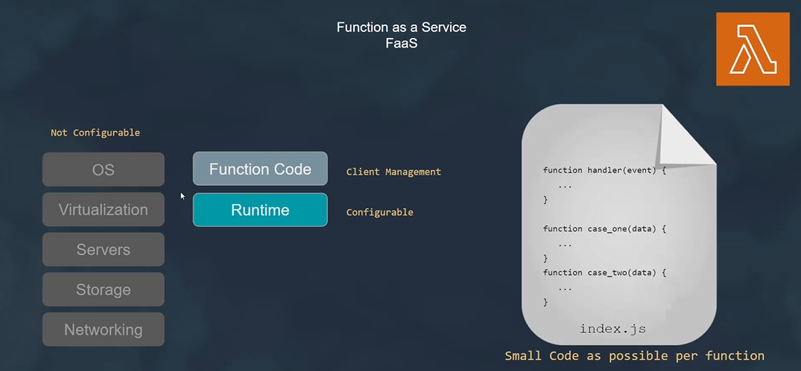

# AWS Lambda

AWS Lambda is a serverless compute service provided by AWS that lets you run code without provisioning or managing servers. It automatically scales and manages the infrastructure needed to run your code in response to incoming requests or events.

## Key Features

- **Serverless Computing**: Lambda abstracts the underlying infrastructure, allowing you to focus on writing code without worrying about server management, scaling, or maintenance.
- **Event-Driven**: Lambda functions are triggered in response to various events, such as HTTP requests, S3 object uploads, DynamoDB updates, SNS notifications, and more.
- **Flexible Programming Languages**: Lambda supports multiple programming languages, including Node.js, Python, Java, C#, Go, and Ruby, enabling you to write functions in the language of your choice.
- **Automatic Scaling**: Lambda automatically scales your functions in response to incoming requests or events, ensuring high availability and optimal performance without the need for manual intervention.
- **Pay-Per-Use Pricing**: With Lambda, you only pay for the compute time consumed by your functions, measured in milliseconds, and the number of requests processed, making it cost-effective for both low and high traffic applications.

## Use Cases

- **Web Applications**: Lambda is commonly used for building serverless web applications, where functions handle HTTP requests from clients and interact with other AWS services to perform tasks such as data processing, authentication, and database operations.
- **Real-Time Data Processing**: Lambda functions can be triggered by streaming data sources such as Amazon Kinesis or Amazon DynamoDB Streams, allowing you to process and analyze data in real-time for use cases such as IoT data ingestion, analytics, and monitoring.
- **Automated Workflows**: Lambda functions can be integrated with other AWS services such as Amazon S3, Amazon SQS, and AWS Step Functions to automate workflows, perform batch processing, and orchestrate complex tasks without managing servers or infrastructure.
- **Event-Driven Architecture**: Lambda functions are ideal for event-driven architectures, where functions are triggered by events from various sources to perform specific tasks, such as processing notifications, handling user authentication, and executing business logic.

## Conclusion

AWS Lambda is a powerful serverless compute service that enables you to build scalable, cost-effective, and event-driven applications without the overhead of managing servers or infrastructure. With support for multiple programming languages and seamless integration with other AWS services, Lambda provides a flexible and efficient platform for building a wide range of applications and use cases.

For more information on AWS Lambda and how to get started, refer to the [AWS Lambda documentation](https://docs.aws.amazon.com/lambda/latest/dg/welcome.html).

# Function as a Service (FaaS)

Function as a Service (FaaS) is a cloud computing model that enables developers to deploy individual functions or pieces of code in the cloud without managing the underlying infrastructure. FaaS platforms, such as AWS Lambda, Azure Functions, and Google Cloud Functions, automatically handle server provisioning, scaling, and execution of functions in response to events or triggers.

## Key Features

- **Serverless Computing**: FaaS abstracts the underlying infrastructure, allowing developers to focus on writing and deploying code without managing servers.
- **Event-Driven**: Functions in FaaS platforms are triggered by events or triggers, such as HTTP requests, database changes, file uploads, or timer-based events.
- **Automatic Scaling**: FaaS platforms automatically scale functions in response to changes in workload, ensuring optimal performance and cost-efficiency.
- **Pay-Per-Use Pricing**: With FaaS, you only pay for the compute time consumed by your functions, measured in milliseconds, and the number of invocations, making it cost-effective for both low and high traffic applications.
- **Support for Multiple Programming Languages**: FaaS platforms support multiple programming languages, allowing developers to write functions in their preferred language, such as JavaScript, Python, Java, C#, Go, and more.

## Use Cases

- **Web Applications**: FaaS is commonly used for building serverless web applications, where functions handle HTTP requests from clients and interact with other cloud services to perform tasks such as data processing, authentication, and database operations.
- **Real-Time Data Processing**: FaaS platforms can be used for real-time data processing tasks, such as stream processing, event-driven architectures, and IoT data ingestion, where functions are triggered by streaming data sources or events.
- **Automated Workflows**: FaaS functions can be integrated with other cloud services to automate workflows, perform batch processing, and orchestrate complex tasks without managing servers or infrastructure.
- **Microservices Architecture**: FaaS is well-suited for building microservices-based architectures, where each function represents a discrete unit of functionality that can be independently deployed, scaled, and managed.

## Conclusion

Function as a Service (FaaS) is a powerful cloud computing model that enables developers to build scalable, event-driven, and cost-effective applications without the overhead of managing servers or infrastructure. By leveraging FaaS platforms, developers can focus on writing code and delivering value to their customers, while the cloud provider takes care of the underlying infrastructure and scaling.

For more information on FaaS platforms and how to get started, refer to the documentation of the respective cloud providers, such as [AWS Lambda](https://docs.aws.amazon.com/lambda/latest/dg/welcome.html), [Azure Functions](https://docs.microsoft.com/en-us/azure/azure-functions/), and [Google Cloud Functions](https://cloud.google.com/functions/docs).

# Lambda Integrations with Other AWS Services

AWS Lambda seamlessly integrates with various AWS services, allowing you to build serverless applications that respond to events and triggers from different sources. Here are some key integrations:

## 1. Amazon S3

Lambda can be triggered by events such as object creation, deletion, or modification in Amazon S3 buckets. This integration enables you to process data stored in S3 buckets, perform transformations, generate thumbnails, or trigger downstream workflows based on S3 events.

## 2. Amazon DynamoDB

Lambda functions can be triggered by DynamoDB streams, capturing changes to DynamoDB tables in real-time. This integration enables you to process database events, perform data validation, update secondary indexes, or trigger notifications based on changes to DynamoDB data.

## 3. Amazon API Gateway

Lambda functions can be integrated with API Gateway to build serverless APIs. Lambda functions serve as the backend for API Gateway endpoints, enabling you to process HTTP requests, authenticate users, validate input, and execute business logic in response to API requests.

## 4. Amazon SNS

Lambda functions can subscribe to topics in Amazon Simple Notification Service (SNS) to process notifications sent to the topic. This integration enables you to trigger Lambda functions based on various events, such as application alerts, system notifications, or messaging events.

## 5. Amazon SQS

Lambda functions can be triggered by messages in Amazon Simple Queue Service (SQS) queues. This integration enables you to process messages asynchronously, decouple components of your application, handle background tasks, or scale processing based on the size of the message queue.

## 6. Amazon EventBridge

Lambda functions can be invoked by events from Amazon EventBridge (formerly CloudWatch Events), which provides a centralized event bus for managing events across AWS services. This integration enables you to build event-driven architectures, automate workflows, and respond to events from multiple sources.

## 7. Amazon Kinesis

Lambda functions can process streaming data from Amazon Kinesis streams or Amazon Kinesis Data Firehose. This integration enables you to analyze real-time data, perform stream processing, detect anomalies, and trigger actions based on streaming data events.

## 8. AWS Step Functions

Lambda functions can be orchestrated as tasks in AWS Step Functions state machines. This integration enables you to build complex workflows, coordinate multiple Lambda functions, handle error handling, and manage the flow of data between Lambda functions.

## Conclusion

AWS Lambda offers seamless integrations with various AWS services, enabling you to build event-driven, serverless applications that respond to events and triggers from different sources. By leveraging Lambda integrations, you can create powerful, scalable, and cost-effective solutions that meet your specific use cases and requirements.

For detailed information on Lambda integrations and how to configure them, refer to the [AWS Lambda documentation](https://docs.aws.amazon.com/lambda/latest/dg/welcome.html).

# Firecracker

Firecracker is an open-source virtualization technology developed by Amazon Web Services (AWS) that provides a lightweight and secure environment for running microVMs (micro virtual machines) in the cloud. It is specifically designed to improve resource utilization, increase security, and reduce startup time for serverless computing, containers, and other lightweight workloads.

## Key Features

- **Lightweight Virtualization**: Firecracker enables the creation and management of lightweight microVMs, which consume minimal resources and have fast startup times compared to traditional VMs.
- **Secure Isolation**: Firecracker provides strong isolation between microVMs using KVM (Kernel-based Virtual Machine) technology, ensuring that each microVM operates independently and securely.
- **Fast Boot Time**: Firecracker has a fast boot time, allowing microVMs to start quickly and efficiently in response to workload demands, making it suitable for serverless computing and other dynamic workloads.
- **Resource Efficiency**: Firecracker optimizes resource utilization by dynamically adjusting CPU and memory allocations based on workload requirements, ensuring efficient use of cloud resources.
- **API-driven Management**: Firecracker exposes a RESTful API for managing microVMs, enabling seamless integration with orchestration tools, container runtimes, and serverless platforms.

## Use Cases

- **Serverless Computing**: Firecracker is used to run serverless functions in a secure and isolated environment, providing a lightweight and fast execution environment for event-driven workloads.
- **Container Isolation**: Firecracker can be used to provide secure isolation for containers, allowing each container to run in its own microVM for enhanced security and performance.
- **Edge Computing**: Firecracker is suitable for edge computing scenarios where lightweight and fast VMs are required to process data and run applications at the edge of the network.
- **CI/CD Workflows**: Firecracker can be used to create ephemeral test environments for continuous integration and continuous deployment (CI/CD) workflows, allowing developers to quickly spin up and tear down test environments.

## Conclusion

Firecracker is an innovative virtualization technology that provides lightweight, secure, and fast microVMs for serverless computing, containers, and other lightweight workloads. With its lightweight design, secure isolation, fast boot time, and resource efficiency, Firecracker is well-suited for modern cloud-native applications and dynamic workloads running in the cloud.

For more information on Firecracker and how to get started, refer to the [Firecracker documentation](https://firecracker-microvm.github.io/).

# AWS Lambda Pricing

AWS Lambda pricing is based on two main factors: the number of requests processed by your functions and the duration of the execution time for each function invocation.

## 1. Request Pricing

- **First 1 million requests per month**: Free
- **$0.20 per 1 million requests thereafter**

Requests are counted each time your function is invoked, including retries on asynchronous invocations.

## 2. Duration Pricing

- **Duration is calculated from the time your code begins executing until it returns or otherwise terminates**, rounded up to the nearest 100ms.
- **Billed in increments of 100ms**.
- **Charged based on the amount of memory allocated to your function**.

### Memory Pricing

- **Memory allocation**: You choose the amount of memory allocated to your function (in increments of 64MB), ranging from 128MB to 10,240MB (10GB).
- **Price per GB-second**: $0.00001667 per GB-second.
- **Minimum execution time**: 100ms.

### Example:

- If your function runs for 500ms and is allocated 1GB of memory, the total duration is 500ms (rounded up to the nearest 100ms).
- The price for this execution would be calculated as follows:
  - Duration (in seconds): 500ms / 1000ms = 0.5 seconds
  - Memory allocation (in GB): 1GB
  - Price per GB-second: $0.00001667
  - Total price: 0.5 seconds * 1GB * $0.00001667 = $0.000008335

## Conclusion

AWS Lambda offers a pay-per-use pricing model, where you only pay for the compute time and resources consumed by your functions. By leveraging Lambda, you can build scalable, event-driven applications without the overhead of managing servers or infrastructure.

For more detailed information on AWS Lambda pricing, including pricing calculators and examples, refer to the [AWS Lambda Pricing](https://aws.amazon.com/lambda/pricing/) page.

[Back to main](readme.md)
