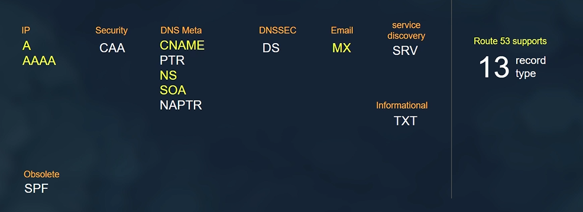

# Amazon Route 53

Amazon Route 53 is a scalable and highly available Domain Name System (DNS) web service provided by AWS. It is designed to route end users to internet applications by translating human-readable domain names (e.g., www.example.com) into the numeric IP addresses (e.g., 192.0.2.1) required for internet communication. Here's an overview of Amazon Route 53:

## Key Features

- **DNS Management**: Route 53 provides a comprehensive set of DNS management features, including domain registration, DNS routing, health checks, and traffic management.
- **Scalability and Availability**: Route 53 is designed to be highly scalable and available, with a global network of DNS servers distributed across multiple AWS regions for low-latency and high-performance DNS resolution.
- **Health Checks and Failover**: Route 53 enables you to monitor the health and availability of your internet resources using health checks, and automatically route traffic away from unhealthy resources to healthy ones using failover configurations.
- **Traffic Management**: Route 53 offers traffic management features such as weighted routing, latency-based routing, geolocation routing, and multivalue answer routing to distribute traffic across multiple endpoints based on various criteria.
- **Integration with AWS Services**: Route 53 integrates seamlessly with other AWS services such as Amazon S3, Amazon EC2, Elastic Load Balancing (ELB), and AWS Global Accelerator, allowing you to easily route traffic to AWS resources.

## Use Cases

- **Domain Registration**: Route 53 allows you to register and manage domain names, providing a seamless experience for managing domain registration and DNS configuration in the AWS Management Console.
- **Website Hosting**: Route 53 can be used to host static websites by configuring DNS records to point to Amazon S3 buckets or Amazon CloudFront distributions.
- **Load Balancing and Failover**: Route 53 is commonly used for load balancing and failover scenarios, ensuring high availability and fault tolerance for internet-facing applications by distributing traffic across multiple endpoints and automatically routing traffic away from unhealthy resources.
- **Traffic Routing**: Route 53's traffic management features are used to implement advanced traffic routing strategies such as A/B testing, blue-green deployments, and canary releases by distributing traffic based on geographic location, latency, or other criteria.

## Best Practices

- **Use Alias Records**: When configuring DNS records for AWS resources such as ELB load balancers, CloudFront distributions, or S3 buckets, use Route 53 alias records instead of traditional DNS records for seamless integration and better performance.
- **Enable Health Checks**: Configure health checks for your internet resources to monitor their availability and health status, and use failover configurations to automatically route traffic away from unhealthy resources.
- **Implement DNS Security**: Enable DNSSEC (DNS Security Extensions) for your domain to provide additional security and prevent DNS spoofing and cache poisoning attacks.
- **Monitor DNS Traffic**: Use Route 53's DNS query logs and CloudWatch metrics to monitor DNS traffic and performance, identify issues, and optimize DNS configurations for better reliability and performance.

## Conclusion

Amazon Route 53 is a scalable and highly available Domain Name System (DNS) web service provided by AWS. With its comprehensive set of DNS management features, scalability, and integration with other AWS services, Route 53 is an essential component for managing domain registration, DNS routing, and traffic management for internet-facing applications in AWS.

For more information, refer to the [AWS documentation on Amazon Route 53](https://docs.aws.amazon.com/Route53/latest/DeveloperGuide/Welcome.html).

# Hosted Zones in Amazon Route 53

A hosted zone is a container for records in Amazon Route 53. It's where you define DNS records for your domain, such as resource record sets that route traffic for your domain. Each hosted zone corresponds to a domain name that you have registered. Here's an overview of hosted zones in Amazon Route 53:

## Key Features

- **DNS Records**: Hosted zones allow you to define various types of DNS records, including A records, CNAME records, MX records, TXT records, and more, to specify how traffic is routed for your domain.
- **Alias Records**: Route 53 supports alias records, which are used to map resource record sets in your hosted zone to AWS resources such as Elastic Load Balancers, Amazon CloudFront distributions, Amazon S3 buckets configured as websites, and other AWS resources.
- **Subdomains**: Hosted zones support subdomains, allowing you to create separate DNS configurations for different subdomains of your domain.
- **Traffic Management**: You can use Route 53's traffic management features such as weighted routing, latency-based routing, geolocation routing, and failover routing within a hosted zone to distribute traffic across multiple endpoints.

## Use Cases

- **Domain Management**: Hosted zones are used for managing DNS configurations for domain names registered with Route 53 or transferred to Route 53 from another registrar.
- **Website Hosting**: You can create hosted zones to configure DNS records for hosting static websites, serving content from Amazon S3 buckets or Amazon CloudFront distributions.
- **Application Hosting**: Hosted zones are used to define DNS records for applications hosted on AWS, including load balancers, EC2 instances, and other AWS services.
- **Email Routing**: You can configure MX (Mail Exchange) records in hosted zones to route email traffic for your domain to specific email servers.

## Best Practices

- **Organize Records**: Organize DNS records in hosted zones logically, grouping related records together for better management and troubleshooting.
- **Use Alias Records**: Whenever possible, use Route 53 alias records instead of traditional DNS records for better integration with AWS services and improved performance.
- **Regularly Review and Update**: Regularly review and update DNS records in hosted zones to ensure they accurately reflect the current configuration of your domain and applications.
- **Monitor Health**: Monitor the health of DNS records using Route 53 health checks and DNS query logs to identify issues and ensure reliable DNS resolution.

## Conclusion

Hosted zones in Amazon Route 53 provide a flexible and scalable way to manage DNS configurations for your domain names. By defining DNS records in hosted zones, you can control how traffic is routed for your domain and leverage Route 53's traffic management features for improved reliability and performance.

For more information, refer to the [AWS documentation on Hosted Zones in Route 53](https://docs.aws.amazon.com/Route53/latest/DeveloperGuide/hosted-zones-working-with.html).

# Types of DNS Records in Amazon Route 53

Amazon Route 53 supports various types of DNS records, each serving a specific purpose in directing traffic and resolving domain names to IP addresses. Understanding the different types of DNS records and when to use them is essential for configuring DNS settings in Route 53 effectively. Here are the common types of DNS records and their use cases:



## A (Address) Record

- **Use Case**: Maps a domain name to an IPv4 address.
- **Example**: Used to point a domain (e.g., www.example.com) to the IP address of a web server or EC2 instance.

## AAAA (IPv6 Address) Record

- **Use Case**: Maps a domain name to an IPv6 address.
- **Example**: Used to support IPv6 connectivity for a domain.

## CNAME (Canonical Name) Record

- **Use Case**: Creates an alias for a domain name (canonical name) to another domain name.
- **Example**: Used to redirect one domain to another (e.g., `blog.example.com` to `www.example.com`). it cannot be used to alias the top domain `example.com`

## MX (Mail Exchange) Record

- **Use Case**: Specifies mail servers responsible for receiving email on behalf of a domain.
- **Example**: Used to route email traffic to specific mail servers (e.g., mail.example.com).

## TXT (Text) Record

- **Use Case**: Stores arbitrary text data associated with a domain.
- **Example**: Used for various purposes such as SPF records for email authentication, DKIM records for email validation, and verification records for domain ownership.

## SRV (Service) Record

- **Use Case**: Specifies information about available services within a domain.
- **Example**: Used for service discovery and configuration, such as locating SIP, LDAP, or XMPP servers.

## NS (Name Server) Record

- **Use Case**: Specifies authoritative DNS servers for a domain.
- **Example**: Used to delegate DNS resolution to specific name servers (e.g., ns1.example.com, ns2.example.com).

## PTR (Pointer) Record

- **Use Case**: Used in reverse DNS lookups to map an IP address to a domain name.
- **Example**: Used by mail servers to verify the identity of the sending server in email headers.

## SOA (Start of Authority) Record

- **Use Case**: Specifies authoritative information about a DNS zone, including the primary name server, administrator email address, and other zone parameters.
- **Example**: Essential for defining the properties of a DNS zone and managing its configuration.

## SPF (Sender Policy Framework) Record

- **Use Case**: Specifies authorized mail servers for sending email on behalf of a domain.
- **Example**: Used to prevent email spoofing and unauthorized use of a domain in email headers.

## CAA (Certification Authority Authorization) Record

- **Use Case**: Specifies which certificate authorities (CAs) are allowed to issue SSL/TLS certificates for a domain.
- **Example**: Used to control the issuance of SSL/TLS certificates and improve security by restricting certificate authorities.

## DNSSEC (DNS Security Extensions) Records

- **Use Case**: Provides cryptographic authentication and integrity verification for DNS data.
- **Example**: Used to prevent DNS spoofing and ensure the authenticity of DNS responses.

## Forwarding Record (Route 53 Specific)

- **Use Case**: Redirects DNS queries for a domain to another domain or URL.
- **Example**: Used for domain forwarding or URL redirection.

## Alias Record (Route 53 Specific)

- **Use Case**: Maps a domain name to an AWS resource such as an ELB load balancer, CloudFront distribution, or S3 bucket.
- **Example**: Used to point a domain to an AWS resource without requiring an IP address.

## Traffic Policy Record (Route 53 Specific)

- **Use Case**: Defines traffic management policies for DNS queries, including weighted routing, latency-based routing, geolocation routing, and failover routing.
- **Example**: Used to control how traffic is distributed across multiple endpoints based on specified routing policies.

## Conclusion

Understanding the different types of DNS records and their use cases is essential for configuring DNS settings effectively in Amazon Route 53. By leveraging the appropriate DNS record types, you can control how traffic is routed, manage email services, implement security measures, and optimize DNS resolution for your domain.

For more information on DNS record types in Amazon Route 53, refer to the [AWS documentation](https://docs.aws.amazon.com/Route53/latest/DeveloperGuide/welcome-dns-service.html).

# Create Public DNS record for EC2 – from CLI
```bash
#!/bin/bash

region="eu-north-1"
dns_name="example.com"

create_hosted_zone()
{
    check_zone=$(aws route53 list-hosted-zones-by-name --dns-name $dns_name | grep -oP '(?<="Id": ")[^"]*' | uniq)
    if [ "$check_zone" == "" ]; then
        
        echo "Hosted Zone will be created ..."
        time=$(date -u +"%Y-%m-%d-%H-%M-%S")
        hosted_zone_id=$(aws route53 create-hosted-zone --name $dns_name --caller-reference $time | grep -oP '(?<="Id": ")[^"]*')
        
        if [ "$hosted_zone_id" == "" ]; then
            echo "Error in create Hosted Zone"
            exit 1
        fi
        echo "Hosted Zone created."

    else
        echo "Hosted Zone already exist."
        hosted_zone_id=$check_zone
    fi
}

get_instance_ip()
{
    # $1 ec2 Name
    ec2_ip=$(aws ec2 describe-instances --region $region --filters Name=tag:Name,Values=$1 | grep -oP '(?<="PublicIpAddress": ")[^"]*' )
    if [ "$ec2_ip" == "" ]; then
        echo "EC2 with name: '$1' not exist."
        exit 1
    else
        echo "EC2 found. public ip: $ec2_ip"
    fi
}

create_dns_record()
{
    # $1 sub domain, $2 ip
    full_sub_domain="$1.$dns_name"
    change=$(cat << EOF
{
  "Changes": 
  [
    {
      "Action": "CREATE",
      "ResourceRecordSet": 
      {
        "Name": "$full_sub_domain",
        "Type": "A",
        "TTL": 300,
        "ResourceRecords": 
        [
          {
            "Value": "$2"
          }
        ]
      }
    }
  ]
}
EOF
)

    check_record=$(aws route53 list-resource-record-sets --hosted-zone-id $hosted_zone_id --query "ResourceRecordSets[?Name == '$full_sub_domain.']" | grep -oP '(?<="Name": ")[^"]*')
    if [ "$check_record" == "" ]; then
        
        echo "DNS Record will be created ..."
        record_id=$(aws route53 change-resource-record-sets --hosted-zone-id $hosted_zone_id --change-batch $change | grep -oP '(?<="Id": ")[^"]*')
        
        if [ "$record_id" == "" ]; then
            echo "Error in create DNS Record"
            exit 1
        fi
        echo "DNS Record created."

    else
        echo "DNS Record already exist."
    fi
}


create_hosted_zone
get_instance_ip "devops90"
create_dns_record "jump" $ip

```

# Create Private Domain and Private DNS record for EC2 – from CLI
```bash
#!/bin/bash

region="eu-north-1"
dns_name="devops90.com"
private_dns_name="ourapp.prod"
vpc_name="devops90-vpc"

create_hosted_zone()
{
    check_zone=$(aws route53 list-hosted-zones-by-name --query "HostedZones[?Name == '$dns_name.']" | grep -oP '(?<="Id": ")[^"]*')

    if [ "$check_zone" == "" ]; then
        echo "Hosted Zone will be created ..."
        time=$(date -u +"%Y-%m-%d-%H-%M-%S")
        hosted_zone_id=$(aws route53 create-hosted-zone --name $dns_name --caller-reference $time  --query HostedZone | grep -oP '(?<="Id": ")[^"]*')
        if [ "$hosted_zone_id" == "" ]; then
            echo "Error in create Hosted Zone"
            exit 1
        fi
        echo "Hosted Zone created: $hosted_zone_id"
    else
        echo "Hosted Zone already exist: $check_zone"
        hosted_zone_id=$check_zone
    fi

    echo $hosted_zone_id

}

get_vpc_id()
{
    VPCID=$(aws ec2 describe-vpcs --region $region --filters Name=tag:Name,Values=$vpc_name | grep -oP '(?<="VpcId": ")[^"]*')
    if [ "$VPCID" == "" ]; then
        echo "VPC with name: $vpc_name doesn't exist"
        exit 1
    else
        echo "VPC found: $VPCID"
    fi
}

create_private_zone()
{
    check_zone=$(aws route53 list-hosted-zones-by-name --query "HostedZones[?Name == '$private_dns_name.']" | grep -oP '(?<="Id": ")[^"]*')
    if [ "$check_zone" == "" ]; then
        
        echo "Hosted Zone will be created ..."
        time=$(date -u +"%Y-%m-%d-%H-%M-%S")
        hosted_zone_id=$(aws route53 create-hosted-zone --hosted-zone-config \{\"PrivateZone\":true\} --vpc \{\"VPCRegion\":\"$region\",\"VPCId\":\"$VPCID\"\} --name $private_dns_name --caller-reference $time --query HostedZone | grep -oP '(?<="Id": ")[^"]*')
        
        if [ "$hosted_zone_id" == "" ]; then
            echo "Error in create Hosted Zone"
            exit 1
        fi
        echo "Hosted Zone created."

    else
        echo "Hosted Zone already exist."
        hosted_zone_id=$check_zone
    fi
}

get_instance_ip()
{
    # $1 ec2 Name, $2 Private or Public
    ec2_ip=$(aws ec2 describe-instances --region $region --filters Name=tag:Name,Values=$1 Name=instance-state-name,Values=running | grep -oP "(?<=\"$2IpAddress\": \")[^\"]*" | uniq)
    if [ "$ec2_ip" == "" ]; then
        echo "EC2 with name: '$1' not exist."
        exit 1
    else
        echo "EC2 found. public ip: $ec2_ip"
    fi

}

create_dns_record()
{
    # $1 sub domain, $2 ip, $3 Private or Public
    if [ "$3" == "Private" ]; then
        full_sub_domain="$1.$private_dns_name"
    else
        full_sub_domain="$1.$dns_name"
    fi
    
    change=$(cat << EOF
{
  "Changes": 
  [
    {
      "Action": "CREATE",
      "ResourceRecordSet": 
      {
        "Name": "$full_sub_domain",
        "Type": "A",
        "TTL": 300,
        "ResourceRecords": 
        [
          {
            "Value": "$2"
          }
        ]
      }
    }
  ]
}
EOF
)
    change=$( echo $change | tr -d '\n' | tr -d ' ')
    
    check_record=$(aws route53 list-resource-record-sets --hosted-zone-id $hosted_zone_id --query "ResourceRecordSets[?Name == '$full_sub_domain.']" | grep -oP '(?<="Name": ")[^"]*')
    if [ "$check_record" == "" ]; then
        echo "DNS Record will be created ..."
        change_info=$(aws route53 change-resource-record-sets --hosted-zone-id $hosted_zone_id --change-batch $change)
        echo $change_info
    else
        echo "DNS Record already exist."
    fi
}

get_vpc_id
create_private_zone
get_instance_ip "devops90" "Private"
create_dns_record srv $ec2_ip "Private"


```

# Routing Policies in Amazon Route 53

Amazon Route 53 offers several routing policies that you can use to control how traffic is distributed to your resources. Each routing policy serves different use cases and provides flexibility in managing your DNS configurations. Here are the routing policies available in Route 53:

## 1. Simple Routing Policy

- **Description**: Directs traffic to a single resource, such as an IP address or an AWS resource like an EC2 instance.
- **Use Case**: Suitable for scenarios where you have a single resource that handles all incoming traffic.

## 2. Weighted Routing Policy

- **Description**: Distributes traffic across multiple resources based on the assigned weights.
- **Use Case**: Used for load balancing traffic across resources with different capacities or for A/B testing scenarios.

## 3. Latency-Based Routing Policy

- **Description**: Routes traffic to the AWS region that provides the lowest latency for the end user.
- **Use Case**: Ideal for applications where latency is critical, ensuring users are directed to the nearest data center.

## 4. Failover Routing Policy

- **Description**: Routes traffic to a standby resource in case the primary resource becomes unavailable.
- **Use Case**: Used for implementing high availability and disaster recovery scenarios.

## 5. Geolocation Routing Policy

- **Description**: Directs traffic to different resources based on the geographic location of the end user.
- **Use Case**: Suitable for serving localized content or complying with regional regulations.

## 6. Geoproximity Routing Policy

- **Description**: Routes traffic based on the geographic location of the end user and the health of your resources.
- **Use Case**: Ideal for distributing traffic to resources based on proximity and health considerations.

## 7. Multivalue Answer Routing Policy

- **Description**: Returns multiple values in response to DNS queries, effectively providing simple load balancing across resources.
- **Use Case**: Used when you want to distribute traffic across multiple healthy resources without the need for advanced routing logic.

## 8. IP-based

- **Description**: Routes traffic based on CIDR.
- **Use Case**: Route traffic from a CIDR to IP.


## Conclusion

Understanding the different routing policies available in Amazon Route 53 allows you to choose the appropriate policy based on your application's requirements. By leveraging these routing policies, you can optimize traffic distribution, improve performance, and enhance the availability of your applications.

For more information on routing policies in Amazon Route 53, refer to the [AWS documentation](https://docs.aws.amazon.com/Route53/latest/DeveloperGuide/routing-policy.html).


[Back to Main](readme.md)
