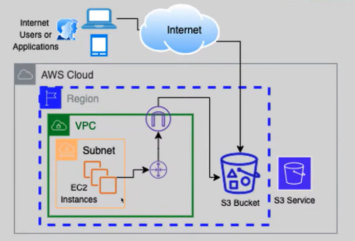

# Amazon S3 (Simple Storage Service)

Amazon S3 (Simple Storage Service) is a scalable object storage service offered by AWS that allows you to store and retrieve data from anywhere on the web. It is designed to provide high durability, availability, and scalability for storing a wide variety of data, including images, videos, documents, backups, and logs.





## Key Concepts:
1. **Buckets:** A bucket is a container for objects stored in Amazon S3. You can create multiple buckets to organize and manage your data.
2. **Objects:** Objects are the fundamental entities stored in Amazon S3. An object can be any file or data, along with metadata, stored as a key-value pair.
3. **Regions:** Amazon S3 is globally distributed across multiple geographical regions. You can choose the region where you want to create your buckets to optimize latency and compliance requirements.
4. **Storage Classes:** Amazon S3 offers different storage classes, including Standard, Standard-IA (Infrequent Access), One Zone-IA, Intelligent-Tiering, Glacier, and Glacier Deep Archive, each designed for specific use cases based on data access frequency and durability requirements.
5. **Lifecycle Policies:** You can define lifecycle policies to automatically transition objects between different storage classes or delete them after a specified period.

## Features:
- **Durability and Availability:** Amazon S3 is designed to provide 99.999999999% (11 nines) durability and 99.99% availability for your data.
- **Scalability:** S3 can scale to accommodate any amount of data, from a few gigabytes to petabytes or more, without any upfront provisioning.
- **Security:** S3 offers various security features, including encryption at rest and in transit, access control via IAM policies and bucket policies, and integration with AWS Key Management Service (KMS) for managing encryption keys.
- **Versioning:** You can enable versioning on your S3 buckets to preserve, retrieve, and restore every version of every object stored in the bucket. and it will be enabled if you allow object lock and also in cross-region or same region replication.
- **Cross-Region Replication:** You can replicate objects across different AWS regions for disaster recovery, compliance, and low-latency access.
- **Event Notifications:** S3 supports event notifications that can trigger AWS Lambda functions, SNS topics, or SQS queues in response to object creation, deletion, or restore events.

## Use Cases:
- **Static Website Hosting:** Amazon S3 can host static websites by serving HTML, CSS, JavaScript, and other web assets directly from buckets.
- **Data Backup and Archiving:** S3 is commonly used for data backup and long-term archival storage due to its durability and cost-effectiveness.
- **Content Distribution:** S3 integrates with Amazon CloudFront, AWS's content delivery network (CDN), to distribute content globally with low latency and high transfer speeds.
- **Data Lakes:** S3 serves as a foundational component for building data lakes, allowing organizations to store and analyze large volumes of structured and unstructured data at scale.

# Steps to Create a Bucket in Amazon S3

1. **Sign in to the AWS Management Console:**
   Open a web browser and navigate to the [AWS Management Console](https://aws.amazon.com/console/). Sign in to your AWS account using your credentials.

2. **Navigate to Amazon S3:**
   Once logged in, search for "S3" in the AWS Management Console search bar, and click on the "Amazon S3" service in the search results. Alternatively, you can find Amazon S3 under the "Storage" category in the AWS Management Console.

3. **Create a New Bucket:**
   - Click on the "Create bucket" button to start the bucket creation process.
   - Enter a unique name for your bucket in the "Bucket name" field. Bucket names must be globally unique across all existing bucket names in Amazon S3.
   - Choose the AWS region where you want to create the bucket. Select the region closest to your users to minimize latency.
   - Click on the "Create" button to create the bucket.

4. **Configure Bucket Properties (Optional):**
   - After creating the bucket, you can configure optional properties such as versioning, server access logging, default encryption, and tags. These configurations can be adjusted later if needed.

5. **Set Bucket Permissions (Optional):**
   - By default, newly created buckets are private and can only be accessed by the bucket owner. If you want to grant public access or specific permissions to other AWS accounts or IAM users, you can configure bucket policies and access control lists (ACLs) in the "Permissions" tab.

6. **Confirmation:**
   - Once you have configured the bucket properties and permissions, click on the "Create bucket" button to confirm and create the bucket.
   - You will see a confirmation message indicating that the bucket has been successfully created.

7. **Access Your Bucket:**
   - After the bucket is created, you can start uploading objects (files) to the bucket using the Amazon S3 console, AWS CLI, SDKs, or third-party tools.

8. **Explore Additional Features:**
   - Explore additional features of Amazon S3 such as lifecycle policies, cross-region replication, event notifications, and object metadata to further customize and manage your bucket and its contents.

# Create Bucket, Set Public Access Block, and Upload File Using AWS CLI

## Create Bucket:
```bash
aws s3api create-bucket --bucket my-example-bucket --region us-west-2
```
## Set Public Access Block:
```bash
aws s3api put-public-access-block --bucket my-example-bucket --public-access-block-configuration "BlockPublicAcls=true,IgnorePublicAcls=true,BlockPublicPolicy=true,RestrictPublicBuckets=true"
```
## Upload file:
```bash
aws s3api put-object --bucket my-example-bucket --content-type image/jpeg --key myImage.jpg --body /mnt/c/aws/myImage.jpg
```
## Allow Public Read
```bash
aws s3api delete-public-access-block --bucket my-example-bucket

aws s3api put-object-acl --bucket my-example-bucket --key myImage.jpg --acl public-read
```
## Delete File
```bash
aws s3api delete-object --bucket my-example-bucket --key myImage.jpg
```
## Delete Bucket
```bash
aws s3api delete-bucket --bucket my-example-bucket --region us-west-2
```

# Security and Permissions on an Amazon S3 Bucket

Amazon S3 provides several mechanisms to control access to your buckets and objects, ensuring that only authorized users or applications can interact with your data. Here are some key aspects of security and permissions in Amazon S3:

## Bucket Policies:
- **Bucket-Level Access Control:** You can define bucket policies to control access to the entire bucket based on various conditions, including IP address, VPC endpoint, AWS account, or IAM identity.
- **JSON-based Policies:** Bucket policies are JSON documents that specify who can access the bucket and what actions they can perform. Policies can be attached to individual buckets to define granular access controls.
- **Cross-Account Access:** Bucket policies can grant access to resources in other AWS accounts, enabling cross-account sharing of objects.
- **Evaluation:** Bucket policies are evaluated before any other access control mechanisms, such as IAM policies or ACLs. They provide a centralized way to manage access control for all objects within the bucket.
- **Example:**
```json
{
    "Version": "2012-10-17",
    "Id": "ExamplePolicy01",
    "Statement": [
        {
            "Sid": "ExampleStatement01",
            "Effect": "Allow",
            "Principal": {
                "AWS": "arn:aws:iam::123456789012:user/Dave"
            },
            "Action": [
                "s3:GetObject",
                "s3:GetBucketLocation",
                "s3:ListBucket"
            ],
            "Resource": [
                "arn:aws:s3:::awsexamplebucket1/*",
                "arn:aws:s3:::awsexamplebucket1"
            ]
        }
    ]
}

//cli

aws s3api put-bucket-policy --bucket my-example-bucket --policy file://policy.json
```

## Access Control Lists (ACLs):
- **Object-Level Access Control:** ACLs are another way to control access to individual objects within a bucket. ACLs can grant read, write, and delete permissions to specific AWS accounts or predefined groups.
- **Fine-Grained Control:** ACLs allow you to specify permissions for individual AWS accounts, predefined groups (e.g., authenticated users, all users), or specific email addresses.

## IAM Policies:
- **User-Level Access Control:** IAM (Identity and Access Management) policies are used to manage access permissions for IAM users and roles. IAM policies can grant access to specific S3 buckets and objects based on various conditions and actions.
- **Granular Permissions:** IAM policies support granular permissions, allowing you to specify which API actions (e.g., s3:GetObject, s3:PutObject) are allowed or denied for specific resources.
- **Temporary Access:** IAM roles can be used to grant temporary access to S3 resources for applications running on EC2 instances, Lambda functions, or other AWS services.

## Pre-Signed URLs:
- **Temporary Access Links:** Pre-signed URLs allow you to generate temporary URLs that grant access to specific objects in your bucket for a limited time period. Pre-signed URLs are often used for providing temporary access to private objects without requiring AWS credentials.

## Default Encryption:
- **Data Encryption:** Amazon S3 offers default encryption options to encrypt data at rest to protect against unauthorized access. You can enable default encryption for a bucket to automatically encrypt all objects stored in the bucket using server-side encryption (SSE) with Amazon S3-managed keys (SSE-S3) or customer-managed keys (SSE-C).

## Access Logging:
- **Audit Trail:** Amazon S3 provides access logging features that allow you to track requests made to your bucket and objects. Access logs capture details such as the requester's IP address, HTTP method, and response status, providing visibility into access patterns and potential security threats.

## Block Public Access:
- **Restrict Public Access:** Amazon S3 offers settings to block public access to your buckets and objects by default. You can enable block public access settings at the account level or individual bucket level to prevent accidental exposure of sensitive data to the public internet.

# S3 Object Lock in Amazon S3

S3 Object Lock is a feature in Amazon Simple Storage Service (S3) that allows you to apply a write-once-read-many (WORM) lock to objects stored in S3 buckets. This feature helps you enforce compliance requirements, prevent accidental deletion or modification of objects, and ensure data immutability for regulatory or business reasons.

## Features

### Write-Once-Read-Many (WORM)
- S3 Object Lock enables you to set a retention period during which an object remains immutable and cannot be deleted or modified.
- Once an object is locked, it cannot be overwritten, deleted, or modified until the retention period expires or is removed.

### Retention Period
- You can specify a retention period for objects using either a retention period or a legal hold.
- The retention period can be set for a specific duration, such as days, months, or years, or indefinitely until explicitly removed.

### Legal Hold
- In addition to retention periods, S3 Object Lock supports legal holds, which prevent deletion or modification of objects until the legal hold is removed.
- Legal holds are typically used for objects involved in legal or regulatory investigations, ensuring data integrity during litigation or audits.

## Purpose

### Compliance Requirements
- S3 Object Lock helps organizations meet compliance requirements, such as SEC Rule 17a-4(f), FINRA Rule 4511, GDPR, HIPAA, or other regulatory standards that mandate data immutability and retention.

### Data Protection
- By applying retention periods or legal holds to objects, S3 Object Lock protects critical data from accidental deletion, modification, or tampering, ensuring data integrity and security.

## Use Cases

### Financial Services
- Financial institutions can use S3 Object Lock to ensure compliance with regulatory requirements, such as recordkeeping regulations, by retaining financial records and transaction data immutable for specified retention periods.

### Healthcare
- Healthcare organizations can leverage S3 Object Lock to protect patient records, medical imaging data, and other sensitive healthcare information, ensuring data integrity and compliance with HIPAA regulations.

### Legal and Compliance
- Legal and compliance teams can apply legal holds to objects involved in legal proceedings, audits, or investigations, ensuring data preservation and integrity during litigation or regulatory inquiries.

### Digital Preservation
- Organizations involved in digital preservation initiatives can use S3 Object Lock to safeguard historical documents, cultural artifacts, or digital assets from alteration or deletion, ensuring long-term data preservation.

## Considerations

### Costs
- S3 Object Lock may incur additional costs, such as storage fees for locked objects or data transfer fees associated with legal hold notifications or retention period changes.

### Configuration
- Proper configuration and management of S3 Object Lock settings, including retention periods and legal holds, are essential to ensure compliance and data protection.

## Conclusion

S3 Object Lock in Amazon S3 is a powerful feature that enables organizations to enforce data immutability and retention requirements for regulatory compliance, data protection, and digital preservation initiatives. By applying retention periods or legal holds to objects, S3 Object Lock helps safeguard critical data from accidental deletion or modification, ensuring data integrity and compliance with regulatory standards.

For more information on S3 Object Lock in Amazon S3, refer to the [AWS Documentation](https://docs.aws.amazon.com/AmazonS3/latest/userguide/object-lock.html).


# Vault Lock in Amazon Glacier and Amazon S3 Glacier

Vault Lock is a feature in Amazon Glacier and Amazon S3 Glacier (Glacier) that allows you to apply a vault lock policy to a vault, which enforces compliance controls for the vault's archival data. This feature helps you meet regulatory and compliance requirements by preventing the deletion or modification of archived data for a specified retention period.

## Features

### Compliance Controls
- Vault Lock allows you to apply a vault lock policy to a vault, enforcing compliance controls for the archival data stored within the vault.
- The vault lock policy can specify a retention period during which data is immutable and cannot be deleted or modified.

### Write-Once-Read-Many (WORM)
- Similar to S3 Object Lock, Vault Lock enforces a write-once-read-many (WORM) model for archival data stored in Glacier vaults.
- Once a vault lock policy is applied, data within the vault remains immutable for the specified retention period.

### Legal Hold
- Vault Lock supports legal holds, which prevent deletion or modification of data until the legal hold is removed.
- Legal holds are typically used for data involved in legal or regulatory investigations, ensuring data integrity during litigation or audits.

## Purpose

### Compliance Requirements
- Vault Lock helps organizations meet regulatory and compliance requirements, such as SEC Rule 17a-4(f), FINRA Rule 4511, GDPR, HIPAA, or other standards that mandate data immutability and retention.

### Data Preservation
- By applying vault lock policies to Glacier vaults, organizations can protect critical data from accidental deletion, modification, or tampering, ensuring data integrity and compliance with regulatory standards.

## Use Cases

### Financial Services
- Financial institutions can use Vault Lock to ensure compliance with recordkeeping regulations by retaining financial records and transaction data immutable for specified retention periods.

### Healthcare
- Healthcare organizations can leverage Vault Lock to protect patient records, medical imaging data, and other sensitive healthcare information, ensuring data integrity and compliance with HIPAA regulations.

### Legal and Compliance
- Legal and compliance teams can apply legal holds to data stored in Glacier vaults, ensuring data preservation and integrity during litigation or regulatory inquiries.

## Considerations

### Costs
- Vault Lock may incur additional costs, such as storage fees for archived data or data transfer fees associated with legal hold notifications or retention period changes.

### Configuration
- Proper configuration and management of Vault Lock policies are essential to ensure compliance and data protection, including specifying appropriate retention periods and managing legal holds.

## Conclusion

Vault Lock in Amazon Glacier and Amazon S3 Glacier provides a powerful solution for enforcing compliance controls and ensuring data immutability for archival data. By applying vault lock policies to Glacier vaults, organizations can meet regulatory requirements, protect critical data, and preserve data integrity for long-term retention.

For more information on Vault Lock in Amazon Glacier and Amazon S3 Glacier, refer to the [AWS Documentation](https://docs.aws.amazon.com/amazonglacier/latest/dev/vault-lock.html).


# Amazon S3 Storage Classes by Category

Amazon S3 offers a variety of storage classes designed to meet different performance, durability, and cost requirements. These storage classes are categorized into three main categories: Standard, Infrequent Access, and Glacier.

## Standard Storage Classes:
- **S3 Standard**: The default storage class designed for frequently accessed data with high availability, durability, and low latency. Ideal for frequently accessed data such as active workloads, multimedia content, and data analytics. $0.023 GB/Month

- **S3 Intelligent-Tiering**: A storage class designed for data with unknown or changing access patterns. Automatically moves data between two access tiers: frequent access and infrequent access, optimizing costs based on access patterns. object monitoring cost $0.00025 per 1000 objects

## Infrequent Access Storage Classes:
- **S3 Standard-IA (Infrequent Access)**: Designed for data that is accessed less frequently but requires rapid access when needed. Offers the same availability and durability as S3 Standard but with lower storage costs and higher retrieval fees. $0.0125 GB/Month - min storage duration 30 days - >= 3 AZ - 99.9% - retrieval $0.01 GB

- **S3 One Zone-IA**: Similar to S3 Standard-IA but stores data in a single Availability Zone, offering lower storage costs than S3 Standard-IA but with slightly less durability.$0.01 GB/Month - min storage duration 30 days - 1 AZ - 99.5% - retrieval $0.01 GB

## Glacier Storage Classes:
- **Amazon S3 Glacier**: A low-cost storage class designed for long-term data archiving with retrieval times ranging from minutes to hours. Suitable for data archiving, compliance, and regulatory requirements where access times are less critical. $0.004 GB/Month - min storage duration 90 days - $0.03 GB retrieval - ms access time

- **Amazon S3 Glacier Flexible Retrieval**: A storage class designed to provide the flexibility to choose between three retrieval options: Expedited, Standard, and Bulk. Each retrieval option has different pricing and availability characteristics, allowing you to tailor retrieval times and costs based on your specific needs. $0.0036 GB/Month - min storage duration 90 days - $0.01 to $0.03 GB retrieval - minutes to hours access time

- **Amazon S3 Glacier Deep Archive**: The lowest-cost storage class designed for long-term data retention and archiving with retrieval times ranging from hours to days. Ideal for data that is accessed rarely and has strict compliance and regulatory requirements. $0.00099 GB/Month - min storage duration 180 days - $0.02 GB retrieval - hours access time

## Other Storage Classes:
- **S3 Outposts**: A storage class designed for data stored on AWS Outposts, offering the same features and performance as S3 Standard but within the customer's data center.

- **S3 Object Lock**: A feature that allows you to apply retention periods and legal holds to objects, ensuring they remain immutable and protected against deletion or modification for a specified duration.

These storage classes provide flexibility in managing data based on access patterns, performance requirements, and cost considerations, allowing you to optimize storage costs while meeting your specific needs.


# Amazon S3 Lifecycle Policies

Amazon S3 lifecycle policies allow you to define rules to automatically manage the lifecycle of your objects stored in S3 buckets. With lifecycle policies, you can define actions such as transitioning objects to different storage classes, deleting objects after a specified period, or archiving objects to Amazon S3 Glacier or Glacier Deep Archive.


## Benefits of S3 Lifecycle Policies:
- **Cost Optimization**: Automatically move objects to less expensive storage classes as they age or delete them when they're no longer needed to optimize storage costs.
- **Data Management**: Simplify data management by automatically managing the lifecycle of objects without manual intervention.
- **Compliance and Retention**: Ensure compliance with regulatory requirements by automatically archiving or deleting objects based on retention policies.

## Components of S3 Lifecycle Policies:
- **Rules**: Define rules to specify the conditions and actions for managing the lifecycle of objects.
- **Transitions**: Specify when to transition objects to a different storage class based on their age or other criteria.
- **Expiration**: Define expiration actions to automatically delete objects after a specified period.

## Example Lifecycle Policy:
```json
{
    "Rules": [
        {
            "ID": "MoveToGlacier",
            "Status": "Enabled",
            "Filter": {
                "Prefix": "logs/"
            },
            "Transitions": [
                {
                    "Days": 30,
                    "StorageClass": "GLACIER"
                },
                {
                    "Days": 365,
                    "StorageClass": "DEEP_ARCHIVE"
                }
            ],
            "Expiration": {
                "Days": 3650
            }
        }
    ]
}
```
## In this example:
- The rule with the ID "MoveToGlacier" is enabled and applies to objects with the prefix "logs/".
- Objects matching the filter are transitioned to the GLACIER storage class after 30 days and to the DEEP_ARCHIVE storage class after 365 days.
- Objects are automatically deleted after 3650 days (10 years)

## Notes:
- You can define multiple rules in a lifecycle policy to apply different lifecycle actions to different sets of objects.
- Lifecycle policies can be applied at the bucket level and are automatically applied to all objects within the bucket that match the rule criteria.

[Back to mian](readme.md)
