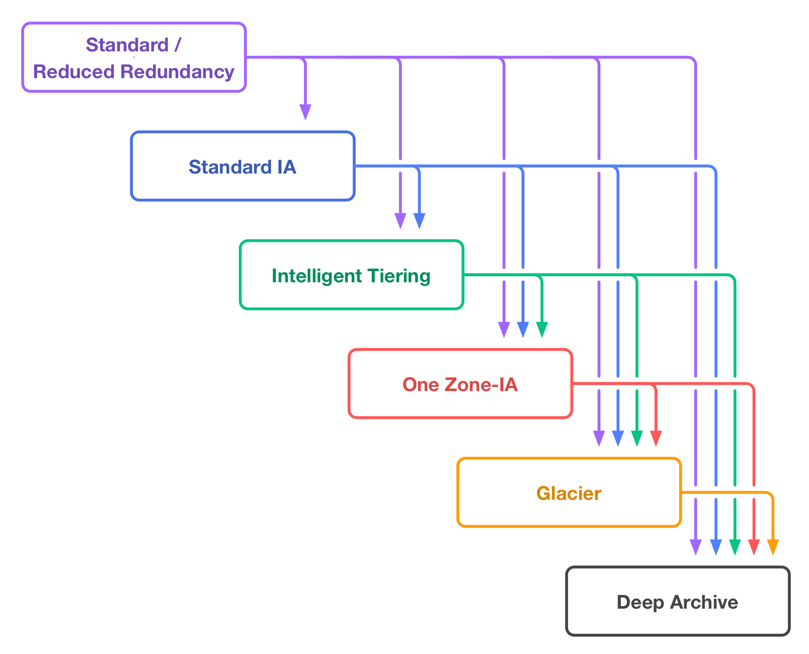

# Amazon S3 (Simple Storage Service)

Amazon S3 (Simple Storage Service) is a scalable object storage service offered by AWS that allows you to store and retrieve data from anywhere on the web. It is designed to provide high durability, availability, and scalability for storing a wide variety of data, including images, videos, documents, backups, and logs.


## Key Concepts:
1. **Buckets:** A bucket is a container for objects stored in Amazon S3. You can create multiple buckets to organize and manage your data.
2. **Objects:** Objects are the fundamental entities stored in Amazon S3. An object can be any file or data, along with metadata, stored as a key-value pair.
3. **Regions:** Amazon S3 is globally distributed across multiple geographical regions. You can choose the region where you want to create your buckets to optimize latency and compliance requirements.
4. **Storage Classes:** Amazon S3 offers different storage classes, including Standard, Standard-IA (Infrequent Access), One Zone-IA, Intelligent-Tiering, Glacier, and Glacier Deep Archive, each designed for specific use cases based on data access frequency and durability requirements.
5. **Lifecycle Policies:** You can define lifecycle policies to automatically transition objects between different storage classes or delete them after a specified period.

## Features:
- **Durability and Availability:** Amazon S3 is designed to provide 99.999999999% (11 nines) durability and 99.99% availability for your data.
- **Scalability:** S3 can scale to accommodate any amount of data, from a few gigabytes to petabytes or more, without any upfront provisioning.
- **Security:** S3 offers various security features, including encryption at rest and in transit, access control via IAM policies and bucket policies, and integration with AWS Key Management Service (KMS) for managing encryption keys.
- **Versioning:** You can enable versioning on your S3 buckets to preserve, retrieve, and restore every version of every object stored in the bucket. and it will be enabled if you allow object lock and also in cross-region or same region replication.
- **Cross-Region Replication:** You can replicate objects across different AWS regions for disaster recovery, compliance, and low-latency access.
- **Event Notifications:** S3 supports event notifications that can trigger AWS Lambda functions, SNS topics, or SQS queues in response to object creation, deletion, or restore events.

## Use Cases:
- **Static Website Hosting:** Amazon S3 can host static websites by serving HTML, CSS, JavaScript, and other web assets directly from buckets.
- **Data Backup and Archiving:** S3 is commonly used for data backup and long-term archival storage due to its durability and cost-effectiveness.
- **Content Distribution:** S3 integrates with Amazon CloudFront, AWS's content delivery network (CDN), to distribute content globally with low latency and high transfer speeds.
- **Data Lakes:** S3 serves as a foundational component for building data lakes, allowing organizations to store and analyze large volumes of structured and unstructured data at scale.

# Steps to Create a Bucket in Amazon S3

1. **Sign in to the AWS Management Console:**
   Open a web browser and navigate to the [AWS Management Console](https://aws.amazon.com/console/). Sign in to your AWS account using your credentials.

2. **Navigate to Amazon S3:**
   Once logged in, search for "S3" in the AWS Management Console search bar, and click on the "Amazon S3" service in the search results. Alternatively, you can find Amazon S3 under the "Storage" category in the AWS Management Console.

3. **Create a New Bucket:**
   - Click on the "Create bucket" button to start the bucket creation process.
   - Enter a unique name for your bucket in the "Bucket name" field. Bucket names must be globally unique across all existing bucket names in Amazon S3.
   - Choose the AWS region where you want to create the bucket. Select the region closest to your users to minimize latency.
   - Click on the "Create" button to create the bucket.

4. **Configure Bucket Properties (Optional):**
   - After creating the bucket, you can configure optional properties such as versioning, server access logging, default encryption, and tags. These configurations can be adjusted later if needed.

5. **Set Bucket Permissions (Optional):**
   - By default, newly created buckets are private and can only be accessed by the bucket owner. If you want to grant public access or specific permissions to other AWS accounts or IAM users, you can configure bucket policies and access control lists (ACLs) in the "Permissions" tab.

6. **Confirmation:**
   - Once you have configured the bucket properties and permissions, click on the "Create bucket" button to confirm and create the bucket.
   - You will see a confirmation message indicating that the bucket has been successfully created.

7. **Access Your Bucket:**
   - After the bucket is created, you can start uploading objects (files) to the bucket using the Amazon S3 console, AWS CLI, SDKs, or third-party tools.

8. **Explore Additional Features:**
   - Explore additional features of Amazon S3 such as lifecycle policies, cross-region replication, event notifications, and object metadata to further customize and manage your bucket and its contents.

# Create Bucket, Set Public Access Block, and Upload File Using AWS CLI

## Create Bucket:
```bash
aws s3api create-bucket --bucket my-example-bucket --region us-west-2
```
## Set Public Access Block:
```bash
aws s3api put-public-access-block --bucket my-example-bucket --public-access-block-configuration "BlockPublicAcls=true,IgnorePublicAcls=true,BlockPublicPolicy=true,RestrictPublicBuckets=true"
```
## Upload file:
```bash
aws s3api put-object --bucket my-example-bucket --content-type image/jpeg --key myImage.jpg --body /mnt/c/aws/myImage.jpg
```
## Allow Public Read
```bash
aws s3api delete-public-access-block --bucket my-example-bucket

aws s3api put-object-acl --bucket my-example-bucket --key myImage.jpg --acl public-read
```
## Delete File
```bash
aws s3api delete-object --bucket my-example-bucket --key myImage.jpg
```
## Delete Bucket
```bash
aws s3api delete-bucket --bucket my-example-bucket --region us-west-2
```

# Security and Permissions on an Amazon S3 Bucket

Amazon S3 provides several mechanisms to control access to your buckets and objects, ensuring that only authorized users or applications can interact with your data. Here are some key aspects of security and permissions in Amazon S3:


## Bucket Policies:
- **Bucket-Level Access Control:** You can define bucket policies to control access to the entire bucket based on various conditions, including IP address, VPC endpoint, AWS account, or IAM identity.
- **JSON-based Policies:** Bucket policies are JSON documents that specify who can access the bucket and what actions they can perform. Policies can be attached to individual buckets to define granular access controls.
- **Cross-Account Access:** Bucket policies can grant access to resources in other AWS accounts, enabling cross-account sharing of objects.
- **Evaluation:** Bucket policies are evaluated before any other access control mechanisms, such as IAM policies or ACLs. They provide a centralized way to manage access control for all objects within the bucket.
- **Example:**
```json
{
    "Version": "2012-10-17",
    "Id": "ExamplePolicy01",
    "Statement": [
        {
            "Sid": "ExampleStatement01",
            "Effect": "Allow",
            "Principal": {
                "AWS": "arn:aws:iam::123456789012:user/Dave"
            },
            "Action": [
                "s3:GetObject",
                "s3:GetBucketLocation",
                "s3:ListBucket"
            ],
            "Resource": [
                "arn:aws:s3:::awsexamplebucket1/*",
                "arn:aws:s3:::awsexamplebucket1"
            ]
        }
    ]
}

//cli

aws s3api put-bucket-policy --bucket my-example-bucket --policy file://policy.json
```

## Access Control Lists (ACLs):
- **Object-Level Access Control:** ACLs are another way to control access to individual objects within a bucket. ACLs can grant read, write, and delete permissions to specific AWS accounts or predefined groups.
- **Fine-Grained Control:** ACLs allow you to specify permissions for individual AWS accounts, predefined groups (e.g., authenticated users, all users), or specific email addresses.

## Object ACL and Bucket ACL
| Feature          | Object ACL                               | Bucket ACL                               |
|------------------|------------------------------------------|------------------------------------------|
| **Scope**        | Applies to individual objects in a bucket | Applies to the entire bucket             |
| **Granularity**  | Fine-grained control over individual objects | Broad control over all objects in the bucket |
| **Permissions**  | Can grant specific permissions to individual objects | Can grant permissions to all objects in the bucket |
| **Usage**        | Used to control access to individual objects and override bucket-level permissions | Used to set default permissions for all objects in the bucket |
| **Examples**     | Restrict access to sensitive objects by specifying specific permissions | Set default permissions for public or private access to all objects in the bucket |


## IAM Policies:
- **User-Level Access Control:** IAM (Identity and Access Management) policies are used to manage access permissions for IAM users and roles. IAM policies can grant access to specific S3 buckets and objects based on various conditions and actions.
- **Granular Permissions:** IAM policies support granular permissions, allowing you to specify which API actions (e.g., s3:GetObject, s3:PutObject) are allowed or denied for specific resources.
- **Temporary Access:** IAM roles can be used to grant temporary access to S3 resources for applications running on EC2 instances, Lambda functions, or other AWS services.

## Pre-Signed URLs:
- **Temporary Access Links:** Pre-signed URLs allow you to generate temporary URLs that grant access to specific objects in your bucket for a limited time period. Pre-signed URLs are often used for providing temporary access to private objects without requiring AWS credentials.

## Default Encryption:
- **Data Encryption:** Amazon S3 offers default encryption options to encrypt data at rest to protect against unauthorized access. You can enable default encryption for a bucket to automatically encrypt all objects stored in the bucket using server-side encryption (SSE) with Amazon S3-managed keys (SSE-S3) or customer-managed keys (SSE-C).

## Access Logging:
- **Audit Trail:** Amazon S3 provides access logging features that allow you to track requests made to your bucket and objects. Access logs capture details such as the requester's IP address, HTTP method, and response status, providing visibility into access patterns and potential security threats.

## Block Public Access:
- **Restrict Public Access:** Amazon S3 offers settings to block public access to your buckets and objects by default. You can enable block public access settings at the account level or individual bucket level to prevent accidental exposure of sensitive data to the public internet.


# S3 Object Lock in Amazon S3

S3 Object Lock is a feature in Amazon Simple Storage Service (S3) that allows you to apply a write-once-read-many (WORM) lock to objects stored in S3 buckets. This feature helps you enforce compliance requirements, prevent accidental deletion or modification of objects, and ensure data immutability for regulatory or business reasons.

## Features

### Write-Once-Read-Many (WORM)
- S3 Object Lock enables you to set a retention period during which an object remains immutable and cannot be deleted or modified.
- Once an object is locked, it cannot be overwritten, deleted, or modified until the retention period expires or is removed.

### Retention Period
- You can specify a retention period for objects using either a retention period or a legal hold.
- The retention period can be set for a specific duration, such as days, months, or years, or indefinitely until explicitly removed.

### Legal Hold
- In addition to retention periods, S3 Object Lock supports legal holds, which prevent deletion or modification of objects until the legal hold is removed.
- Legal holds are typically used for objects involved in legal or regulatory investigations, ensuring data integrity during litigation or audits.

## Purpose

### Compliance Requirements
- S3 Object Lock helps organizations meet compliance requirements, such as SEC Rule 17a-4(f), FINRA Rule 4511, GDPR, HIPAA, or other regulatory standards that mandate data immutability and retention.

### Data Protection
- By applying retention periods or legal holds to objects, S3 Object Lock protects critical data from accidental deletion, modification, or tampering, ensuring data integrity and security.

## Use Cases

### Financial Services
- Financial institutions can use S3 Object Lock to ensure compliance with regulatory requirements, such as recordkeeping regulations, by retaining financial records and transaction data immutable for specified retention periods.

### Healthcare
- Healthcare organizations can leverage S3 Object Lock to protect patient records, medical imaging data, and other sensitive healthcare information, ensuring data integrity and compliance with HIPAA regulations.

### Legal and Compliance
- Legal and compliance teams can apply legal holds to objects involved in legal proceedings, audits, or investigations, ensuring data preservation and integrity during litigation or regulatory inquiries.

### Digital Preservation
- Organizations involved in digital preservation initiatives can use S3 Object Lock to safeguard historical documents, cultural artifacts, or digital assets from alteration or deletion, ensuring long-term data preservation.

## Considerations

### Costs
- S3 Object Lock may incur additional costs, such as storage fees for locked objects or data transfer fees associated with legal hold notifications or retention period changes.

### Configuration
- Proper configuration and management of S3 Object Lock settings, including retention periods and legal holds, are essential to ensure compliance and data protection.

## Conclusion

S3 Object Lock in Amazon S3 is a powerful feature that enables organizations to enforce data immutability and retention requirements for regulatory compliance, data protection, and digital preservation initiatives. By applying retention periods or legal holds to objects, S3 Object Lock helps safeguard critical data from accidental deletion or modification, ensuring data integrity and compliance with regulatory standards.

For more information on S3 Object Lock in Amazon S3, refer to the [AWS Documentation](https://docs.aws.amazon.com/AmazonS3/latest/userguide/object-lock.html).


# Vault Lock in Amazon Glacier and Amazon S3 Glacier

Vault Lock is a feature in Amazon Glacier and Amazon S3 Glacier (Glacier) that allows you to apply a vault lock policy to a vault, which enforces compliance controls for the vault's archival data. This feature helps you meet regulatory and compliance requirements by preventing the deletion or modification of archived data for a specified retention period.

## Features

### Compliance Controls
- Vault Lock allows you to apply a vault lock policy to a vault, enforcing compliance controls for the archival data stored within the vault.
- The vault lock policy can specify a retention period during which data is immutable and cannot be deleted or modified.

### Write-Once-Read-Many (WORM)
- Similar to S3 Object Lock, Vault Lock enforces a write-once-read-many (WORM) model for archival data stored in Glacier vaults.
- Once a vault lock policy is applied, data within the vault remains immutable for the specified retention period.

### Legal Hold
- Vault Lock supports legal holds, which prevent deletion or modification of data until the legal hold is removed.
- Legal holds are typically used for data involved in legal or regulatory investigations, ensuring data integrity during litigation or audits.

## Purpose

### Compliance Requirements
- Vault Lock helps organizations meet regulatory and compliance requirements, such as SEC Rule 17a-4(f), FINRA Rule 4511, GDPR, HIPAA, or other standards that mandate data immutability and retention.

### Data Preservation
- By applying vault lock policies to Glacier vaults, organizations can protect critical data from accidental deletion, modification, or tampering, ensuring data integrity and compliance with regulatory standards.

## Use Cases

### Financial Services
- Financial institutions can use Vault Lock to ensure compliance with recordkeeping regulations by retaining financial records and transaction data immutable for specified retention periods.

### Healthcare
- Healthcare organizations can leverage Vault Lock to protect patient records, medical imaging data, and other sensitive healthcare information, ensuring data integrity and compliance with HIPAA regulations.

### Legal and Compliance
- Legal and compliance teams can apply legal holds to data stored in Glacier vaults, ensuring data preservation and integrity during litigation or regulatory inquiries.

## Considerations

### Costs
- Vault Lock may incur additional costs, such as storage fees for archived data or data transfer fees associated with legal hold notifications or retention period changes.

### Configuration
- Proper configuration and management of Vault Lock policies are essential to ensure compliance and data protection, including specifying appropriate retention periods and managing legal holds.

## Conclusion

Vault Lock in Amazon Glacier and Amazon S3 Glacier provides a powerful solution for enforcing compliance controls and ensuring data immutability for archival data. By applying vault lock policies to Glacier vaults, organizations can meet regulatory requirements, protect critical data, and preserve data integrity for long-term retention.

For more information on Vault Lock in Amazon Glacier and Amazon S3 Glacier, refer to the [AWS Documentation](https://docs.aws.amazon.com/amazonglacier/latest/dev/vault-lock.html).


# Amazon S3 Storage Classes by Category

Amazon S3 offers a variety of storage classes designed to meet different performance, durability, and cost requirements. These storage classes are categorized into three main categories: Standard, Infrequent Access, and Glacier.


## Standard Storage Classes:
- **S3 Standard**: The default storage class designed for frequently accessed data with high availability, durability, and low latency. Ideal for frequently accessed data such as active workloads, multimedia content, and data analytics. $0.023 GB/Month

- **S3 Intelligent-Tiering**: A storage class designed for data with unknown or changing access patterns. Automatically moves data between two access tiers: frequent access and infrequent access, optimizing costs based on access patterns. object monitoring cost $0.00025 per 1000 objects

## Infrequent Access Storage Classes:
- **S3 Standard-IA (Infrequent Access)**: Designed for data that is accessed less frequently but requires rapid access when needed. Offers the same availability and durability as S3 Standard but with lower storage costs and higher retrieval fees. $0.0125 GB/Month - min storage duration 30 days - >= 3 AZ - 99.9% - retrieval $0.01 GB

- **S3 One Zone-IA**: Similar to S3 Standard-IA but stores data in a single Availability Zone, offering lower storage costs than S3 Standard-IA but with slightly less durability.$0.01 GB/Month - min storage duration 30 days - 1 AZ - 99.5% - retrieval $0.01 GB

## Glacier Storage Classes:
Are designed to sustain data loss in two facilities. Glacier automatically encrypts data at rest using AES-256-bit symmetric keys. It supports secure data transfer in-transit over Secure Sockets Layer (SSL). Glacier archives are visible and available only through AWS S3 not through AWS Glacier.

- **Amazon S3 Glacier**: A low-cost storage class designed for long-term data archiving with retrieval times ranging from minutes to hours. Suitable for data archiving, compliance, and regulatory requirements where access times are less critical. $0.004 GB/Month - min storage duration 90 days - $0.03 GB retrieval - ms access time

- **Amazon S3 Glacier Flexible Retrieval**: A storage class designed to provide the flexibility to choose between three retrieval options: Expedited, Standard, and Bulk. Each retrieval option has different pricing and availability characteristics, allowing you to tailor retrieval times and costs based on your specific needs. $0.0036 GB/Month - min storage duration 90 days - $0.01 to $0.03 GB retrieval - minutes to hours access time

- **Amazon S3 Glacier Deep Archive**: The lowest-cost storage class designed for long-term data retention and archiving with retrieval times ranging from hours to days. Ideal for data that is accessed rarely and has strict compliance and regulatory requirements. $0.00099 GB/Month - min storage duration 180 days - $0.02 GB retrieval - hours access time

### An archive is the base storage unit in Glacier.
   An archive can be any data such as a file, a photo, or a document.
### A vault is a container to store archives.
   A vault is confined to an AWS region.
   A vault can store an unlimited number of archives.
   Maximum 1000 vaults per AWS region.
   We can get archives uploaded to vaults using:
      CLI, SDKs (not the AWS console).
      Lifecycle policies to transition data from S3 to Glacier vaults.

## Other Storage Classes:
- **S3 Outposts**: A storage class designed for data stored on AWS Outposts, offering the same features and performance as S3 Standard but within the customer's data center.

- **S3 Object Lock**: A feature that allows you to apply retention periods and legal holds to objects, ensuring they remain immutable and protected against deletion or modification for a specified duration.

These storage classes provide flexibility in managing data based on access patterns, performance requirements, and cost considerations, allowing you to optimize storage costs while meeting your specific needs.


# Amazon S3 Lifecycle Policies

Amazon S3 lifecycle policies allow you to define rules to automatically manage the lifecycle of your objects stored in S3 buckets. With lifecycle policies, you can define actions such as transitioning objects to different storage classes, deleting objects after a specified period, or archiving objects to Amazon S3 Glacier or Glacier Deep Archive.



## Benefits of S3 Lifecycle Policies:
- **Cost Optimization**: Automatically move objects to less expensive storage classes as they age or delete them when they're no longer needed to optimize storage costs.
- **Data Management**: Simplify data management by automatically managing the lifecycle of objects without manual intervention.
- **Compliance and Retention**: Ensure compliance with regulatory requirements by automatically archiving or deleting objects based on retention policies.

## Components of S3 Lifecycle Policies:
- **Rules**: Define rules to specify the conditions and actions for managing the lifecycle of objects.
- **Transitions**: Specify when to transition objects to a different storage class based on their age or other criteria.
- **Expiration**: Define expiration actions to automatically delete objects after a specified period.


## Example Lifecycle Policy:
```json
{
    "Rules": [
        {
            "ID": "MoveToGlacier",
            "Status": "Enabled",
            "Filter": {
                "Prefix": "logs/"
            },
            "Transitions": [
                {
                    "Days": 30,
                    "StorageClass": "GLACIER"
                },
                {
                    "Days": 365,
                    "StorageClass": "DEEP_ARCHIVE"
                }
            ],
            "Expiration": {
                "Days": 3650
            }
        }
    ]
}
```
## In this example:
- The rule with the ID "MoveToGlacier" is enabled and applies to objects with the prefix "logs/".
- Objects matching the filter are transitioned to the GLACIER storage class after 30 days and to the DEEP_ARCHIVE storage class after 365 days.
- Objects are automatically deleted after 3650 days (10 years)

## Notes:
- You can define multiple rules in a lifecycle policy to apply different lifecycle actions to different sets of objects.
- Lifecycle policies can be applied at the bucket level and are automatically applied to all objects within the bucket that match the rule criteria.


# Setting up a Static Website in Amazon S3

Amazon Simple Storage Service (S3) provides a cost-effective and scalable solution for hosting static websites. By configuring an S3 bucket to serve static website content, you can leverage the reliability and scalability of S3 for hosting your website without the need for traditional web servers.

## Steps to Set up a Static Website in Amazon S3

### 1. Create an S3 Bucket
- Navigate to the Amazon S3 console.
- Click on "Create bucket" and provide a unique bucket name.
- Choose the AWS region for your bucket and click "Create."

### 2. Upload Website Content
- Upload your website content (HTML, CSS, JavaScript, images, etc.) to the S3 bucket.
- Ensure that the objects are set to public read access so that they can be accessed by visitors.

### 3. Configure Bucket for Static Website Hosting
- Select the newly created bucket in the S3 console.
- Click on the "Properties" tab and then select "Static website hosting."
- Choose "Use this bucket to host a website" and enter the index document (e.g., index.html) and error document (optional).
- Click "Save."

### 4. Set Bucket Policy for Public Access
- Navigate to the "Permissions" tab of your bucket.
- Click on "Bucket Policy" and add a policy to allow public read access to objects in the bucket.
- Example Bucket Policy:
  ```json
  {
    "Version": "2012-10-17",
    "Statement": [
      {
        "Sid": "PublicReadGetObject",
        "Effect": "Allow",
        "Principal": "*",
        "Action": "s3:GetObject",
        "Resource": "arn:aws:s3:::YOUR_BUCKET_NAME/*"
      }
    ]
  }
  ```

### 5. Access Your Static Website
- Once the bucket is configured for static website hosting and public access, you can access your website using the provided endpoint URL (e.g., http://YOUR_BUCKET_NAME.s3-website-REGION.amazonaws.com).

## Usage Considerations for S3 Static Websites

When hosting a static website on Amazon S3, there are several important usage considerations to keep in mind, including traffic, storage, costs, and performance.

### Traffic

- **Visitor Traffic:** Consider the expected amount of visitor traffic to your static website. S3 can handle a high volume of traffic, but it's essential to monitor and scale accordingly if you anticipate spikes in traffic.

- **Access Logs:** Enable access logging for your S3 bucket to track visitor traffic and analyze usage patterns. Access logs can provide valuable insights into visitor behavior and help optimize your website.

### Storage

- **Content Size:** Be mindful of the size of your website content, including HTML, CSS, JavaScript, images, and other files. S3 offers scalable storage, but storage costs are based on the amount of data stored, so minimizing unnecessary data can help reduce costs.

- **Versioning:** Consider enabling versioning for your S3 bucket if you need to track and manage different versions of your website content. Versioning can help prevent accidental deletions and provide a history of changes.

### Costs

- **Storage Costs:** Monitor your storage usage and understand how storage costs are calculated based on the amount of data stored in your S3 bucket. Regularly review your storage usage and consider lifecycle policies to optimize storage costs.

- **Data Transfer Costs:** Be aware of data transfer costs associated with serving content to visitors. S3 offers low-cost data transfer within the AWS network, but data transfer out to the internet or other AWS regions may incur additional charges.

### Performance

- **Latency:** Consider the latency of serving content from S3 to visitors located in different geographic regions. You can improve website performance by leveraging Amazon CloudFront CDN for content delivery, which caches content at edge locations closer to your visitors.

- **Availability:** S3 provides high availability and durability for hosting static websites, but it's essential to monitor service health and availability to ensure uninterrupted access to your website.


## S3 Static Website Hosting vs. S3 REST API Endpoints
| Feature                      | S3 Static Website Hosting      | S3 REST API Endpoints         |
|------------------------------|--------------------------------|-------------------------------|
| **Purpose**                  | Hosting static websites        | Exposing S3 bucket content and operations |
| **Access Method**            | Direct access via HTTP/HTTPS   | Indirect access via HTTP/HTTPS requests |
| **Capabilities**             | Supports static content with client-side scripting | Provides programmatic access to S3 objects and operations |
| **Content Delivery**         | Content served directly from S3 buckets | API requests processed by S3 |
| **Performance**              | May benefit from using CloudFront CDN | Response times depend on network latency |
| **Use Cases**                | Public-facing websites, blogs, documentation | Web applications, mobile apps, backend systems |
| **Examples**                 | Company websites, personal blogs | File upload/download services, data backup systems |


## Conclusion

Setting up a static website in Amazon S3 is a straightforward process that allows you to host static content with high availability, scalability, and low cost. By following the steps outlined above, you can quickly deploy and serve static websites using Amazon S3.

Hosting a static website on Amazon S3 offers scalability, reliability, and cost-effectiveness, but it's essential to consider usage considerations related to traffic, storage, costs, and performance. By monitoring and optimizing these factors, you can ensure a seamless and efficient experience for visitors to your S3 static website.

For more detailed information on usage considerations and best practices for hosting static websites on Amazon S3, refer to the [AWS Documentation](https://docs.aws.amazon.com/AmazonS3/latest/dev/WebsiteHosting.html).


# S3 Pre-Signed URLs (Query string) Authentication

S3 pre-signed URLs are a feature of Amazon Simple Storage Service (S3) that allows you to generate URLs with temporary access permissions to specific objects in your S3 buckets. These URLs grant temporary access to download or upload objects without requiring the requester to have AWS credentials.

## Purpose

### Temporary Access
- S3 pre-signed URLs provide temporary access to specific objects in your S3 buckets without requiring the requester to have AWS credentials.
- These URLs are generated with a limited validity period, after which they expire and access is revoked.

### Secure Sharing
- Pre-signed URLs allow you to securely share access to S3 objects with third parties, such as clients or users, without exposing your AWS credentials.
- You can control the permissions and expiration time of pre-signed URLs to ensure secure access to your S3 objects.

## Use Cases

### Private Content Sharing
- Securely share private content stored in S3 buckets with specific users or clients by generating pre-signed URLs with limited validity periods.

### File Uploads
- Allow users to upload files directly to your S3 buckets without exposing AWS credentials by generating pre-signed URLs for PUT requests.

### Temporary Access Control
- Grant temporary access to specific objects in your S3 buckets for a limited duration, such as sharing files for a specific project or time-limited access to resources.

## Considerations

### Expiration Time
- Set an appropriate expiration time for pre-signed URLs to balance security and usability. Shorter expiration times enhance security but may inconvenience users.

### Permissions
- Ensure that pre-signed URLs have the necessary permissions to perform the desired actions (e.g., read or write access to S3 objects).

### Access Logging
- Monitor and log pre-signed URL usage to track access to your S3 objects and detect any unauthorized access attempts.

### Signed Url Creation
- Create will work even on private buckets and objects by `An IAM user`, `Root account`, `EC2 instance/APP` or `someone with STS token' and that for specific period.

### Example
- To create an S3 pre-signed URL for an object using the command line, you can use the `aws s3 presign` command provided by the AWS Command Line Interface (CLI). Here's the basic syntax:

```bash
aws s3 presign s3://bucket_name/object_key [--expires-in <seconds>] [--profile <profile_name>] [--region <region_name>]
```
- Replace bucket_name with the name of your S3 bucket and object_key with the key of the object for which you want to generate the pre-signed URL. Optionally, you can specify the --expires-in parameter to set the expiration time for the pre-signed URL in seconds.
- After running the command, the pre-signed URL will be displayed in the command line output, which you can then use to access the object for the specified duration.

## Conclusion

S3 pre-signed URLs in Amazon S3 provide a secure and temporary way to grant access to specific objects in your S3 buckets without exposing AWS credentials. By generating pre-signed URLs with limited validity periods and controlled permissions, you can securely share private content, enable file uploads, and grant temporary access to S3 resources for various use cases.

For more detailed information on S3 pre-signed URLs and how to generate them, refer to the [AWS Documentation](https://docs.aws.amazon.com/AmazonS3/latest/dev/PresignedUrlUploadObject.html).

# S3 Transfer Acceleration in Amazon S3

S3 Transfer Acceleration is a feature of Amazon Simple Storage Service (S3) that utilizes Amazon CloudFront's globally distributed edge locations to accelerate data transfers to and from S3 buckets. This feature helps improve data transfer speeds, especially for long-distance transfers or transfers over the internet.

## Purpose

### Faster Data Transfers
- S3 Transfer Acceleration aims to accelerate data transfers to and from S3 buckets, especially for geographically distant clients or clients with limited bandwidth.

### Global Reach
- Leveraging Amazon CloudFront's network of edge locations, S3 Transfer Acceleration enables faster data transfers globally by minimizing latency and maximizing throughput.

## Benefits

### Improved Speed
- S3 Transfer Acceleration can significantly improve data transfer speeds, especially for large files or data sets, by reducing the time required to upload or download objects from S3 buckets.

### Simplified Setup
- Enabling S3 Transfer Acceleration is straightforward and does not require any changes to your existing S3 buckets or applications. You can simply enable it for individual S3 buckets via the AWS Management Console or API.

### Global Availability
- S3 Transfer Acceleration is available in all AWS regions where Amazon S3 is available, allowing you to accelerate data transfers for your applications and users worldwide.

## Considerations

### Cost
- While S3 Transfer Acceleration can improve data transfer speeds, it may incur additional costs compared to standard S3 data transfer rates. Be sure to review the pricing details and consider the cost implications before enabling this feature.

### Use Cases
- Evaluate your specific use cases and data transfer requirements to determine if S3 Transfer Acceleration is suitable. It may provide significant benefits for applications with global users or frequent data transfers over the internet.

### Compatibility
- Ensure that your applications and workflows are compatible with S3 Transfer Acceleration. While it is compatible with most S3 API operations, certain features or functionalities may not be fully supported.

## Conclusion

S3 Transfer Acceleration in Amazon S3 offers a straightforward and effective way to improve data transfer speeds for your S3 buckets, especially for global applications or clients with limited bandwidth. By leveraging Amazon CloudFront's edge locations, S3 Transfer Acceleration accelerates data transfers worldwide, enhancing the performance and responsiveness of your applications.

For more detailed information on S3 Transfer Acceleration, including setup instructions and pricing details, refer to the [AWS Documentation](https://docs.aws.amazon.com/AmazonS3/latest/dev/transfer-acceleration.html).


# S3 Requester Pays in Amazon S3

S3 Requester Pays is a feature of Amazon Simple Storage Service (S3) that allows bucket owners to configure their buckets so that the requester, rather than the bucket owner, pays for the data transfer and request costs associated with accessing objects in the bucket. This feature is useful when the data stored in the bucket is intended for specific users or applications that should bear the cost of accessing the data.

## Purpose

### Cost Allocation
- S3 Requester Pays allows bucket owners to allocate data transfer and request costs to the requesters who access objects in the bucket. This can be useful in scenarios where the data is shared with specific users or applications, and the bucket owner wants the requesters to bear the associated costs.

### Billing Separation
- By enabling S3 Requester Pays, bucket owners can separate the costs of storing data in the bucket (which are borne by the bucket owner) from the costs of accessing the data (which are borne by the requesters). This can help with cost allocation and billing management.

## Benefits

### Cost Savings
- S3 Requester Pays can result in cost savings for bucket owners, especially in scenarios where the data in the bucket is accessed by multiple requesters who are willing to pay for their access.

### Billing Flexibility
- Requester Pays allows for more flexible billing arrangements, where the cost of accessing data can be passed on to the requesters who benefit from accessing the data, rather than being absorbed by the bucket owner.

## Considerations

### Access Control
- Consider access control measures to ensure that only authorized requesters are able to access objects in the bucket, especially since they will be responsible for paying the associated costs.

### Communication
- Clearly communicate to requesters that they will be responsible for the costs of accessing data in the bucket, as this may impact their decision to access the data.

### Usage Monitoring
- Monitor usage and associated costs to ensure that requesters are being billed accurately and fairly for their access to the data in the bucket.

## Conclusion

S3 Requester Pays in Amazon S3 offers a way for bucket owners to allocate data transfer and request costs to the requesters who access objects in the bucket. By enabling Requester Pays, bucket owners can separate the costs of storing data from the costs of accessing data, resulting in potential cost savings and billing flexibility.

For more detailed information on S3 Requester Pays, including setup instructions and pricing details, refer to the [AWS Documentation](https://docs.aws.amazon.com/AmazonS3/latest/dev/RequesterPaysBuckets.html).


# S3 Cross-Origin Resource Sharing (CORS) in Amazon S3

S3 Cross-Origin Resource Sharing (CORS) is a feature of Amazon Simple Storage Service (S3) that enables you to configure rules to control access to your S3 resources from web applications running in a browser. CORS allows you to specify which origins (domains) are allowed to make cross-origin requests to your S3 buckets and what HTTP methods are permitted for those requests.

## Purpose of S3 CORS

### Secure Cross-Origin Requests
- S3 CORS allows you to control access to your S3 resources from web applications running in a browser, ensuring that only trusted origins can make cross-origin requests.

### Enhanced Web Application Security
- By configuring CORS rules, you can mitigate the risk of cross-site scripting (XSS) attacks and other security vulnerabilities associated with cross-origin requests.

## Configuration Options for S3 CORS

### CORS Rules
- CORS rules are configurations that specify which origins are allowed to access your S3 resources and what HTTP methods are permitted for cross-origin requests. Each CORS rule consists of an allowed origin, allowed methods, allowed headers, exposed headers, and max age (optional).

### Allowed Origins
- Allowed origins are the domains from which cross-origin requests are allowed to access your S3 resources. You can specify one or more origins in a CORS rule to grant access to specific domains.

### Allowed Methods
- Allowed methods specify the HTTP methods (e.g., GET, PUT, POST, DELETE) that are allowed for cross-origin requests to your S3 resources. You can specify one or more methods in a CORS rule.

## Considerations for S3 CORS

### Security
- When configuring CORS rules, ensure that you only allow trusted origins and restrict the allowed methods to the minimum necessary for your application's functionality.

### Access Control
- Combine S3 CORS configuration with other access control mechanisms, such as IAM policies and bucket policies, to enforce fine-grained access control over your S3 resources.

## Conclusion

S3 Cross-Origin Resource Sharing (CORS) in Amazon S3 allows you to control access to your S3 resources from web applications running in a browser by configuring CORS rules. By specifying allowed origins and methods, you can enhance the security of your web applications and mitigate the risk of cross-origin security vulnerabilities.

For more detailed information on configuring S3 CORS rules and best practices, refer to the [AWS Documentation](https://docs.aws.amazon.com/AmazonS3/latest/dev/cors.html).


# S3 Batch Operations in Amazon S3

S3 Batch Operations is a feature of Amazon Simple Storage Service (S3) that enables you to perform large-scale batch operations on objects stored in S3 buckets. With S3 Batch Operations, you can automate and streamline tasks such as copying, tagging, and deleting objects across millions or billions of objects with a single job, reducing manual effort and improving operational efficiency.

## Purpose of S3 Batch Operations

### Automate Large-Scale Tasks
- S3 Batch Operations allows you to automate and streamline large-scale tasks on objects stored in S3 buckets, such as copying, tagging, and deleting objects. By batching these operations together, you can save time and resources compared to performing them manually.

### Improve Operational Efficiency
- By leveraging S3 Batch Operations, you can improve operational efficiency by efficiently managing and processing large volumes of objects in S3 buckets. This enables you to perform tasks at scale without the need for manual intervention.

## Capabilities of S3 Batch Operations

### Copy Objects
- S3 Batch Operations allows you to copy objects between S3 buckets or within the same bucket. You can specify the source and destination buckets, prefixes, and other parameters for copying objects in bulk.

### Tag Objects
- With S3 Batch Operations, you can add or modify tags on objects stored in S3 buckets. Tags are key-value pairs that provide metadata for organizing and managing objects in S3.

### Delete Objects
- S3 Batch Operations enables you to delete objects from S3 buckets in bulk. You can specify criteria for selecting objects to be deleted based on object keys, prefixes, or tags.

## Use Cases for S3 Batch Operations

### Data Migration
- S3 Batch Operations can be used for large-scale data migration tasks, such as moving data between S3 buckets or from on-premises storage systems to S3.

### Data Processing
- S3 Batch Operations can streamline data processing tasks, such as applying metadata tags to objects for categorization or deleting outdated data based on specified criteria.

### Compliance and Governance
- S3 Batch Operations can help enforce compliance and governance policies by tagging objects with relevant metadata or deleting expired data in accordance with retention policies.

## Considerations for S3 Batch Operations

### Job Configuration
- When configuring S3 Batch Operations jobs, carefully specify the parameters and criteria for selecting objects to ensure that the desired operations are performed accurately and efficiently.

### Cost Management
- Consider the cost implications of S3 Batch Operations, especially for large-scale operations involving millions or billions of objects. Monitor job execution costs and optimize job configurations to minimize unnecessary expenses.

### Data Integrity
- Ensure data integrity and accuracy when performing batch operations on objects in S3 buckets. Validate job results and monitor job execution to identify any issues or errors.

## Conclusion

S3 Batch Operations in Amazon S3 enables you to automate and streamline large-scale batch operations on objects stored in S3 buckets, such as copying, tagging, and deleting objects. By leveraging S3 Batch Operations, you can improve operational efficiency, automate repetitive tasks, and manage data at scale effectively.

For more detailed information on configuring and using S3 Batch Operations, refer to the [AWS Documentation](https://docs.aws.amazon.com/AmazonS3/latest/userguide/batch-operations.html).


# S3 Select in Amazon S3

S3 Select is a feature of Amazon Simple Storage Service (S3) that allows you to retrieve specific data from objects stored in S3 using simple SQL expressions. With S3 Select, you can efficiently query and retrieve only the data you need from large objects stored in S3, reducing the amount of data transferred and improving query performance. It support `CVS`, `JSON` and `Apache Parquet` formats and works of `GZIP` or `BZIP2` compressed objects, and on `SSE` encrypted objects.

## Purpose of S3 Select

### Efficient Data Retrieval
- S3 Select enables efficient data retrieval by allowing you to specify SQL expressions to filter and retrieve only the required data from objects stored in S3, eliminating the need to download the entire object.

### Reduced Data Transfer Costs
- By retrieving only the necessary data using S3 Select, you can reduce data transfer costs associated with downloading large objects from S3, especially when working with large datasets.

## Benefits of S3 Select

### Improved Query Performance
- S3 Select improves query performance by executing SQL expressions directly on the data stored in S3, rather than transferring the entire object to the client for processing.

### Reduced Network Latency
- With S3 Select, only the selected data is transferred over the network, reducing network latency and improving the overall performance of data retrieval operations.

## Usage of S3 Select

### SQL Expressions
- S3 Select supports simple SQL expressions that allow you to filter, project, and aggregate data stored in objects based on specific criteria. You can specify SQL expressions when querying objects using S3 Select.

### Supported File Formats
- S3 Select supports querying objects stored in various file formats, including CSV, JSON, and Apache Parquet. You can specify the file format when configuring S3 Select queries.

## Considerations for S3 Select

### Supported Regions
- S3 Select is available in select AWS regions. Ensure that you use S3 Select in regions where it is supported to take advantage of its features.

### Data Format and Compression
- Consider the data format and compression used for objects stored in S3 when using S3 Select. Some file formats and compression codecs may be more suitable for efficient querying and retrieval.

## Conclusion

S3 Select in Amazon S3 is a powerful feature that enables efficient and selective retrieval of data from objects stored in S3 using simple SQL expressions. By querying only the necessary data, S3 Select helps improve query performance, reduce data transfer costs, and enhance overall data retrieval efficiency.

For more detailed information on using S3 Select and supported SQL expressions, refer to the [AWS Documentation](https://docs.aws.amazon.com/AmazonS3/latest/userguide/selecting-content.html).


# S3 Performance Recommendations

Amazon S3 is designed to provide high scalability, durability, and availability for storing and retrieving objects of any size. However, optimizing performance for specific use cases can help improve efficiency and reduce costs. Below are some performance recommendations for optimizing Amazon S3 performance:

## 1. Use Regional S3 Endpoints

- When accessing S3 within the same AWS region as your application, use regional S3 endpoints (e.g., s3.amazonaws.com) rather than global endpoints (e.g., s3-global.amazonaws.com). Regional endpoints offer lower latency and improved performance for S3 operations.

## 2. Choose the Right Storage Class

- Choose the appropriate S3 storage class based on your data access patterns and retention requirements. For frequently accessed data, use S3 Standard or S3 Intelligent-Tiering. For infrequently accessed data, consider S3 Standard-IA or S3 One Zone-IA. For long-term archival, use S3 Glacier or S3 Glacier Deep Archive.

## 3. Optimize Object Key Naming

- Use meaningful and unique object key names to distribute object access across multiple partitions in S3 and prevent hotspots. Avoid sequential or repetitive key names that may result in increased request latency or throttling.

## 4. Leverage Multipart Uploads

- For large objects (over 100 MB in size), use multipart uploads to parallelize uploads and improve upload performance. Multipart uploads also provide resiliency against network failures and allow you to resume uploads from the last successful part in case of interruptions.

## 5. Enable Transfer Acceleration

- Enable Amazon S3 Transfer Acceleration to utilize Amazon CloudFront's globally distributed edge locations for accelerated data transfers. Transfer Acceleration can improve upload and download speeds, especially for geographically distributed users.

## 6. Byte Range Fetches
### Utilize Byte Range Fetches for Partial Object Retrieval
- Implement byte range fetches to retrieve specific byte ranges of an object from Amazon S3. This allows you to download only the required portions of large objects, reducing data transfer costs and improving download efficiency.

### Support Partial Content Responses
- Ensure that your application supports partial content responses (HTTP 206 status code) returned by Amazon S3 when performing byte range fetches. Handle partial content responses correctly to assemble the retrieved byte ranges into the complete object.

  
## 7. Monitor and Optimize Data Access

- Monitor S3 access patterns and performance metrics using Amazon CloudWatch metrics and S3 access logs. Analyze access patterns to identify opportunities for optimizing data storage, retrieval, and caching strategies.

## 8. Implement Object Expiry Policies

- Implement lifecycle policies to automatically expire or transition objects to lower-cost storage classes based on predefined retention periods or access patterns. This helps optimize storage costs and ensures compliance with data retention policies.

## 9. Fine-Tune S3 Request Rate Limits

- Fine-tune S3 request rate limits (e.g., GET, PUT, DELETE) to avoid exceeding the default limits and potential throttling. Adjust request rate limits based on your application's performance requirements and usage patterns.

## Conclusion

By following these performance recommendations, you can optimize performance when using Amazon S3 and improve efficiency for storing and retrieving objects. Continuously monitor and evaluate your S3 usage patterns to identify further optimization opportunities and ensure optimal performance for your applications.

For more detailed information on Amazon S3 performance optimization and best practices, refer to the [AWS Documentation](https://docs.aws.amazon.com/AmazonS3/latest/dev/optimizing-performance.html).


# S3 Monitoring and Event Notifications

Amazon S3 provides monitoring and event notification features that enable you to track and receive notifications about events and changes within your S3 buckets. These features allow you to monitor bucket activity, automate workflows, and integrate with other AWS services for enhanced functionality.

## Key Components

### Amazon CloudWatch Metrics
- Amazon S3 integrates with Amazon CloudWatch to provide metrics on bucket and object activity, including request rates, data transfer volume, and error rates. CloudWatch metrics enable you to monitor the performance and health of your S3 buckets in real-time.

### Amazon S3 Event Notifications
- Amazon S3 event notifications allow you to define event-driven workflows by configuring notifications for specific bucket events, such as object creation, deletion, or replication. You can choose to send notifications to various AWS services, including `Amazon SNS`, `Amazon SQS`, and `AWS Lambda`.

## Benefits

### Real-Time Monitoring
- S3 monitoring and event notifications provide real-time visibility into bucket activity, enabling you to monitor changes and events as they occur and react promptly to critical events.

### Automation
- Event notifications allow you to automate workflows and processes based on specific bucket events, such as triggering data processing jobs, updating database records, or notifying stakeholders about changes.

### Integration
- S3 event notifications seamlessly integrate with other AWS services, enabling you to build comprehensive solutions that leverage the capabilities of services like `Amazon SNS`, `Amazon SQS`, and `AWS Lambda`.

## Use Cases

### Data Ingestion
- Receive notifications when new objects are uploaded to S3 buckets, triggering downstream data processing or analysis tasks.

### Data Replication
- Monitor replication events and automate workflows for replicating data across multiple S3 buckets or AWS regions.

### Compliance and Security
- Set up event notifications for object access or permission changes to maintain compliance and security posture, such as auditing access logs or detecting unauthorized access attempts.

## Conclusion

S3 monitoring and event notifications are powerful features that enable you to track bucket activity, automate workflows, and integrate with other AWS services for enhanced functionality. By leveraging these features, you can build scalable and efficient solutions that meet your monitoring, automation, and compliance requirements.

For detailed information on configuring S3 event notifications and monitoring, refer to the [AWS Documentation](https://docs.aws.amazon.com/AmazonS3/latest/dev/NotificationHowTo.html) and [Amazon S3 Developer Guide](https://docs.aws.amazon.com/AmazonS3/latest/dev/Welcome.html).


# S3 Access Logs

S3 access logs are records of requests made to an Amazon S3 bucket. These logs capture detailed information about each request, including the requester's IP address, the time of the request, the requested object, the HTTP method used, and the response status.

## Purpose

### Monitoring
- S3 access logs enable you to monitor access to your S3 resources, providing insights into usage patterns, request rates, and access patterns over time.

### Auditing
- Access logs serve as an audit trail for tracking access to sensitive data stored in S3 buckets, helping you maintain compliance with regulatory requirements and internal policies.

### Troubleshooting
- When troubleshooting issues related to access or performance, S3 access logs can provide valuable information about request failures, error codes, and latency metrics.

## Contents of Access Logs

### Requester IP Address
- The IP address of the requester making the S3 request.

### Request Time
- The timestamp indicating when the request was made.

### Requested Object
- The name of the object requested by the requester.

### HTTP Method
- The HTTP method (e.g., GET, PUT, DELETE) used in the request.

### Response Status
- The HTTP response status code returned by S3 for the request.

## Configuration

### Enabling Access Logging
- To enable access logging for an S3 bucket, you must configure logging settings and specify a target bucket where access logs will be stored.

### Logging Format
- S3 access logs are stored in a standardized log format, which includes specific fields and metadata for each request.

## Analysis and Visualization

### Log Analysis Tools
- Various log analysis tools and services (e.g., Amazon Athena, Amazon QuickSight) can be used to analyze and visualize S3 access logs, allowing you to gain insights into access patterns and usage trends.

## Conclusion

S3 access logs provide detailed records of requests made to an S3 bucket, offering valuable insights for monitoring, auditing, and troubleshooting access to your S3 resources. By enabling access logging and analyzing the generated logs, you can gain visibility into access patterns, identify potential security risks, and optimize the performance of your S3 infrastructure.

For detailed information on configuring and analyzing S3 access logs, refer to the [Amazon S3 Documentation](https://docs.aws.amazon.com/AmazonS3/latest/userguide/ServerLogs.html).


# S3 Server-Side Encryption

Amazon S3 (Simple Storage Service) provides server-side encryption to help protect data at rest in S3 buckets. When server-side encryption is enabled, Amazon S3 encrypts the object data before saving it to disk and decrypts it when the data is retrieved. This adds an extra layer of security to sensitive data stored in S3.


## Types of Server-Side Encryption in S3:

1. **SSE-S3 (Server-Side Encryption with S3 Managed Keys):**
   - With SSE-S3, Amazon S3 handles the encryption and decryption of objects using AES-256 encryption.
   - SSE-S3 encrypts the object data with a unique key, which is then encrypted with a master key that is regularly rotated by Amazon S3.
   - SSE-S3 is a good choice for users who prefer a fully managed encryption solution without managing their own keys.

2. **SSE-KMS (Server-Side Encryption with AWS Key Management Service):**
   - SSE-KMS allows users to use AWS Key Management Service (KMS) to manage encryption keys for their S3 objects.
   - Users can create and manage their own encryption keys in AWS KMS or use AWS-managed keys.
   - SSE-KMS offers additional features such as fine-grained access control and audit logging through AWS KMS.
   - SSE-KMS is suitable for users who require more control over their encryption keys and want to integrate encryption with AWS KMS for enhanced security.

3. **SSE-C (Server-Side Encryption with Customer-Provided Keys):**
   - SSE-C allows users to provide their own encryption keys to encrypt objects stored in S3.
   - With SSE-C, users must manage their encryption keys securely and ensure they are available for decryption when accessing objects.
   - SSE-C provides flexibility for users who want to manage their encryption keys outside of AWS, such as using on-premises key management solutions.

## Bucket Default Encryption (SSE-S3 / SSE-KMS)
This is a bucket level configuration. When enabled, all new object uploads without encryption information will be encrypted using the default encryption. If the request includes encryption information, the default encryption is not used. Existing unencrypted data in the bucket before enabling this feature will need to be
encrypted by Copy or S3 Batch operation.


## Benefits of Server-Side Encryption in S3:
- **Data Protection:** Server-side encryption helps protect sensitive data stored in S3 buckets by encrypting it at rest, reducing the risk of unauthorized access.
- **Compliance:** Server-side encryption can help organizations meet compliance requirements for data protection and privacy regulations.
- **Ease of Use:** With server-side encryption, encryption and decryption are handled transparently by S3, requiring no changes to applications or workflows accessing S3 objects.

## Best Practices:
1. **Enable Server-Side Encryption by Default:** Configure S3 buckets to enable server-side encryption by default to ensure that all objects uploaded to the bucket are encrypted.
2. **Choose Encryption Type Based on Requirements:** Select the appropriate server-side encryption option (SSE-S3, SSE-KMS, or SSE-C) based on security, compliance, and management requirements.
3. **Manage Encryption Keys Securely:** If using SSE-KMS or SSE-C, securely manage encryption keys and implement best practices for key management to prevent unauthorized access to sensitive data.

By implementing server-side encryption in Amazon S3, organizations can enhance the security of their data stored in S3 buckets and mitigate the risk of data breaches or unauthorized access.


# S3 Multipart Uploads

Amazon S3 (Simple Storage Service) Multipart Upload feature allows users to upload large objects to S3 in parts, which can significantly improve upload speed, reliability, and efficiency for large files. Multipart Uploads also help in the event of network issues or interruptions during the upload process by allowing the upload to resume from the last successfully uploaded part. can be done to objects > 100MB and must be used from objects > 5GB

## Key Components of Multipart Uploads:

1. **Parts:** Large objects are divided into smaller parts, each typically ranging from 5 MB to 5 GB in size, except for the last part, which can be smaller.
   
2. **Upload Parts:** Each part of the object is uploaded independently to Amazon S3. Once all parts are uploaded, S3 combines them into a single object.

3. **Upload ID:** Multipart uploads are identified by an Upload ID, which is generated when the multipart upload is initiated. This ID is used to track and manage the upload process.

4. **Part Numbers:** Each part of the object is assigned a unique part number, starting from 1.

## Benefits of Multipart Uploads:

- **Improved Performance:** Multipart Uploads allow for parallel uploading of parts, which can significantly improve upload speed, especially for large files or in high-latency network environments.
  
- **Resilience:** Multipart Uploads can resume from the last successfully uploaded part in the event of network interruptions or failures, reducing the risk of data loss or corruption during the upload process.

- **Cost Efficiency:** Multipart Uploads optimize bandwidth usage and reduce the likelihood of failed uploads, helping to minimize data transfer costs and overall upload time.

## Use Cases:

- **Large Files:** Multipart Uploads are ideal for uploading large files, such as video files, database backups, or disk images, where uploading the entire file in a single operation may be impractical or unreliable.
  
- **High Throughput:** Applications that require high throughput for uploading large volumes of data to S3 can benefit from Multipart Uploads to maximize efficiency and performance.

- **Resilient Uploads:** Multipart Uploads are recommended for scenarios where network connectivity may be unreliable or prone to interruptions, ensuring that uploads can be resumed seamlessly.

## Best Practices:

1. **Use Multipart Uploads for Large Objects:** Consider using Multipart Uploads for any object larger than 100 MB to optimize performance and reliability.
  
2. **Choose Optimal Part Size:** Experiment with different part sizes to find the optimal balance between upload speed, network efficiency, and S3 performance.

3. **Handle Upload Errors:** Implement error handling and retry logic to manage any errors that may occur during the multipart upload process, ensuring robustness and reliability.

By leveraging Multipart Uploads in Amazon S3, users can efficiently and reliably upload large objects to S3, improving performance and resilience for data transfer operations.


[Back to mian](readme.md)
