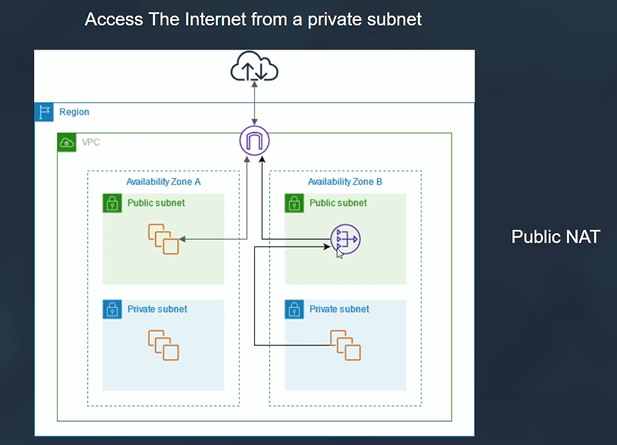
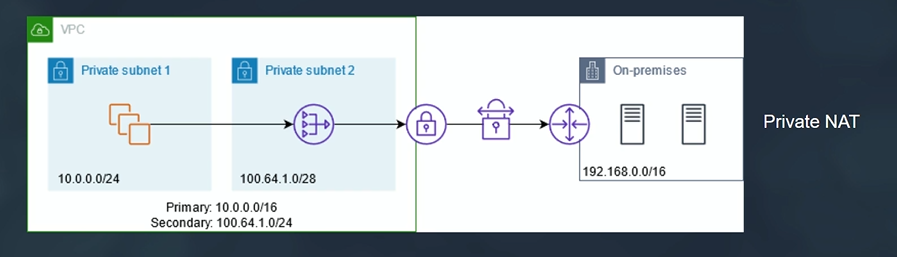
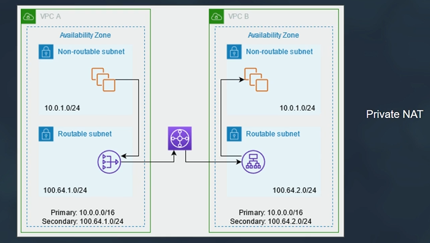
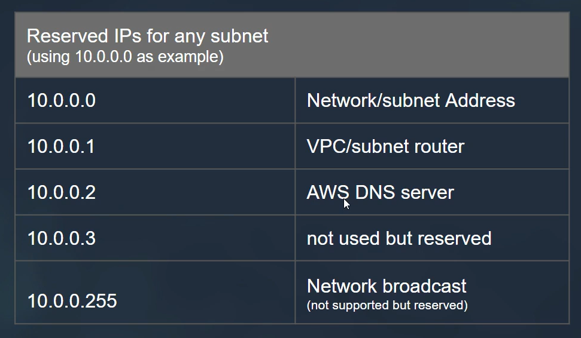
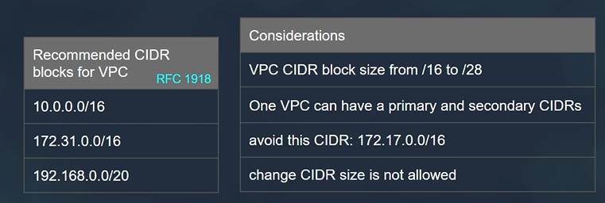
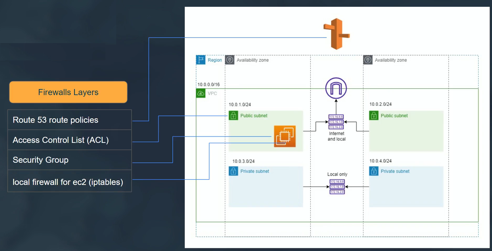
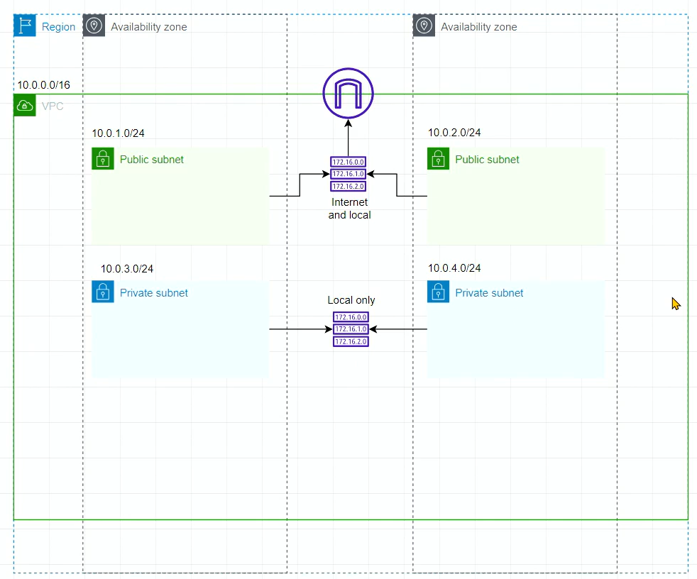

# Amazon Virtual Private Cloud (VPC)

Amazon Virtual Private Cloud (VPC) is a service offered by AWS that allows you to create a virtual network in the cloud, providing you with complete control over your network environment, including IP address range, subnets, route tables, and network gateways. VPC enables you to securely connect your AWS resources, such as EC2 instances, RDS databases, and Lambda functions, and control inbound and outbound network traffic.

## Features of Amazon VPC

- **Isolated Virtual Network**: VPC provides an isolated virtual network environment that allows you to launch AWS resources in a logically isolated section of the AWS cloud.
- **Custom IP Address Range**: You can define your own IP address range (CIDR block) for your VPC, allowing you to choose the IP addresses for your resources according to your network requirements.
- **Subnet Configuration**: VPC allows you to divide your IP address range into one or more subnets, each located in a different Availability Zone (AZ), providing high availability and fault tolerance for your resources.
- **Internet and VPN Connectivity**: VPC allows you to connect your VPC to the internet using an internet gateway (IGW) and establish secure connections to your on-premises network using virtual private gateways (VPGs) and VPN connections.
- **Security**: VPC provides security features such as security groups and network access control lists (NACLs) to control inbound and outbound traffic to and from your resources.
- **Elastic Network Interfaces (ENIs)**: VPC allows you to attach elastic network interfaces (ENIs) to your EC2 instances, enabling them to communicate with other resources in your VPC and connect to the internet or on-premises networks.

## Use Cases for Amazon VPC

- **Enterprise Applications**: VPC is suitable for hosting enterprise applications and databases in a secure and isolated network environment.
- **Web Hosting**: VPC allows you to host web applications and websites securely, with fine-grained control over inbound and outbound traffic.
- **Hybrid Cloud**: VPC enables you to extend your on-premises network to the cloud and seamlessly integrate AWS resources with your existing infrastructure.
- **Big Data Processing**: VPC is ideal for running big data processing and analytics workloads, providing high-performance network connectivity between data sources and processing engines.

## Conclusion

Amazon Virtual Private Cloud (VPC) is a powerful networking service offered by AWS that allows you to create a virtual network in the cloud with complete control over your network environment. By leveraging VPC, you can securely connect your AWS resources, control inbound and outbound traffic, and build scalable and resilient cloud architectures.

For more information, refer to the [AWS documentation on Amazon VPC](https://docs.aws.amazon.com/vpc/).


# Components of Amazon Virtual Private Cloud (VPC)

Amazon Virtual Private Cloud (VPC) consists of several key components that allow you to create a virtual network in the cloud and control the networking environment for your AWS resources. Here are the main components of VPC and how they work:


## 1. CIDR Block
- The CIDR (Classless Inter-Domain Routing) block is the IP address range that you specify for your VPC.
- It determines the range of IP addresses that can be assigned to resources within your VPC.
- We can expand the VPC address pool by addng up to 4 additional secondaru CIDR blocks.

## 2. Subnets
- Subnets are subdivisions of the CIDR block that you define within your VPC.
- Each subnet is associated with a specific Availability Zone (AZ) and can contain a range of IP addresses from the parent CIDR block.
- In the same VPC subnets can not be overlaping
- Subnets provide a way to organize and isolate resources within your VPC and enable high availability and fault tolerance by distributing resources across multiple AZs.

## 3. Implied Router
- An implied router, also known as the "local" router, is a default router that exists in every VPC.
- It is automatically created by the cloud provider when you create a VPC.
- The implied router handles local traffic within the VPC, directing traffic between subnets without the need for explicit configuration.
- It ensures that instances within the same VPC can communicate with each other using private IP addresses without the need for additional routing configuration.
  
## 4. Route Tables
- Route tables are used to define the routing rules for traffic within your VPC.
- Each subnet is associated with a route table, which determines how traffic is routed to and from resources within the subnet.
- Route tables contain entries that specify the destination CIDR blocks and the target (e.g., an internet gateway or virtual private gateway) for traffic destined for those CIDR blocks.

## 5. Internet Gateway (IGW)
- An internet gateway is a horizontally scaled, redundant, and highly available VPC component that allows communication between instances in your VPC and the internet.
- It provides a target for internet-bound traffic from resources within your VPC.
- To enable internet access for resources within your VPC, you attach an internet gateway to your VPC and update the route table to route traffic destined for the internet to the internet gateway.

## 6. Virtual Private Gateway (VGW)
- A virtual private gateway is a VPC component that represents the VPN (Virtual Private Network) endpoint on the AWS side of a VPN connection.
- It enables secure communication between your VPC and your on-premises network or other remote networks via VPN connections.

## 7. NAT Gateway
- A NAT (Network Address Translation) gateway is a managed service that allows instances within a private subnet to initiate outbound internet traffic while preventing inbound traffic from reaching those instances.
- Supports `TCP`, `UDP` and `ICMP`
- Bandwidth start from 5Gbps up to 100 Gbps
- 1M packet/sec up to 10M
- It enables instances within private subnets to access the internet for software updates, package downloads, and other external services.
  
- Also it can be used to access on-premises network.
  
- Enable communication between overlapping networks (private networks with the same CIDR)
  
  

## 8. Security Groups
- Security groups act as virtual firewalls for your instances, controlling inbound and outbound traffic at the instance level.
- You can specify rules in a security group to allow or deny traffic based on IP protocol, port number, and source or destination IP address.
- Each instance in your VPC is associated with one or more security groups, and you can modify the security group rules at any time.

## 9. Network Access Control Lists (NACLs)
- Network Access Control Lists (NACLs) act as stateless firewalls for controlling traffic at the subnet level.
- Unlike security groups, NACLs operate at the subnet level and evaluate traffic based on subnet-level rules.
- You can specify rules in a NACL to allow or deny traffic based on IP protocol, port number, and source or destination IP address.

## How It Works
- When you create a VPC, you define the CIDR block for the VPC and create subnets within that CIDR block.
- You configure route tables to determine how traffic is routed within the VPC, including routing traffic to the internet via internet gateways or to remote networks via virtual private gateways.
- You can use security groups to control inbound and outbound traffic at the instance level and NACLs to control traffic at the subnet level.
- By configuring these components, you can create a customized and secure networking environment for your AWS resources within your VPC.


# Amazon Virtual Private Cloud (VPC) Pricing

Amazon VPC offers a flexible and pay-as-you-go pricing model based on the resources and features you use. The pricing for VPC includes charges for various components and features such as the number of VPCs, the number of subnets, data transfer, NAT gateway usage, and VPN connections. Here are the key factors that determine the pricing for Amazon VPC:

## 1. VPC Creation
- There is no additional charge for creating a VPC in AWS. You can create multiple VPCs in your AWS account at no extra cost.

## 2. Subnets
- There is no additional charge for creating subnets within your VPC. You can create multiple subnets within each VPC to organize your resources.

## 3. Data Transfer
- Data transfer charges apply for traffic that flows in and out of your VPC, including traffic between your VPC and the internet, between VPCs in different AWS regions, and between your VPC and other AWS services.
- Data transfer pricing varies by region and depends on the amount of data transferred.

## 4. NAT Gateway
- NAT Gateway usage is charged per hour for each NAT gateway that you create in your VPC.
- Data processing charges also apply for data processed by NAT gateways.

## 5. VPN Connections
- VPN connections between your VPC and your on-premises network or other remote networks incur hourly charges based on the type of VPN connection (e.g., IPsec VPN or AWS Site-to-Site VPN).

## 6. Other Features
- Additional charges may apply for features such as AWS Direct Connect, VPC peering, VPC endpoint services, and other advanced networking features.

## Pricing Calculator
- You can use the AWS Pricing Calculator to estimate the cost of Amazon VPC based on your specific requirements and usage patterns.
- The pricing calculator allows you to customize various parameters such as the number of VPCs, subnets, data transfer volume, and other features to get an accurate cost estimate.

## Conclusion
Amazon VPC offers a flexible pricing model that allows you to pay only for the resources and features you use. By understanding the pricing factors and using the AWS Pricing Calculator, you can effectively manage and optimize the cost of your VPC deployment in AWS.

For detailed pricing information, refer to the [AWS Pricing page](https://aws.amazon.com/pricing/).

# Designing an Amazon Virtual Private Cloud (VPC)

Designing an Amazon Virtual Private Cloud (VPC) involves several key steps to create a secure, scalable, and efficient network infrastructure for your AWS resources. Here's a guide on how to design a VPC:

## 1. Define Requirements
- Identify the requirements for your VPC, including the number of resources, traffic patterns, security requirements, and connectivity options.
- Consider factors such as scalability, fault tolerance, compliance, and performance when defining your requirements.

## 2. Plan IP Addressing
- Determine the IP address range (CIDR block) for your VPC based on the number of resources and subnets you need.
- Allocate IP address ranges for each subnet within your VPC, considering factors such as scalability, segregation, and future growth.

## 3. Design Subnets
- Divide your VPC's IP address range into subnets based on your requirements for isolation, availability, and scalability.
- Create public subnets for resources that require direct internet access and private subnets for internal resources that should not be directly accessible from the internet.

## 4. Configure Routing
- Design and configure route tables to control the routing of traffic within your VPC and between your VPC and external networks.
- Configure internet gateways (IGWs) for internet access, virtual private gateways (VGWs) for VPN connectivity, and route propagation for seamless routing.

## 5. Implement Security
- Design security groups and network access control lists (NACLs) to control inbound and outbound traffic to and from your resources within the VPC.
- Define security policies and enforce least privilege principles to ensure a secure network environment.

## 6. Enable Connectivity
- Configure connectivity options such as VPN connections, AWS Direct Connect, VPC peering, and AWS Transit Gateway to connect your VPC to on-premises networks and other AWS resources.
- Ensure secure and reliable connectivity between your VPC and external networks.

## 7. Monitor and Manage
- Implement monitoring and logging solutions to track the performance, availability, and security of your VPC and its resources.
- Use AWS CloudWatch, VPC Flow Logs, and other monitoring tools to gain visibility into network traffic and resource usage.

## Conclusion
Designing an Amazon Virtual Private Cloud (VPC) involves careful planning and consideration of various factors such as IP addressing, subnetting, routing, security, and connectivity. By following the steps outlined above, you can create a well-designed VPC that meets your specific requirements for security, scalability, and performance.

For more information, refer to the [AWS documentation on Amazon VPC](https://docs.aws.amazon.com/vpc/).

# VPC Subnet Design

When designing subnets within an Amazon Virtual Private Cloud (VPC), it's essential to consider factors such as scalability, availability, security, and routing requirements. A well-designed subnet layout ensures efficient resource utilization and seamless communication between resources while adhering to best practices for network architecture.

## 1. Define Subnet Requirements

Before designing subnets, define the requirements for your VPC, including the number of resources, traffic patterns, and security requirements. Consider factors such as public-facing applications, backend services, databases, and internal services that require isolation.

## 2. Determine IP Addressing Scheme

Define the IP addressing scheme for your VPC subnet layout. Choose a CIDR block for your VPC that provides sufficient IP addresses for your resources while allowing for future growth. Divide the CIDR block into smaller subnets based on your requirements and traffic patterns.

## 3. Create Subnets

Create subnets within your VPC based on the defined IP addressing scheme. Divide the CIDR block into subnets of appropriate sizes to accommodate different types of resources. Consider creating separate subnets for public-facing resources, backend services, databases, and internal resources.

## 4. Assign Subnet Types

Assign appropriate types to each subnet based on its purpose and requirements. Common subnet types include:
- **Public Subnets**: Subnets with direct internet access for public-facing resources such as web servers or load balancers.
- **Private Subnets**: Subnets without direct internet access for backend services, databases, or internal resources.
- **DMZ Subnets**: Demilitarized zones (DMZ) for hosting publicly accessible resources while maintaining security.

## 5. Configure Routing and Security

Configure routing tables and security groups to control inbound and outbound traffic to and from the subnets. Use route tables to define routes between subnets and to the internet gateway (IGW) for public subnets. Configure security groups to enforce security policies and control access between resources within and outside the subnets.

## Example Subnet Layout

Here's an example subnet layout for a VPC with a CIDR block of 10.0.0.0/16:

- **Public Subnets**:
  - Subnet 1: 10.0.1.0/24
  - Subnet 2: 10.0.2.0/24

- **Private Subnets**:
  - Subnet 3: 10.0.3.0/24
  - Subnet 4: 10.0.4.0/24

- **DMZ Subnets**:
  - Subnet 5: 10.0.5.0/24



## Conclusion

Designing a VPC subnet layout involves careful planning and consideration of various factors such as IP addressing, subnet types, routing, and security requirements. By following best practices and adhering to your specific requirements, you can create an efficient and secure subnet layout for your Amazon VPC.

For more information, refer to the [AWS documentation on Amazon VPC](https://docs.aws.amazon.com/vpc/).


# CIDR (Classless Inter-Domain Routing)

CIDR, which stands for Classless Inter-Domain Routing, is a method used to allocate and specify IP addresses and IP address ranges. CIDR notation is used to represent IP address ranges using a combination of an IP address and a suffix indicating the number of bits in the network portion of the address. CIDR notation is commonly used in networking and routing configurations to define subnets and IP address ranges.

## Format

CIDR notation consists of an IP address followed by a forward slash (/) and a number indicating the size of the network prefix or subnet mask. For example, the CIDR notation "192.0.2.0/24" represents the IP address range from 192.0.2.0 to 192.0.2.255, where the first 24 bits (3 bytes) represent the network portion of the address, and the remaining 8 bits represent the host portion.

## Prefix Length

The number following the forward slash (/) in CIDR notation represents the number of bits in the network prefix or subnet mask. This number is also known as the prefix length. The prefix length determines the size of the network and the number of available IP addresses. For example, a prefix length of 24 (as in "192.0.2.0/24") corresponds to a subnet mask of 255.255.255.0 and allows for 256 IP addresses (2^8) in the subnet.

## CIDR Blocks

CIDR blocks are contiguous ranges of IP addresses represented in CIDR notation. CIDR blocks are commonly used to define IP address ranges for networks, subnets, and routing configurations. For example, the CIDR block "192.0.2.0/24" represents the range of IP addresses from 192.0.2.0 to 192.0.2.255.

## Subnetting

CIDR notation is used in subnetting to divide a larger IP address range into smaller, more manageable subnets. Subnetting allows for efficient use of IP addresses and better organization of network resources. CIDR notation is used to represent both the larger network and the individual subnets within it.

## Conclusion

CIDR (Classless Inter-Domain Routing) notation is a standard method used to represent IP address ranges and subnets in networking and routing configurations. By using CIDR notation, network administrators can efficiently allocate and manage IP addresses and define network boundaries and subnets.

For more information, refer to the [CIDR Wikipedia page](https://en.wikipedia.org/wiki/Classless_Inter-Domain_Routing).


# VPC CIDR Blocks

A CIDR (Classless Inter-Domain Routing) block is a range of IP addresses that define the address space for your Amazon Virtual Private Cloud (VPC). When creating a VPC, you must specify a CIDR block, which determines the range of IP addresses available for resources within the VPC. Here's a guide on VPC CIDR blocks:

## CIDR Notation

CIDR notation is used to represent IP address ranges in a compact format. It consists of an IP address followed by a forward slash (/) and a number indicating the number of bits in the network prefix. For example, "10.0.0.0/16" represents the CIDR block with the IP address range from 10.0.0.0 to 10.0.255.255, where the first 16 bits represent the network portion of the address.

## Choosing CIDR Blocks

When choosing a CIDR block for your VPC, consider the following factors:
- **Size**: Choose a CIDR block that provides enough IP addresses for your resources while allowing for future growth.
- **Isolation**: Divide the CIDR block into smaller subnets to isolate different types of resources and control traffic flow.
- **Overlap**: Avoid overlapping CIDR blocks with existing networks to prevent conflicts and ensure seamless connectivity.

## Reserved CIDR Blocks

Some CIDR blocks are reserved by AWS and cannot be used for VPCs. These reserved CIDR blocks include:
- **10.0.0.0/8**: The entire 10.0.0.0/8 CIDR block is reserved for private use and cannot be used for VPCs.
- **100.64.0.0/10**: The 100.64.0.0/10 CIDR block is reserved for carrier-grade NAT (CGN) and cannot be used for VPCs.

## Example CIDR Blocks

Here are some example CIDR blocks commonly used for VPCs:
- **10.0.0.0/16**: Provides 65,536 IP addresses for resources within the VPC.
- **172.16.0.0/16**: Provides 65,536 IP addresses for resources within the VPC.
- **192.168.0.0/16**: Provides 65,536 IP addresses for resources within the VPC.



## Conclusion

Choosing the right CIDR block is essential when creating a VPC, as it determines the range of IP addresses available for your resources. By considering factors such as size, isolation, and reserved blocks, you can select a CIDR block that meets your specific requirements for your Amazon VPC.

For more information, refer to the [AWS documentation on Amazon VPC CIDR Blocks](https://docs.aws.amazon.com/vpc/latest/userguide/VPC_Subnets.html).

# VPC NAT Gateway

A NAT Gateway allows resources within a private subnet of an Amazon Virtual Private Cloud (VPC) to initiate outbound internet traffic while preventing inbound traffic from reaching those resources directly. NAT Gateways are commonly used to enable outbound internet access for instances in private subnets, such as instances running in a private subnet of a multi-tier application architecture.


## Purpose
The primary purpose of a NAT Gateway is to facilitate outbound internet communication for resources within private subnets of a VPC. It acts as a gateway for instances in private subnets to access the internet while keeping them hidden from incoming traffic initiated from the internet.

## Features
- **Outbound Traffic**: NAT Gateways allow instances in private subnets to initiate outbound traffic to the internet.
- **Managed Service**: NAT Gateways are managed by AWS and provide high availability and scalability.
- **Elastic IP**: Each NAT Gateway is associated with an Elastic IP (EIP) address, which provides a static public IP address for outbound traffic.

## Use Cases
- **Internet Access**: Enable instances in private subnets to access the internet for software updates, package downloads, and other external resources.
- **Public-facing Services**: Allow instances in private subnets to communicate with external services or APIs hosted on the internet.

## Considerations
- **Cost**: NAT Gateways incur costs based on data processing and data transfer rates.
- **Availability**: NAT Gateways operate in a single Availability Zone and require redundancy for high availability.

## Creating a NAT Gateway
To create a NAT Gateway:
1. Navigate to the VPC dashboard in the AWS Management Console.
2. Select "NAT Gateways" from the navigation pane.
3. Click on "Create NAT Gateway" and follow the on-screen instructions.
4. Specify the subnet and Elastic IP (EIP) for the NAT Gateway.
5. Review the configuration and click on "Create NAT Gateway" to create it.
6. You can now add it to a `route table`

## Conclusion
A NAT Gateway is a crucial component in enabling outbound internet access for instances in private subnets of a VPC. By deploying a NAT Gateway, you can ensure secure and controlled outbound communication while maintaining the isolation of resources in private subnets.

For more information, refer to the [AWS documentation on NAT Gateways](https://docs.aws.amazon.com/vpc/latest/userguide/vpc-nat-gateway.html).

# NAT Instance 

A Network Address Translation (NAT) instance in AWS Virtual Private Cloud (VPC) is a type of EC2 instance that enables instances in a private subnet to initiate outbound traffic to the internet while preventing inbound traffic from the internet. NAT instances act as intermediaries between instances in private subnets and the internet, allowing them to access resources such as software updates, patches, and external services.


## How NAT Instances Work

- **Outbound Traffic**: Instances in private subnets send outbound traffic to the NAT instance. The NAT instance then translates the source IP address of the outbound traffic to its own public IP address and forwards the traffic to the internet.
- **Inbound Traffic**: Inbound traffic from the internet is not permitted to reach instances in private subnets directly. This helps improve security by preventing direct access to instances in private subnets from external sources.

## Key Features and Considerations

- **EC2 Instance Type**: NAT instances are regular EC2 instances that run specialized Amazon Machine Images (AMIs) optimized for NAT functionality.
- **Elastic IP Address**: NAT instances require an Elastic IP (EIP) address to provide a static public IP address for outbound traffic.
- **High Availability**: To ensure high availability, it's recommended to deploy NAT instances across multiple Availability Zones within a region.
- **Network Performance**: NAT instances have network performance limitations compared to NAT gateways, especially for high-throughput workloads.
- **Security Groups and Routing**: NAT instances require proper configuration of security groups and route tables to allow outbound traffic and enable communication between instances and the NAT instance.

## Benefits of Using NAT Instances

- **Outbound Internet Access**: NAT instances enable instances in private subnets to access the internet for software updates, patching, and accessing external services.
- **Security**: By acting as intermediaries, NAT instances provide an additional layer of security by preventing direct inbound access to instances in private subnets from the internet.
- **Customization and Control**: NAT instances offer flexibility and control over configuration settings, allowing for customizations based on specific requirements.

## Limitations and Considerations

- **Scaling and Performance**: NAT instances have limited scalability and network performance compared to NAT gateways, which may impact performance for high-throughput workloads.
- **Management Overhead**: Managing and maintaining NAT instances requires additional effort compared to managed services like NAT gateways.
- **Cost**: While NAT instances may have lower hourly rates compared to NAT gateways, additional costs may be incurred for data transfer and Elastic IP addresses.

## NAT Instance Source/Destination Check

In Amazon Web Services (AWS), NAT instances are often used in Virtual Private Clouds (VPCs) to allow instances in private subnets to access the internet while remaining private and secure. One important aspect of configuring NAT instances is managing their source/destination check.

### Source/Destination Check

By default, source/destination check is enabled for EC2 instances in AWS. This means that the instance must perform source/destination checks on all packets that it sends and receives. If a packet's source or destination IP address doesn't match the instance's network interfaces, the packet is dropped.

### NAT Instance Configuration

For NAT instances, source/destination check must be disabled to allow them to function correctly as gateways for outbound internet traffic from private subnets. When source/destination check is disabled, the NAT instance forwards traffic from private instances to the internet without performing source/destination checks.

### Disabling Source/Destination Check

To disable source/destination check for a NAT instance:

1. Navigate to the AWS Management Console and locate the NAT instance.
2. Select the instance and choose "Actions" > "Networking" > "Change Source/Dest. Check".
3. Disable source/destination check for the instance.

### Considerations

- **Security**: Disabling source/destination check for a NAT instance opens it up to potentially malicious traffic. Ensure that appropriate security groups and network ACLs are in place to restrict access to the instance.
- **Functionality**: Disabling source/destination check is essential for NAT instances to function correctly. Failure to do so will result in dropped packets and connectivity issues for instances in private subnets.


## Conclusion

NAT instances provide a cost-effective solution for enabling outbound internet access from instances in private subnets within an AWS VPC while offering flexibility and control over configuration settings. However, organizations should consider the limitations and performance considerations when choosing between NAT instances and managed services like NAT gateways for their specific use cases.


# Nat Instance vs Nat Gateway

| Feature            | NAT Instance                          | NAT Gateway                           |
|--------------------|---------------------------------------|---------------------------------------|
| **Service Type**   | EC2 Instance running NAT AMI          | Managed AWS Service                   |
| **Availability**   | Single instance per Availability Zone | Redundant across multiple AZs         |
| **Performance**    | Limited by instance type               | Scales automatically, higher throughput up to 45 Gbps|
| **High Availability** | Manual setup across AZs            | Built-in redundancy, no manual setup  |
| **Elastic IP (EIP)**| Requires EIP                          | Automatically assigned  or EIP              |
| **Scaling**        | Manual scaling                        | Auto-scales based on traffic          |
| **Maintenance**    | Requires regular maintenance          | Fully managed, no maintenance required|
| **Cost**           | Lower hourly rate, additional costs for data transfer and EIPs | Higher hourly rate, no additional costs |
| **Use Cases**      | Small-scale deployments, cost-sensitive scenarios | High-throughput workloads, critical production environments |
| **Security Groups** | Yes  | No |
| **NACLs** | Yes  | Yes |


# NAT Gateway AZ-Independent Architecture for High Availability

AWS NAT Gateway offers a highly available architecture that is designed to be AZ-independent, providing redundancy and resilience against failures in a single Availability Zone (AZ). This architecture ensures continuous availability of outbound internet traffic from private subnets within an AWS Virtual Private Cloud (VPC).


## Architecture Overview

- **Multiple NAT Gateways**: NAT Gateways are deployed across multiple AZs within a region to ensure redundancy and high availability. Each NAT Gateway is associated with a specific AZ but is capable of handling traffic from multiple subnets across different AZs.
  
- **Elastic IP (EIP) Allocation**: Each NAT Gateway is automatically assigned one or more Elastic IPs (EIPs) to provide static public IP addresses for outbound internet traffic. These EIPs are associated with the NAT Gateway's network interfaces, enabling seamless failover in case of AZ failures.

- **AZ Failover**: In the event of an AZ failure, traffic from affected subnets is automatically rerouted to the available NAT Gateways in other AZs. This AZ-independent architecture ensures continuous availability of outbound traffic without manual intervention.

- **Traffic Distribution**: AWS automatically distributes outbound traffic across multiple NAT Gateways based on subnet routing configurations. This helps distribute the load evenly and ensures optimal performance and scalability.

- **Managed Service**: NAT Gateway is a fully managed service provided by AWS, which handles all aspects of deployment, scaling, and maintenance. AWS automatically monitors the health and availability of NAT Gateways and handles failover scenarios transparently.

## Benefits

- **High Availability**: AZ-independent architecture ensures continuous availability of outbound internet traffic even in the event of AZ failures.
  
- **Scalability**: NAT Gateway automatically scales to accommodate increased traffic demands, ensuring optimal performance and reliability.

- **Simplicity**: Fully managed service eliminates the need for manual intervention and maintenance, reducing operational overhead.

- **Redundancy**: Deployment across multiple AZs provides built-in redundancy and resilience against single AZ failures, enhancing overall reliability.

## Considerations

- **Cost**: While NAT Gateway offers high availability and scalability, it is a paid service, and costs may vary based on usage and traffic volume.

- **Data Transfer Costs**: Data transfer costs may apply for outbound traffic, especially when traffic crosses AZ boundaries or regions.

- **Configuration**: Proper configuration of subnet route tables is essential to ensure traffic is routed correctly to the NAT Gateways in different AZs.

## Conclusion

NAT Gateway's AZ-independent architecture for high availability provides a robust and resilient solution for handling outbound internet traffic from private subnets within AWS VPCs. By leveraging multiple NAT Gateways across multiple AZs, organizations can ensure continuous availability and optimal performance for their applications and services.


# VPC Firewall Layers

Firewall layers in an Amazon Virtual Private Cloud (VPC) provide security measures to control inbound and outbound traffic to and from resources within the VPC. These firewall layers include Network Access Control Lists (NACLs) and Security Groups, which work together to enforce network security policies and protect resources from unauthorized access.


## Network Access Control Lists (NACLs)

Network Access Control Lists (NACLs) are stateless packet filters that operate at the subnet level within a VPC. NACLs allow you to control traffic entering and exiting subnets based on IP addresses, ports, and protocols. Key features of NACLs include:

- **Allow/Deny Rules**: NACLs have numbered rules that determine whether to allow or deny traffic based on source and destination IP addresses, ports, and protocols.
- **Stateless**: Unlike Security Groups, NACLs are stateless, meaning they do not track the state of connections. Each inbound and outbound rule must be explicitly defined.
- **Ordered Rules**: NACL rules are evaluated in numerical order, with lower-numbered rules taking precedence over higher-numbered rules.

## Security Groups

Security Groups are stateful firewalls that control traffic at the instance level within a VPC. Security Groups act as virtual firewalls for instances and provide granular control over inbound and outbound traffic based on security group rules. Key features of Security Groups include:

- **Stateful Inspection**: Security Groups automatically track the state of connections, allowing return traffic for established connections without the need for explicit rules.
- **Instance Level**: Security Groups are associated with instances and control traffic at the instance level, applying rules to inbound and outbound traffic based on security group membership.
- **Dynamic Updates**: Security Group rules can be dynamically updated to allow or deny traffic based on changing security requirements.

## Firewall Layers in Action

When traffic enters a VPC, it first encounters the Network Access Control List (NACL) associated with the subnet. The NACL evaluates the inbound traffic based on its rules and either allows or denies the traffic. If the traffic is allowed, it proceeds to the associated instances within the subnet.

Once the traffic reaches the instances, it is further filtered by the Security Groups associated with the instances. Security Groups enforce additional security policies at the instance level, controlling inbound and outbound traffic based on their rules.

## Conclusion

Firewall layers, including Network Access Control Lists (NACLs) and Security Groups, provide essential security measures to control inbound and outbound traffic within an Amazon Virtual Private Cloud (VPC). By leveraging these firewall layers, you can enforce network security policies and protect resources from unauthorized access.

For more information, refer to the [AWS documentation on VPC Security](https://docs.aws.amazon.com/vpc/latest/userguide/VPC_Security.html).


# VPC Security Groups

VPC Security Groups are virtual firewalls that control inbound and outbound traffic at the instance level within an Amazon Virtual Private Cloud (VPC). Security Groups act as the first line of defense for instances, allowing you to define rules that dictate which traffic is allowed or denied based on specified criteria. Here's an overview of VPC Security Groups:

## Key Features

- **Stateful Filtering**: Security Groups are stateful, meaning they automatically track the state of connections and allow return traffic for established connections without the need for explicit rules.
- **Instance-Level Protection**: Security Groups are associated with instances, allowing you to define granular security policies at the instance level.
- **Dynamic Updates**: Security Group rules can be dynamically updated to allow or deny traffic based on changing security requirements.
- **Default Deny All**: By default, Security Groups deny all inbound and outbound traffic until explicitly configured rules are added.
- **Layered Security**: Security Groups complement other VPC security measures such as Network Access Control Lists (NACLs) by providing additional instance-level protection.

## Inbound and Outbound Rules

- **Inbound Rules**: Inbound rules define the traffic allowed to reach instances. You can specify rules based on protocols, ports, and IP addresses of the source.
- **Outbound Rules**: Outbound rules define the traffic allowed to leave instances. You can specify rules based on protocols, ports, and IP addresses of the destination.

## Sources

- **IP Addresses**: You can specify individual IP addresses or ranges of IP addresses (CIDR blocks) as the source of inbound or outbound traffic.
- **Security Group References**: You can reference other Security Groups as the source of inbound traffic. This allows you to allow traffic from instances associated with specific Security Groups.
- **EC2 Classic Link**: If your VPC is linked to an EC2-Classic instance using ClassicLink, you can specify the ID of the EC2-Classic instance as the source of inbound traffic.

## Destinations

- **IP Addresses**: Similar to sources, you can specify individual IP addresses or ranges of IP addresses (CIDR blocks) as the destination of outbound traffic.
- **Security Group References**: You can reference other Security Groups as the destination of outbound traffic. This allows you to allow traffic to instances associated with specific Security Groups.
- **Prefix Lists**: You can reference AWS-managed or custom prefix lists as the destination of outbound traffic. Prefix lists provide a way to specify multiple CIDR blocks as a single rule.

## Example Rules

- **Allow SSH Access**: To allow SSH access to instances in a Security Group, you can create an inbound rule that allows traffic from the source IP address range 0.0.0.0/0 (anywhere) on port 22 (SSH).
- **Allow Web Traffic**: To allow web traffic to instances in a Security Group, you can create an inbound rule that allows traffic from the source IP address range 0.0.0.0/0 (anywhere) on port 80 (HTTP) or port 443 (HTTPS).

## Use Cases

- **Access Control**: Security Groups allow you to control access to instances by defining specific rules for inbound and outbound traffic.
- **Defense in Depth**: Security Groups provide an additional layer of defense by enforcing security policies at the instance level.
- **Micro-Segmentation**: Security Groups enable micro-segmentation by allowing you to create distinct security policies for different types of instances within a VPC.

## Best Practices

- **Least Privilege**: Follow the principle of least privilege by only allowing necessary traffic and restricting unnecessary access.
- **Regular Review**: Regularly review and update Security Group rules to align with changing security requirements.
- **Logging and Monitoring**: Enable logging and monitoring of Security Group activity to detect and respond to potential security incidents.

## Conclusion

VPC Security Groups are essential for enforcing security policies and controlling traffic at the instance level within an Amazon Virtual Private Cloud (VPC). By defining granular rules for inbound and outbound traffic, Security Groups help protect instances from unauthorized access and ensure a secure computing environment.

For more information, refer to the [AWS documentation on VPC Security Groups](https://docs.aws.amazon.com/vpc/latest/userguide/VPC_SecurityGroups.html).

# VPC Network Access Control Lists (NACLs)

VPC Network Access Control Lists (NACLs) are stateless firewall-like rules that control traffic entering and exiting subnets within an Amazon Virtual Private Cloud (VPC). NACLs provide an additional layer of security by allowing you to define rules that explicitly allow or deny traffic based on IP addresses, ports, and protocols. Here's an overview of VPC NACLs:

## Key Features

- **Stateless Filtering**: NACLs operate at the subnet level and are stateless, meaning they do not track the state of connections. Each inbound and outbound rule must be explicitly defined.
- **Numbered Rules**: NACLs have numbered rules that determine the order in which they are evaluated. Lower-numbered rules take precedence over higher-numbered rules.
- **Ingress and Egress Rules**: NACLs have separate sets of rules for inbound and outbound traffic, allowing you to control traffic entering and exiting subnets independently.

## Inbound and Outbound Rules

- **Inbound Rules**: Inbound rules define the traffic allowed to enter the subnet from external sources. You can specify rules based on protocols, ports, and IP addresses of the source.
- **Outbound Rules**: Outbound rules define the traffic allowed to leave the subnet and reach external destinations. You can specify rules based on protocols, ports, and IP addresses of the destination.

## Use Cases

- **Traffic Control**: NACLs allow you to control the flow of traffic entering and exiting subnets, providing an additional layer of security for resources within the VPC.
- **Subnet Isolation**: NACLs enable you to isolate subnets by defining specific rules for inbound and outbound traffic, restricting access to resources within the subnet.
- **Defense in Depth**: NACLs complement other VPC security measures such as Security Groups by providing an additional layer of defense against unauthorized access.

## Best Practices

- **Default Deny All**: Start with a default "deny all" rule and only allow necessary traffic by adding explicit allow rules.
- **Regular Review**: Regularly review and update NACL rules to align with changing security requirements and traffic patterns.
- **Logging and Monitoring**: Enable logging and monitoring of NACL activity to detect and respond to potential security incidents.

## Conclusion

VPC Network Access Control Lists (NACLs) are essential for controlling traffic entering and exiting subnets within an Amazon Virtual Private Cloud (VPC). By defining granular rules for inbound and outbound traffic, NACLs help enforce security policies and protect resources from unauthorized access.

For more information, refer to the [AWS documentation on VPC Network ACLs](https://docs.aws.amazon.com/vpc/latest/userguide/vpc-network-acls.html).

# VPC Implied Router

In Amazon Virtual Private Cloud (VPC), the implied router is a fundamental component that facilitates communication between subnets within the VPC and between the VPC and other network resources. The implied router is automatically created when you create a VPC and plays a crucial role in routing traffic between subnets and managing network connectivity. Here's an overview of the VPC implied router:

## Key Functions

- **Subnet Routing**: The implied router manages routing tables for each subnet within the VPC, enabling communication between instances in different subnets.
- **Internet Gateway Integration**: The implied router integrates with Internet Gateways (IGWs) to facilitate internet connectivity for instances in public subnets, allowing outbound traffic to reach the internet and inbound traffic to reach instances from the internet.
- **VPC Peering and VPN Connections**: The implied router manages routing between VPCs in a VPC peering connection and VPN connections, enabling private communication between connected VPCs and on-premises networks.
- **Route Table Management**: The implied router maintains route tables that define how traffic is routed within the VPC and to external destinations, ensuring efficient and secure routing of network traffic.

## Subnet Routing

- **Intra-VPC Communication**: The implied router enables communication between instances in different subnets within the same VPC by routing traffic internally based on subnet associations and routing table configurations.
- **Inter-VPC Communication**: For VPC peering connections and VPN connections, the implied router facilitates communication between instances in different VPCs and on-premises networks by managing route tables and forwarding traffic appropriately.

## Internet Connectivity

- **Public Subnets**: Instances in public subnets with a route to an Internet Gateway (IGW) can communicate with the internet, while instances in private subnets rely on Network Address Translation (NAT) gateways or instances in public subnets acting as NAT gateways to access the internet.
- **Egress and Ingress Traffic**: The implied router ensures that outbound traffic from instances in public subnets is routed to the internet and that inbound traffic from the internet reaches instances based on their associated public IP addresses and routing configurations.

## Conclusion

The VPC implied router is a critical component of Amazon Virtual Private Cloud (VPC) networking that facilitates communication between subnets within the VPC and with external network resources. By managing routing tables, integrating with Internet Gateways (IGWs), and facilitating VPC peering and VPN connections, the implied router enables secure and efficient network connectivity within the VPC environment.

For more information, refer to the [AWS documentation on VPC Networking](https://docs.aws.amazon.com/vpc/latest/userguide/what-is-amazon-vpc.html).


# VPC Peering in AWS

VPC peering is a networking connection between two Virtual Private Clouds (VPCs) that enables communication between instances in the peered VPCs using private IP addresses. It allows resources within the peered VPCs to communicate with each other as if they were part of the same network, without the need for internet access.

## How VPC Peering Works

- **Peer VPCs**: VPC peering connects two VPCs within the same AWS region or across different AWS regions.
  
- **Private Connectivity**: VPC peering establishes a private network connection between the instances in the peered VPCs, enabling them to communicate using private IP addresses.

- **Security**: VPC peering operates at the network level and does not involve internet gateways, VPN connections, or direct connect gateways. It provides secure communication between VPCs without exposing traffic to the internet.

- **Transitive Routing**: VPC peering does not support transitive routing. This means that if VPC A is peered with VPC B and VPC B is peered with VPC C, instances in VPC A cannot communicate directly with instances in VPC C through the peering connection.

## Key Features and Benefits

- **Simplified Networking**: VPC peering simplifies networking by allowing communication between VPCs using private IP addresses, eliminating the need for complex routing configurations.

- **Resource Sharing**: VPC peering enables resource sharing between VPCs, such as databases, applications, and services, without exposing them to the public internet.

- **Cost-Effective**: VPC peering is a cost-effective solution for connecting VPCs within the same AWS region or across different AWS regions, as it does not incur additional data transfer costs.

- **Cross-Account Peering**: VPC peering supports peering between VPCs in different AWS accounts, allowing organizations to securely connect VPCs across multiple accounts.

## VPC Peering Limitations

VPC peering is a powerful feature in AWS that enables private connectivity between VPCs within the same AWS region or across different AWS regions. However, it's important to be aware of certain limitations when using VPC peering:

### 1. Cross-Region Peering

- **Limitation**: VPC peering is limited to VPCs within the same AWS region. Cross-region VPC peering is not supported.
- **Consideration**: Organizations requiring connectivity between VPCs in different AWS regions must use alternative solutions such as VPC peering combined with AWS Global Accelerator or AWS Transit Gateway.

### 2. Transitive Routing

- **Limitation**: VPC peering does not support transitive routing. This means that if VPC A is peered with VPC B and VPC B is peered with VPC C, instances in VPC A cannot communicate directly with instances in VPC C through the peering connection.
- **Consideration**: Organizations must plan their network architecture carefully and avoid relying on transitive routing when using VPC peering.

### 3. Overlapping CIDR Blocks

- **Limitation**: The CIDR blocks of the peered VPCs cannot overlap. If the CIDR blocks overlap, VPC peering cannot be established.
- **Consideration**: Organizations must ensure that the CIDR blocks of the peered VPCs are unique and do not conflict with each other.

### 4. Maximum Peering Connections

- **Limitation**: Each VPC has a limit on the number of active VPC peering connections it can have. The default limit is 125 peering connections per VPC.
- **Consideration**: Organizations with a large number of VPCs may need to request a limit increase from AWS Support if they require more than the default limit.

### 5. Route Table Configuration

- **Limitation**: Proper configuration of route tables is essential for enabling traffic between instances in the peered VPCs. Incorrect route table configuration can lead to connectivity issues.
- **Consideration**: Organizations must ensure that the route tables in each VPC are updated to route traffic to the peering connection.


## Conclusion

VPC peering is a powerful networking feature in AWS that allows organizations to securely connect VPCs and enable communication between instances using private IP addresses. By understanding how VPC peering works and considering its features and considerations, organizations can leverage VPC peering to build scalable and secure network architectures in the AWS cloud.


# AWS Transit Gateway

AWS Transit Gateway is a fully managed service that enables organizations to connect thousands of VPCs, on-premises networks, and VPN connections within a single gateway. It simplifies network connectivity and management by acting as a central hub for routing traffic between different networks.


## Key Features

- **Centralized Hub**: AWS Transit Gateway serves as a centralized hub for connecting multiple VPCs, on-premises data centers, and remote networks.

- **Scalability**: It supports up to 5,000 VPC attachments per Transit Gateway, allowing organizations to scale their network infrastructure as needed.

- **Transitive Routing**: Transit Gateway supports transitive routing, allowing traffic to flow between attached networks without the need for complex peering arrangements.

- **Route Propagation**: Transit Gateway automatically propagates routes between attached networks, simplifying route management and ensuring consistent routing across the network.

- **VPN Integration**: It seamlessly integrates with AWS VPN to provide secure connectivity between on-premises networks and the AWS cloud.

- **Monitoring and Management**: AWS provides monitoring and management tools, such as Amazon CloudWatch and AWS Management Console, to monitor and manage Transit Gateway performance and configuration.

## Benefits

- **Simplified Connectivity**: AWS Transit Gateway simplifies network connectivity by providing a centralized hub for routing traffic between multiple VPCs and on-premises networks.

- **Improved Scalability**: It supports a large number of VPC attachments, allowing organizations to scale their network infrastructure as their business grows.

- **Reduced Complexity**: Transit Gateway eliminates the need for complex peering arrangements and simplifies route management, reducing network complexity.

- **Enhanced Security**: By centralizing network traffic through Transit Gateway, organizations can implement consistent security policies and controls across their network infrastructure.

## Use Cases

- **Hub and Spoke Architecture**: Transit Gateway is commonly used to implement hub and spoke architectures, where a central hub (Transit Gateway) connects multiple VPCs and on-premises networks.

- **Hybrid Cloud Connectivity**: It facilitates secure connectivity between on-premises data centers and AWS cloud environments, enabling organizations to build hybrid cloud architectures.

- **Multi-account VPC Connectivity**: Transit Gateway enables connectivity between VPCs in different AWS accounts, providing a centralized network hub for multi-account architectures.

- **Global Network Connectivity**: Organizations with geographically distributed networks can use Transit Gateway to centrally manage network connectivity across regions.

## Considerations

- **Cost**: AWS Transit Gateway is priced based on the number of attachments and data transfer volume, so organizations should consider the cost implications of scaling their network infrastructure.

- **Architecture Design**: Proper architecture design is essential to ensure optimal performance and scalability when deploying AWS Transit Gateway in complex network environments.

- **Security**: Organizations should implement appropriate security controls, such as network access controls and encryption, to secure traffic flowing through Transit Gateway.

## Conclusion

AWS Transit Gateway is a powerful networking service that simplifies network connectivity and management in AWS cloud environments. By providing a centralized hub for routing traffic between VPCs, on-premises networks, and VPN connections, Transit Gateway enables organizations to build scalable, secure, and highly available network architectures.


# VPC Endpoints 

VPC endpoints enable private connectivity between your VPC and supported AWS services without requiring internet gateway, NAT device, VPN connection, or AWS Direct Connect connection. This allows you to access AWS services privately from within your VPC, improving security and minimizing exposure to the public internet.

## Key Features

- **Private Connectivity**: VPC endpoints allow you to access AWS services privately from your VPC, eliminating the need for public IP addresses and internet access.

- **Secure Communication**: All traffic between your VPC and the supported AWS service travels over the AWS global network, ensuring secure and reliable communication.

- **Reduced Data Transfer Costs**: Since traffic between your VPC and the AWS service stays within the AWS network, you can avoid data transfer costs associated with internet-based communication.

- **Simplified Network Configuration**: VPC endpoints eliminate the need for complex networking configurations such as VPNs or NAT gateways, simplifying network architecture and management.

- **High Availability**: VPC endpoints are redundant and highly available, providing reliable access to AWS services within your VPC.

## Types of VPC Endpoints

1. **Gateway Endpoints**: Gateway endpoints are used for accessing S3 and DynamoDB from within your VPC. They leverage the VPC gateway to route traffic to the respective AWS service.

2. **Interface Endpoints**: Interface endpoints, also known as VPC endpoints, are used for accessing other AWS services such as Amazon SNS, Amazon SQS, and AWS CloudWatch Logs. They are powered by Elastic Network Interfaces (ENIs) within your VPC.

## Benefits

- **Improved Security**: VPC endpoints enable private communication with AWS services, reducing exposure to potential security threats from the public internet.

- **Reduced Latency**: Since traffic between your VPC and the AWS service travels over the AWS network, it typically experiences lower latency compared to internet-based communication.

- **Simplified Network Architecture**: VPC endpoints eliminate the need for complex networking configurations, making it easier to design and manage your VPC infrastructure.

- **Cost Savings**: By avoiding data transfer costs associated with internet-based communication, VPC endpoints can help reduce overall AWS costs.

## Considerations

- **Supported Services**: Not all AWS services support VPC endpoints. You should check the AWS documentation to verify if the service you want to access supports VPC endpoints.

- **Endpoint Policies**: Interface endpoints require endpoint policies to control access to the associated AWS service. Make sure to configure the appropriate endpoint policies to restrict access as needed.

- **Data Transfer Costs**: While data transfer between your VPC and the AWS service is free over VPC endpoints, data transfer within the AWS network may still incur costs depending on the AWS regions involved.

## Conclusion

VPC endpoints are a powerful feature in AWS that enable private connectivity to supported AWS services from within your VPC. By leveraging VPC endpoints, you can improve security, reduce latency, simplify network architecture, and potentially save costs associated with data transfer.


# IPv6 Egress-Only Internet Gateway

An IPv6 egress-only internet gateway (EIGW) is a networking component in Amazon Virtual Private Cloud (VPC) that allows IPv6-enabled instances in a VPC to access the internet while preventing incoming IPv6 traffic from reaching those instances (with IPv4 I can use internet gateway because there is private IPv4 but in IPv6 case all IPs are public so i have to use EIGW). It provides outbound internet access for IPv6 traffic without exposing the instances to inbound traffic from the internet.


## Key Features

- **Outbound IPv6 Access**: EIGW enables outbound IPv6 traffic from IPv6-enabled instances in a VPC to access the internet, allowing instances to communicate with IPv6-enabled services and resources on the internet.

- **Security**: EIGW restricts inbound IPv6 traffic to the associated VPC, providing a layer of security by preventing direct inbound access to instances from the internet.

- **Simple Configuration**: EIGW is easy to configure and manage through the AWS Management Console, CLI, or API, making it straightforward to enable outbound IPv6 internet access for instances in a VPC.

## Benefits

- **IPv6 Connectivity**: EIGW enables IPv6-enabled instances in a VPC to communicate with IPv6-enabled resources and services on the internet, ensuring compatibility with IPv6-based networks and services.

- **Security**: By restricting inbound IPv6 traffic, EIGW helps protect instances in the VPC from unauthorized access and potential security threats originating from the internet.

- **Simplified Networking**: EIGW simplifies outbound internet access for IPv6 traffic in a VPC, eliminating the need for complex network configurations or additional security measures to control outbound traffic.

## Use Cases

- **IPv6-Enabled Applications**: Organizations with IPv6-enabled applications or services can use EIGW to provide outbound internet access for instances running these applications in a VPC.

- **Internet Access for IPv6 Instances**: EIGW enables instances with IPv6 addresses to access external resources, services, or repositories on the internet that support IPv6 connectivity.

## Considerations

- **IPv6 Support**: EIGW supports outbound IPv6 traffic only and does not provide inbound IPv6 internet access. Organizations requiring inbound IPv6 traffic should consider alternative solutions such as an internet gateway or NAT gateway with IPv6 support.

- **Route Configuration**: To enable outbound IPv6 internet access for instances in a VPC, organizations must configure the route tables associated with the VPC to route IPv6 traffic to the EIGW.

## Conclusion

IPv6 egress-only internet gateway (EIGW) is a valuable networking component in Amazon VPC that enables outbound IPv6 traffic from instances in a VPC to access the internet while providing security by restricting inbound traffic. By leveraging EIGW, organizations can ensure IPv6 connectivity for their applications and services in AWS while maintaining a secure networking environment.


# VPC Flow Logs

VPC Flow Logs is a feature in Amazon Virtual Private Cloud (VPC) that enables you to capture information about the IP traffic flowing in and out of network interfaces in your VPC. It provides detailed visibility into the network traffic within your VPC, allowing you to monitor and analyze network behavior, troubleshoot connectivity issues, and enhance security posture.


## Key Features

- **Traffic Visibility**: VPC Flow Logs capture information about the source and destination IP addresses, ports, protocols, and packet counts for each network flow traversing the network interfaces in your VPC.

- **Customization**: You can customize the flow log configuration to capture specific types of traffic or apply filters to include or exclude certain traffic based on criteria such as IP addresses, ports, or protocols.

- **Integration**: Flow logs can be integrated with Amazon CloudWatch Logs or Amazon S3 for storage, enabling you to analyze and visualize the log data using CloudWatch metrics, dashboards, or third-party log analysis tools.

- **Security Analysis**: By analyzing flow log data, you can detect and investigate security threats, anomalies, or unauthorized network activity within your VPC, helping to enhance your overall security posture.

## Benefits

- **Visibility**: VPC Flow Logs provide granular visibility into network traffic within your VPC, allowing you to understand traffic patterns, diagnose connectivity issues, and identify potential security threats.

- **Compliance**: Flow logs can be used to meet compliance requirements by providing detailed records of network activity for auditing, forensics, or regulatory purposes.

- **Troubleshooting**: Flow logs facilitate troubleshooting by providing insights into network traffic behavior, helping you identify and resolve connectivity issues or performance bottlenecks more efficiently.

## Use Cases

- **Security Monitoring**: Organizations use flow logs to monitor network traffic for suspicious activity, unauthorized access attempts, or potential security breaches within their VPCs.

- **Network Troubleshooting**: Flow logs are valuable for diagnosing connectivity issues, analyzing network performance, and identifying misconfigurations or errors in network configurations.

- **Compliance Auditing**: Flow logs serve as a valuable source of data for compliance audits, enabling organizations to demonstrate adherence to security and regulatory requirements.

## Considerations

- **Cost**: Storing flow log data in Amazon S3 or CloudWatch Logs may incur additional costs, so organizations should consider the cost implications when enabling flow logs for their VPCs.

- **Log Retention**: Organizations should define a retention policy for flow log data to ensure compliance with data retention requirements and optimize storage costs.

## Conclusion

VPC Flow Logs is a powerful feature in Amazon VPC that provides detailed visibility into network traffic within your VPC, enabling you to monitor, analyze, and secure your network infrastructure effectively. By leveraging flow logs, organizations can enhance security, troubleshoot connectivity issues, and meet compliance requirements for their VPC environments.


# Hybrid Cloud Networking on AWS

Hybrid cloud networking refers to the connectivity between on-premises infrastructure and cloud resources, enabling organizations to seamlessly integrate their existing data centers with cloud environments such as Amazon Web Services (AWS). AWS offers several services and features to facilitate hybrid cloud networking, allowing organizations to extend their on-premises networks to the cloud and leverage the benefits of both environments.

## Key Components

### 1. AWS Direct Connect

AWS Direct Connect is a dedicated network connection that enables organizations to establish a private, high-bandwidth connection between their on-premises data centers and AWS. It provides consistent network performance, reduced latency, and increased security compared to public internet connections.


### 2. VPN Connection

AWS VPN Connection allows organizations to establish encrypted connections over the internet between their on-premises networks and AWS. It provides secure access to AWS resources, including VPCs and EC2 instances, over standard VPN protocols such as IPsec.

### 3. AWS Transit Gateway

AWS Transit Gateway is a centralized hub that simplifies network connectivity between on-premises data centers, multiple VPCs, and AWS services. It acts as a scalable and highly available transit hub, allowing organizations to route traffic between different network environments efficiently.

### 4. AWS Site-to-Site VPN

AWS Site-to-Site VPN is a managed VPN service that enables organizations to establish secure connections between their on-premises networks and AWS using standard VPN protocols. It provides secure access to AWS resources without the need for dedicated hardware or appliances.


## Benefits

- **Scalability**: Hybrid cloud networking on AWS allows organizations to scale their network infrastructure seamlessly to meet changing business requirements, whether it's expanding on-premises data centers or deploying new resources in the cloud.

- **Flexibility**: Organizations have the flexibility to choose the right combination of connectivity options, such as Direct Connect, VPN, or Transit Gateway, based on their specific use cases, performance requirements, and security policies.

- **Security**: AWS provides robust security features for hybrid cloud networking, including encryption, access control, and network isolation, ensuring the confidentiality, integrity, and availability of data transmitted between on-premises and cloud environments.

## Use Cases

- **Hybrid Applications**: Organizations can deploy hybrid applications that span across on-premises and cloud environments, leveraging the scalability and agility of AWS while maintaining critical workloads on-premises for regulatory or compliance reasons.

- **Disaster Recovery**: Hybrid cloud networking enables organizations to implement cost-effective disaster recovery solutions by replicating on-premises data to AWS and leveraging cloud resources for backup, failover, and recovery operations.

- **Data Migration**: Organizations can use hybrid cloud networking to facilitate seamless data migration between on-premises data centers and AWS, minimizing downtime, reducing costs, and ensuring data consistency.

## Considerations

- **Bandwidth and Latency**: Organizations should consider bandwidth and latency requirements when choosing between Direct Connect and VPN for hybrid cloud connectivity, especially for latency-sensitive applications or large data transfers.

- **Cost**: Organizations should evaluate the cost implications of hybrid cloud networking, including one-time setup costs, recurring charges for network bandwidth, and data transfer fees between on-premises and AWS environments.

## Conclusion

Hybrid cloud networking on AWS provides organizations with the flexibility, scalability, and security required to seamlessly integrate their on-premises infrastructure with cloud resources. By leveraging services such as Direct Connect, VPN, Transit Gateway, and Site-to-Site VPN, organizations can build robust, efficient, and cost-effective hybrid cloud solutions that meet their business needs.


# Direct Connect Gateway

Direct Connect Gateway is a networking service in Amazon Web Services (AWS) that allows organizations to connect their on-premises networks with multiple Virtual Private Clouds (VPCs) in the AWS Cloud. It simplifies the network architecture for hybrid cloud deployments by centralizing connectivity and routing between on-premises networks and multiple VPCs across different AWS regions.


## Key Features

- **Centralized Connectivity**: Direct Connect Gateway provides a single gateway for connecting multiple on-premises networks and VPCs, simplifying the network architecture and reducing the complexity of managing multiple connections.

- **Transitive Routing**: Direct Connect Gateway enables transitive routing between on-premises networks and VPCs, allowing traffic to flow between VPCs and on-premises networks through the Direct Connect Gateway without the need for additional peering connections.

- **Global Reach**: Direct Connect Gateway supports connections to VPCs in any AWS region where Direct Connect is available, providing global reach and enabling organizations to connect their on-premises networks to VPCs located in different regions.

- **Security**: Direct Connect Gateway integrates with AWS Identity and Access Management (IAM) for access control, allowing organizations to define granular permissions for managing Direct Connect Gateway resources and access to VPCs.

## Benefits

- **Simplified Connectivity**: Direct Connect Gateway simplifies the network architecture for hybrid cloud deployments by centralizing connectivity between on-premises networks and multiple VPCs, reducing the complexity of managing multiple connections and configurations.

- **Scalability**: Direct Connect Gateway scales to support multiple VPCs and on-premises networks, allowing organizations to easily add or remove connections as their network requirements evolve.

- **Cost-Effective**: Direct Connect Gateway helps reduce data transfer costs by enabling transitive routing between VPCs and on-premises networks without the need for additional peering connections or data transfer charges within the AWS network.

## Use Cases

- **Multi-Region Connectivity**: Direct Connect Gateway enables organizations to connect their on-premises networks with VPCs located in multiple AWS regions, providing a centralized and scalable solution for global connectivity.

- **Hub-and-Spoke Architecture**: Direct Connect Gateway is commonly used in hub-and-spoke architectures, where a central VPC acts as a hub for connecting multiple spoke VPCs and on-premises networks, facilitating centralized management and communication between network segments.

- **Data Center Consolidation**: Direct Connect Gateway can be used to consolidate network connectivity for organizations with multiple data centers or branch offices, providing a unified and scalable solution for connecting to AWS resources.

## Considerations

- **Network Architecture**: Organizations should carefully design their network architecture and routing policies when implementing Direct Connect Gateway to ensure efficient and secure connectivity between on-premises networks and VPCs.

- **Bandwidth Requirements**: Organizations should consider their bandwidth requirements for Direct Connect Gateway connections, including the capacity required for transferring data between on-premises networks and AWS resources.

## Conclusion

Direct Connect Gateway is a powerful networking service in AWS that simplifies connectivity for hybrid cloud deployments by providing centralized connectivity and transitive routing between on-premises networks and multiple VPCs. By leveraging Direct Connect Gateway, organizations can build scalable, efficient, and cost-effective network architectures that meet their hybrid cloud requirements.


# Attaching Direct Connect Gateway to Transit Gateway

Direct Connect Gateway (DXGW) is a networking component in Amazon Web Services (AWS) that enables you to establish private connectivity between your on-premises network and one or more Virtual Private Clouds (VPCs) in AWS. Transit Gateway (TGW) is a service that simplifies network connectivity between VPCs, on-premises networks, and other AWS services.


## Overview

Attaching a Direct Connect Gateway to a Transit Gateway allows you to extend your on-premises network connectivity to multiple VPCs in different AWS regions using a single Direct Connect connection. This setup provides a scalable and highly available solution for connecting your on-premises environment to AWS, while also simplifying network management and reducing costs.

## Key Benefits

- **Centralized Connectivity**: Direct Connect Gateway provides centralized connectivity to multiple VPCs across different AWS regions, allowing you to access resources in those VPCs from your on-premises network via a single Direct Connect connection.

- **Simplified Management**: By attaching Direct Connect Gateway to Transit Gateway, you can simplify network management by consolidating routing configurations and reducing the number of BGP sessions required between your on-premises network and AWS.

- **High Availability**: Direct Connect Gateway and Transit Gateway are designed for high availability, providing redundant connections and automatic failover capabilities to ensure continuous connectivity between your on-premises environment and AWS.

## Use Cases

- **Multi-Region Connectivity**: Organizations with resources deployed across multiple AWS regions can use Direct Connect Gateway attached to Transit Gateway to establish consistent and high-performance connectivity from their on-premises network to VPCs in different regions.

- **Hybrid Cloud Architectures**: Direct Connect Gateway attached to Transit Gateway is well-suited for hybrid cloud architectures where organizations need to seamlessly integrate their on-premises environment with multiple VPCs in AWS while maintaining network isolation and security.

## Considerations

- **BGP Configuration**: You need to configure Border Gateway Protocol (BGP) settings on both Direct Connect Gateway and Transit Gateway to enable dynamic routing between your on-premises network and AWS.

- **Network Architecture**: Carefully plan your network architecture and routing configurations to ensure proper connectivity and routing between your on-premises environment, Direct Connect Gateway, Transit Gateway, and VPCs.

## Conclusion

Attaching Direct Connect Gateway to Transit Gateway is a powerful solution for extending your on-premises network connectivity to multiple VPCs in AWS regions. By leveraging this setup, organizations can achieve centralized, scalable, and high-performance connectivity between their on-premises environment and AWS resources.


---

# Create VPC, Subnets, Internet Gateway, and Route Table from AWS Console

Follow these steps to create a VPC, subnets, internet gateway, and route table from the AWS Management Console:



## 1. Create VPC:
- Go to the AWS Management Console and navigate to the VPC dashboard.
- Click on "Create VPC" and provide the necessary details such as VPC name, CIDR block `10.0.0.0/16`, and other optional settings.
- Click on "Create" to create the VPC.

## 2. Create Subnets:
- After creating the VPC, navigate to the "Subnets" section in the VPC dashboard.
- Click on "Create subnet" and select the VPC created in the previous step.
- Provide the subnet details including name, CIDR block `10.0.1.0/24`, availability zone "subnets in same vpc can be in different availability zone", and other settings.
- Repeat this process to create multiple subnets for different purposes (e.g., public, private).

## 3. Create Internet Gateway (IGW):
- In the VPC dashboard, navigate to the "Internet Gateways" section.
- Click on "Create internet gateway" and provide a name for the IGW.
- Select the newly created IGW and attach it to the VPC by clicking on "Attach to VPC" and selecting the VPC.

## 4. Create Route Table:
- In the VPC dashboard, navigate to the "Route Tables" section.
- Click on "Create route table" and provide a name for the route table."one created by default"
- Select the newly created route table and associate it with the VPC by clicking on "Edit routes" and adding a route to the internet gateway.
  - 10.0.0.0/16 -> local
  - 0.0.0.0/0   -> IGW-xxxx

## 5. Associate Subnets:
- After creating the route table, select it and navigate to the "Subnet associations" tab.
- Click on "Edit subnet associations" and select the subnets created earlier to associate them with the route table.

## Conclusion:
By following these steps, you can create a VPC, subnets, internet gateway, and route table from the AWS Management Console. This setup provides the foundation for hosting your AWS resources in a secure and isolated network environment.

For detailed instructions and additional options, refer to the [AWS documentation on Amazon VPC](https://docs.aws.amazon.com/vpc/latest/userguide/).


# Create VPC, Subnets, Internet Gateway, and Route Table Using AWS CLI

Follow these steps to create a VPC, subnets, internet gateway, and route table using the AWS Command Line Interface (CLI):

## 1. Create VPC:
```bash
aws ec2 create-vpc --cidr-block 10.0.0.0/16
```

## 2. Create Subnets:
```bash
aws ec2 create-subnet --vpc-id <VPC_ID> --cidr-block 10.0.1.0/24 --availability-zone <AZ>
aws ec2 create-subnet --vpc-id <VPC_ID> --cidr-block 10.0.2.0/24 --availability-zone <AZ>
```

## 3. Create Internet Gateway (IGW):
```bash
aws ec2 create-internet-gateway
```

## 4. Attach Internet Gateway to VPC:
```bash
aws ec2 attach-internet-gateway --vpc-id <VPC_ID> --internet-gateway-id <IGW_ID>
```

## 5. Create Route Table:
```bash
aws ec2 create-route-table --vpc-id <VPC_ID>
```

## 6. Add Route to Internet Gateway:
```bash
aws ec2 create-route --route-table-id <ROUTE_TABLE_ID> --destination-cidr-block 0.0.0.0/0 --gateway-id <IGW_ID>
```

## 7. Associate Subnets with Route Table:
```bash
aws ec2 associate-route-table --subnet-id <SUBNET_ID> --route-table-id <ROUT
```


# Create VPC, Subnets, Internet Gateway, and Route Table Using AWS CLI with well structured `bash script`
```bash
#!/bin/bash

# create vpc 10.0.0.0/16

check_vpc=$(aws ec2 describe-vpcs --region us-east-1 --filters Name=tag:Name,Values=devops90-vpc | grep -oP '(?<="VpcId": ")[^"]*')
if [ -z "$check_vpc" ]; then

    vpc_result=$(aws ec2 create-vpc \
        --cidr-block 10.0.0.0/16 --region us-east-1 \
        --tag-specification ResourceType=vpc,Tags="[{Key=Name,Value=devops90-vpc}]" \
        --output json)
    echo $vpc_result

    vpc_id=$(echo $vpc_result | grep -oP '(?<="VpcId": ")[^"]*')
    echo $vpc_id

    if [ -z "$vpc_id" ]; then
        echo "Error in creating the vpc"
        exit 1
    fi

    echo "VPC created."

else
    echo "VPC already exist"
    vpc_id=$check_vpc
    echo $vpc_id
fi

echo "-------------------------------"
# ----------------------------------------------------------------------------

# create public subnet 10.0.1.0/24 in first az
# create public subnet 10.0.2.0/24 in second az
# create private subnet 10.0.3.0/24 in first az
# create private subnet 10.0.4.0/24 in second az

create_subnet()
{
    # $1 subnet number, $2 az, $3 public or private
    check_subnet=$(aws ec2 describe-subnets --region us-east-1 --filters Name=tag:Name,Values=sub-$3-$1-devops90 | grep -oP '(?<="SubnetId": ")[^"]*')
    if [ -z "$check_subnet" ]; then
        echo "subnet $1 will be created"

        subnet_result=$(aws ec2 create-subnet \
            --vpc-id $vpc_id --availability-zone us-east-1$2 \
            --cidr-block 10.0.$1.0/24 \
            --tag-specifications ResourceType=subnet,Tags="[{Key=Name,Value=sub-$3-$1-devops90}]" --output json)
            
        echo $subnet_result

        subnet_id=$(echo $subnet_result | grep -oP '(?<="SubnetId": ")[^"]*')
        echo $subnet_id

        if [ -z "$subnet_id" ]; then
            echo "Error in create subnet $1"
            exit 1
        fi
        echo "subnet $1 created."
    else
        echo "subnet $1 already exist"
        subnet_id=$check_subnet
        echo $subnet_id
    fi

}

create_subnet 1 a public
sub1_id=$subnet_id

create_subnet 2 b public
sub2_id=$subnet_id

create_subnet 3 a private
sub3_id=$subnet_id

create_subnet 4 b private
sub4_id=$subnet_id

echo "-------------------------------"

# ----------------------------------------------------------------------------

# create internet gateway
check_igw=$(aws ec2 describe-internet-gateways  --filters Name=tag:Name,Values=devops90-igw | grep -oP '(?<="InternetGatewayId": ")[^"]*')
if [ -z "$check_igw" ]; then
    echo "internet gateway will be created"

    igw_id=$(aws ec2 create-internet-gateway --region us-east-1 \
        --tag-specifications ResourceType=internet-gateway,Tags="[{Key=Name,Value=devops90-igw}]" --output json | grep -oP '(?<="InternetGatewayId": ")[^"]*')

    if [ -z "$igw_id" ]; then
        echo "Error in create internet gateway"
        exit 1
    fi
    echo "internet gateway created."
    
else
    echo "internet gateway already exist"
    igw_id=$check_igw
fi

echo $igw_id

# Attach the internet gateway to vpc (no output)

igw_attach=$(aws ec2 describe-internet-gateways --internet-gateway-ids $igw_id | grep -oP '(?<="VpcId": ")[^"]*')
if [  "$igw_attach" != "$vpc_id" ]; then
    attach_result=$(aws ec2 attach-internet-gateway --internet-gateway-id $igw_id --vpc-id $vpc_id)
    if [ -z "$attach_result" ]; then
        echo "internet gateway attached to the vpc"
    else 
        echo "Internet gateway AlreadyAssociated"
    fi
else
    echo "Internet gateway already attached to this vpc"
fi

echo "-------------------------------"
# ----------------------------------------------------------------------------

# create public rout table
check_rtb=$(aws ec2 describe-route-tables --filters Name=tag:Name,Values=public-devops90-rtb | grep -oP '(?<="RouteTableId": ")[^"]*' | uniq)

if [ -z "$check_rtb" ]; then
    echo "public route table will be created"
    public_rtb_id=$(aws ec2 create-route-table --vpc-id $vpc_id --tag-specifications ResourceType=route-table,Tags="[{Key=Name,Value=public-devops90-rtb}]"  --output json | grep -oP '(?<="RouteTableId": ")[^"]*'  | uniq)
    if [ -z "$public_rtb_id" ]; then
        echo "Error in create public route table"
        exit 1
    fi
    echo "public route table created."

    # create public route 
    route_result=$(aws ec2 create-route --route-table-id $public_rtb_id \
        --destination-cidr-block 0.0.0.0/0 --gateway-id $igw_id | grep -oP '(?<="Return": )[^,]*')
    echo $route_result
    if [ "$route_result" != "true" ]; then
        echo "public route creation faild"
        exit 1
    fi
    echo "public route created"

else 
    echo "public route table already exist"
    public_rtb_id=$check_rtb
fi

echo $public_rtb_id


# associate public route table to the public subnets
aws ec2 associate-route-table --route-table-id $public_rtb_id --subnet-id $sub1_id
aws ec2 associate-route-table --route-table-id $public_rtb_id --subnet-id $sub2_id


echo "-------------------------------"
# ----------------------------------------------------------------------------

# create private route table
check_rtb=$(aws ec2 describe-route-tables --filters Name=tag:Name,Values=private-devops90-rtb | grep -oP '(?<="RouteTableId": ")[^"]*'  | uniq)
if [ -z "$check_rtb" ]; then
    echo "private route table will be created"
    private_rtb_id=$(aws ec2 create-route-table --vpc-id $vpc_id --tag-specifications ResourceType=route-table,Tags="[{Key=Name,Value=private-devops90-rtb}]"  --output json | grep -oP '(?<="RouteTableId": ")[^"]*'  | uniq)
    
    if [ -z "$private_rtb_id" ]; then
        echo "Error in create private route table"
        exit 1
    fi
    echo "private route table created."

else 
    echo "private route table already exist"
    private_rtb_id=$check_rtb
fi

echo $private_rtb_id

# associate public route table to the public subnets
aws ec2 associate-route-table --route-table-id $private_rtb_id --subnet-id $sub3_id
aws ec2 associate-route-table --route-table-id $private_rtb_id --subnet-id $sub4_id
# ----------------------------------------------------------------------------

```

# VPC Bastion Host: Remotely Connect to a Private EC2

A Bastion Host, also known as a jump server, is a special-purpose instance within a VPC that allows secure access to private instances located in private subnets. By using a Bastion Host, you can establish a secure connection to private instances without exposing them directly to the internet. Here's how to set up a Bastion Host to remotely connect to a private EC2 instance:

## Step 1: Launch Bastion Host Instance

- Launch an EC2 instance in a public subnet of your VPC to serve as the Bastion Host.
- Assign a public IP address or Elastic IP (EIP) to the Bastion Host instance for external access.
- Ensure that the security group associated with the Bastion Host allows inbound SSH (port 22) access from your IP address or a restricted range of IP addresses.

## Step 2: Configure Bastion Host Security Group

- Create a security group for the Bastion Host that allows inbound SSH access from your IP address or a restricted range of IP addresses.
- Create outbound rules that allow necessary communication from the Bastion Host to private instances, such as SSH (port 22) access to private EC2 instances.

## Step 3: Connect to Bastion Host

- Use SSH to connect to the Bastion Host from your local machine using the following command:
`ssh -i your-key.pem ec2-user@bastion-host-public-ip`
Replace `your-key.pem` with the path to your private key file and `bastion-host-public-ip` with the public IP address or EIP of the Bastion Host.

## Step 4: Connect to Private EC2 Instance

- Once connected to the Bastion Host, use SSH to connect to the private EC2 instance located in a private subnet using its private IP address:
`ssh -i your-key.pem ec2-user@private-ec2-private-ip`
Replace `your-key.pem` with the path to your private key file and `private-ec2-private-ip` with the private IP address of the private EC2 instance.

## Step 5: Secure Access

- Ensure that only authorized users have access to the Bastion Host by managing SSH key pairs and restricting access through security group rules.
- Regularly review and update security configurations to align with security best practices and compliance requirements.

## Conclusion

Setting up a Bastion Host in an Amazon VPC provides a secure way to remotely connect to private EC2 instances located in private subnets. By following best practices for access control and security configuration, you can establish a secure and manageable environment for accessing private resources within your VPC.

For more information, refer to the [AWS documentation on Bastion Hosts](https://docs.aws.amazon.com/quickstart/latest/linux-bastion/architecture.html).


[Back to Main](readme.md)
