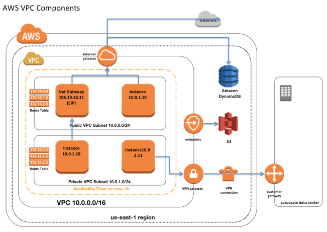

# Amazon Virtual Private Cloud (VPC)

Amazon Virtual Private Cloud (VPC) is a service offered by AWS that allows you to create a virtual network in the cloud, providing you with complete control over your network environment, including IP address range, subnets, route tables, and network gateways. VPC enables you to securely connect your AWS resources, such as EC2 instances, RDS databases, and Lambda functions, and control inbound and outbound network traffic.

## Features of Amazon VPC

- **Isolated Virtual Network**: VPC provides an isolated virtual network environment that allows you to launch AWS resources in a logically isolated section of the AWS cloud.
- **Custom IP Address Range**: You can define your own IP address range (CIDR block) for your VPC, allowing you to choose the IP addresses for your resources according to your network requirements.
- **Subnet Configuration**: VPC allows you to divide your IP address range into one or more subnets, each located in a different Availability Zone (AZ), providing high availability and fault tolerance for your resources.
- **Internet and VPN Connectivity**: VPC allows you to connect your VPC to the internet using an internet gateway (IGW) and establish secure connections to your on-premises network using virtual private gateways (VPGs) and VPN connections.
- **Security**: VPC provides security features such as security groups and network access control lists (NACLs) to control inbound and outbound traffic to and from your resources.
- **Elastic Network Interfaces (ENIs)**: VPC allows you to attach elastic network interfaces (ENIs) to your EC2 instances, enabling them to communicate with other resources in your VPC and connect to the internet or on-premises networks.

## Use Cases for Amazon VPC

- **Enterprise Applications**: VPC is suitable for hosting enterprise applications and databases in a secure and isolated network environment.
- **Web Hosting**: VPC allows you to host web applications and websites securely, with fine-grained control over inbound and outbound traffic.
- **Hybrid Cloud**: VPC enables you to extend your on-premises network to the cloud and seamlessly integrate AWS resources with your existing infrastructure.
- **Big Data Processing**: VPC is ideal for running big data processing and analytics workloads, providing high-performance network connectivity between data sources and processing engines.

## Conclusion

Amazon Virtual Private Cloud (VPC) is a powerful networking service offered by AWS that allows you to create a virtual network in the cloud with complete control over your network environment. By leveraging VPC, you can securely connect your AWS resources, control inbound and outbound traffic, and build scalable and resilient cloud architectures.

For more information, refer to the [AWS documentation on Amazon VPC](https://docs.aws.amazon.com/vpc/).

# Components of Amazon Virtual Private Cloud (VPC)

Amazon Virtual Private Cloud (VPC) consists of several key components that allow you to create a virtual network in the cloud and control the networking environment for your AWS resources. Here are the main components of VPC and how they work:

## 1. CIDR Block
- The CIDR (Classless Inter-Domain Routing) block is the IP address range that you specify for your VPC.
- It determines the range of IP addresses that can be assigned to resources within your VPC.

## 2. Subnets
- Subnets are subdivisions of the CIDR block that you define within your VPC.
- Each subnet is associated with a specific Availability Zone (AZ) and can contain a range of IP addresses from the parent CIDR block.
- Subnets provide a way to organize and isolate resources within your VPC and enable high availability and fault tolerance by distributing resources across multiple AZs.

## 3. Route Tables
- Route tables are used to define the routing rules for traffic within your VPC.
- Each subnet is associated with a route table, which determines how traffic is routed to and from resources within the subnet.
- Route tables contain entries that specify the destination CIDR blocks and the target (e.g., an internet gateway or virtual private gateway) for traffic destined for those CIDR blocks.

## 4. Internet Gateway (IGW)
- An internet gateway is a horizontally scaled, redundant, and highly available VPC component that allows communication between instances in your VPC and the internet.
- It provides a target for internet-bound traffic from resources within your VPC.
- To enable internet access for resources within your VPC, you attach an internet gateway to your VPC and update the route table to route traffic destined for the internet to the internet gateway.

## 5. Virtual Private Gateway (VGW)
- A virtual private gateway is a VPC component that represents the VPN (Virtual Private Network) endpoint on the AWS side of a VPN connection.
- It enables secure communication between your VPC and your on-premises network or other remote networks via VPN connections.

## 6. NAT Gateway
- A NAT (Network Address Translation) gateway is a managed service that allows instances within a private subnet to initiate outbound internet traffic while preventing inbound traffic from reaching those instances.
- It enables instances within private subnets to access the internet for software updates, package downloads, and other external services.

## 7. Security Groups
- Security groups act as virtual firewalls for your instances, controlling inbound and outbound traffic at the instance level.
- You can specify rules in a security group to allow or deny traffic based on IP protocol, port number, and source or destination IP address.
- Each instance in your VPC is associated with one or more security groups, and you can modify the security group rules at any time.

## 8. Network Access Control Lists (NACLs)
- Network Access Control Lists (NACLs) act as stateless firewalls for controlling traffic at the subnet level.
- Unlike security groups, NACLs operate at the subnet level and evaluate traffic based on subnet-level rules.
- You can specify rules in a NACL to allow or deny traffic based on IP protocol, port number, and source or destination IP address.

## How It Works
- When you create a VPC, you define the CIDR block for the VPC and create subnets within that CIDR block.
- You configure route tables to determine how traffic is routed within the VPC, including routing traffic to the internet via internet gateways or to remote networks via virtual private gateways.
- You can use security groups to control inbound and outbound traffic at the instance level and NACLs to control traffic at the subnet level.
- By configuring these components, you can create a customized and secure networking environment for your AWS resources within your VPC.

# Amazon Virtual Private Cloud (VPC) Pricing

Amazon VPC offers a flexible and pay-as-you-go pricing model based on the resources and features you use. The pricing for VPC includes charges for various components and features such as the number of VPCs, the number of subnets, data transfer, NAT gateway usage, and VPN connections. Here are the key factors that determine the pricing for Amazon VPC:

## 1. VPC Creation
- There is no additional charge for creating a VPC in AWS. You can create multiple VPCs in your AWS account at no extra cost.

## 2. Subnets
- There is no additional charge for creating subnets within your VPC. You can create multiple subnets within each VPC to organize your resources.

## 3. Data Transfer
- Data transfer charges apply for traffic that flows in and out of your VPC, including traffic between your VPC and the internet, between VPCs in different AWS regions, and between your VPC and other AWS services.
- Data transfer pricing varies by region and depends on the amount of data transferred.

## 4. NAT Gateway
- NAT Gateway usage is charged per hour for each NAT gateway that you create in your VPC.
- Data processing charges also apply for data processed by NAT gateways.

## 5. VPN Connections
- VPN connections between your VPC and your on-premises network or other remote networks incur hourly charges based on the type of VPN connection (e.g., IPsec VPN or AWS Site-to-Site VPN).

## 6. Other Features
- Additional charges may apply for features such as AWS Direct Connect, VPC peering, VPC endpoint services, and other advanced networking features.

## Pricing Calculator
- You can use the AWS Pricing Calculator to estimate the cost of Amazon VPC based on your specific requirements and usage patterns.
- The pricing calculator allows you to customize various parameters such as the number of VPCs, subnets, data transfer volume, and other features to get an accurate cost estimate.

## Conclusion
Amazon VPC offers a flexible pricing model that allows you to pay only for the resources and features you use. By understanding the pricing factors and using the AWS Pricing Calculator, you can effectively manage and optimize the cost of your VPC deployment in AWS.

For detailed pricing information, refer to the [AWS Pricing page](https://aws.amazon.com/pricing/).

[Back to Main](readme.md)
